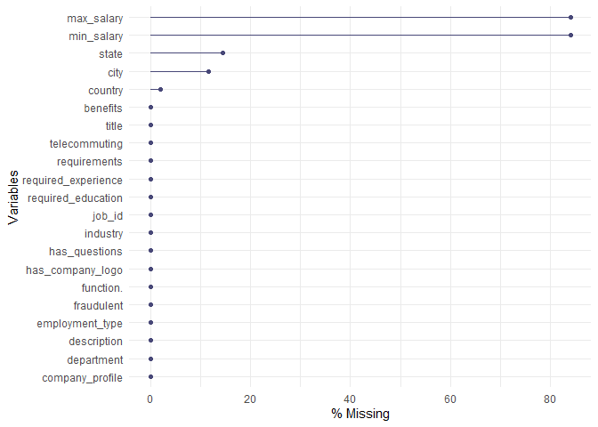
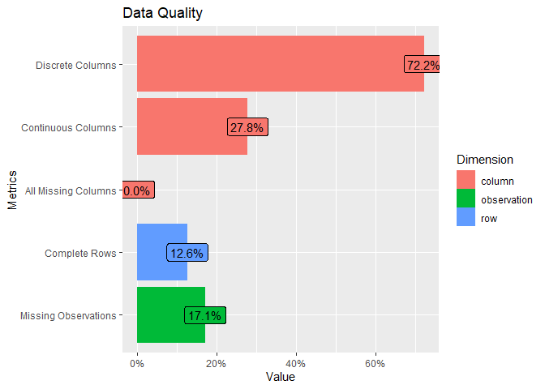
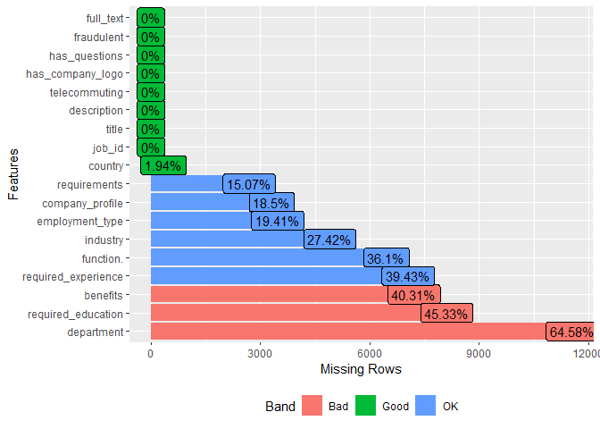
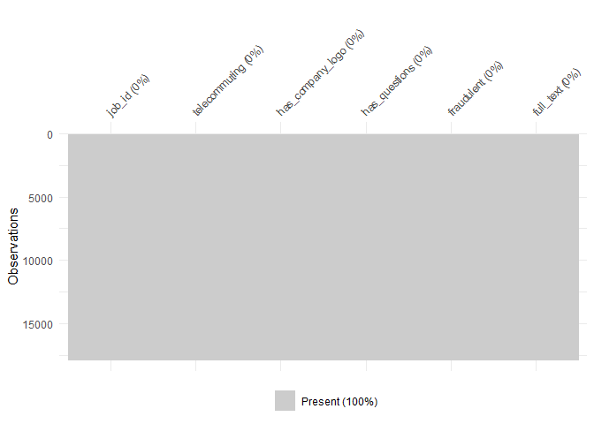

WQD7004 Group Assignment
================

# Fake Job Posting Analysis

### Group 4:

-   JingYu Shen (S2113037)
-   JiPing Zhang (S2042894)
-   Lee Mun Mun (S2112842)
-   Nayli Hatim (S2149344)
-   Jenifer Mayang Jues (S2016572)

# Introduction

In recent years, due to advancement in modern technology. New job
advertising has become a common issue. Fake job posting is becoming
great concern for everyone. According to Habiba et all (2021), job
advertisements which are fake and mostly willing to steal personal &
professional information of job seekers instead of giving right jobs to
them is known as job scam. This dataset contains 18k job description out
of which about 800 are fake. The data consists of both textual
information and meta-information about the jobs.

# Initial Questions

-   What are the significant features of classifying fake job postings
-   Which classification model is the best to classify fake job postings

# Objectives

-   To identify key features of fraudulent job postings
-   To build a model to classify real or fake job postings

# Data Cleaning and Pre-processing

## Import libraries

## Load data

``` r
df <- read.csv("https://raw.githubusercontent.com/abbylmm/fake_job_posting/main/data/fake_job_postings.csv")
```

## Summary data

``` r
df_fake_job <- df
sample_n(df_fake_job, 3)
```

    ##   job_id                                                             title
    ## 1   4097                                         Hero Developer Evangelist
    ## 2   9345                                           English Teacher Abroad 
    ## 3   2430 2 Full-Time Caregivers for a Gentle, Kind Woman with Disabilities
    ##                location department salary_range
    ## 1 US, CA, San Francisco                        
    ## 2    US, VA, Blacksburg                        
    ## 3   US, OR, SE Portland                        
    ##                                                                                                                                                                                                                                                                                                                                                                                                                                                                                                                                                                                                                                                                                                                                                                company_profile
    ## 1                                                                                                                                                                                                           Mashape is the largest, most trafficked API marketplace/hub in the world.Mashape is a revenue generating startup powering thousands of APIs (both private and public) and Applications - itâ\200\231s used in almost 100 countries by thousands of developers and adopted in every major industry including finance, healthcare, military, agriculture, insurance, government, media, e-commerce, retail, aviation, manufacturing and telecom.Mashape is funded by tier 1 VC firms including Index Ventures, NEA, CRV, Stanford University, Jeff Bezos and Eric Schmidt.
    ## 2                                                                                                                                                                                                                                                                                                                                                                                                                                                                                                                                                                                                                                                                                                                        We help teachers get safe &amp; secure jobs abroad :)
    ## 3 United Cerebral Palsy of Oregon &amp; SW Washington (UCP) supports adults with all kinds of developmental disabilities (not just cerebral palsy), so that they can live the life of their dreams.We're growing, so you will see lots of exciting job openings in the next few months!WHY WORK FOR UCP?As an employee of UCP, you'll be proud of the work you do, every day! Our employees assist the people we support to live independently in their own homes and apartments, find and keep their dream jobs, make community connections, serve as their own advocates, and make their own choices. You'll get the chance to work for one of the 100 Best Non-Profit Employers in Oregon. We're fun and flexible, and there's plenty of room for advancement and growth.
    ##                                                                                                                                                                                                                                                                                                                                                                                                                                                                                                                                                                                                                                                                                                                                                                                                                                                                                                                                                                                                                                                                                                                                                                                                                                                                                                                                                                                                                                                                                                                                                                                                                                                                                                                                                                                                                                                                                                                                                                                                                                                                                                                              description
    ## 1                                                                                                                                                                                                                                                                                                                                                                                                                                                                                                                                                                                                                                                                                                                                                                                                                                                                                                             You should know how to code. A specific programming language is not necessary in this case, but an overall understanding of machines, code and APIs is required.De facto, you will organize and attend hackathons - you should have strong communication skills. You will inspire developers, generate contents from blog posts to tweets. You should have a naturally affection in helping people.You will make our big community of developers happy through responsive and outstanding dev support.You decide which conferences/summits will need to be sponsored, put the base for monthly meet-ups around US. Also, you we'll decide the merchandise, the strategy to have a merchandise that people would love to wear - everyday. You will take care of the overall external communication of Mashape.You will also be in charge of discovering new viral mechanics to build into the products, to accelerate the users base. You will think and create unconventional marketing actions. You will also take care of the community and analyze the happiness of our community.You will identify and contact APIs that can list their services on Mashape; also you will think and activate strategic partnerships.
    ## 2                                                                                                                                                                                                                                                                                                                                                                                                                                                                                                                                                                                                                                                                                                                                                                                                                                                                                                                                                                                                                                                                                                                                                                                                                                                                                                                                                                                                                                                                                                                                                                                                                                                                                                                                        Play with kids, get paid for it Love travel? Jobs in Asia$1,500+ USD monthly ($200 Cost of living)Housing provided (Private/Furnished)Airfare ReimbursedExcellent for student loans/credit cardsGabriel Adkins : #URL_ed9094c60184b8a4975333957f05be37e69d3cdb68decc9dd9a4242733cfd7f7##URL_75db76d58f7994c7db24e8998c2fc953ab9a20ea9ac948b217693963f78d2e6b#12 month contract : Apply today 
    ## 3 Are you looking for a caregiving job thatâ\200\231s fun and empowering? Would you like the chance to work one-on-one, making a real difference every day?If so, United Cerebral Palsy (UCP) might have the perfect position for you! We are currently seeking 2 Personal Assistants (caregivers) for a woman who experiences developmental disabilities.She is an incredibly kind, sweet and gentle person with a great sense of humor. She has a busy social life, but needs your assistance to communicate. She also needs your assistance with the activities of daily living, since she uses a wheelchair. She likes to work with people who are upbeat and fun. You will work out of her apartment, which is located in the Hazelwood neighborhood of SE Portland. (No calls, please) HOURS:Position 1 (40 hours per week): 8pm on Saturday through noon on Monday. Work your regular hours on agency holidays.Position 2 (40 hours per week): Monday-Wednesday overnights (8pm until 8am the next day); and 8pm to midnight on Thursdays. Work your regular hours on agency holidays. DUTIES:Plan lots of fun activities, such as creating jewelry items, listening to country music, going shopping, and going on road trips.Assist her to socialize, by planning activities with her wide circle of friends, and helping her to communicate since she doesnâ\200\231t use words.Perform household chores.Keep her safe and healthy by administering medications, feeding her via her G-tube, and monitoring her health concerns. Assist with personal hygiene needs, including providing full assistance with bathing, dressing and incontinence care. Reposition her every 4 hours overnight. ABOUT UCP:UCP is a thriving non-profit that was recently ranked as one of the 100 Best Non-Profit employers in Oregon.We support adults with all kinds of developmental disabilities so that they can live, work and play independently.Find out more about us at #URL_2b35257099321dacb52af707d4a6bdf5dd187d81d6bfd24398f0e5b68a6727a7#.UCP is an Equal Opportunity Employer, and actively seeks applicants from diverse backgrounds. 
    ##                                                                                                                                                                                                                                                                                                                                                                                                                                                                                                                                                                       requirements
    ## 1                                                                                You're an API HustlerYou love to communicate with developers and you measure the success by the happiness of our communityYou have built web or mobile apps before and you feel yourself more a generalist developer.You always want to discover new paths and new technologiesYou have outstanding written and oral communication skillsYou are able to travel worldwide and adapt yourself in new countries and culturesYou should have built at least one community around something you cared
    ## 2                                                                                                                                                                                                                                                                                                                                                                                                                                              University degree required. TEFL / TESOL / CELTA or teaching experience preferred but not necessaryCanada/US passport holders only
    ## 3 Must possess a high school diploma or GED, and be at least 18 years old.Must pass a physical with a lifting test of 75lbs, drug test, reference check, and criminal history background check.Cannot be allergic to cats, as there are cats in the home (although you wonâ\200\231t see them very often).We prefer applicants with experience in developmental disability field.We prefer applicants who we can insure to drive our wheelchair-accessible van (you would need to be 21 years old or older, and have at least 3 years of driving experience and a clean driving record).
    ##                                                                                                                                                                                                                                                                                                                                                                                                                                                                                                                                 benefits
    ## 1  - As an early employee you will get a true stake in the company - Competitive salaries  - Poker nights  - Apple equipments  - Italian Food cooked by the founders - Free lunch 2 times a week. - Official mashaper  - 1 week/year in a spiritual retreat with the team somewhere in the world - A 2nd family  - whatever problem outside of the work, weâ\200\231ll be there - Vacation days &amp; time off - Awesome medical, dental, &amp; vision insurance - 401k - Company dinners &amp; happy hour  - Much moreâ\200¦
    ## 2                                                                                                                                                                                                                                                                                                                                                                                                                                                                                                                    See job description
    ## 3                                                                                                                                                                                                                                                     $9.47/hour, 5% increase to $9.95/hour after successful 90-day Trial Service Period.401k plan with company match.Fully paid training.Generous paid time off.Full medical benefits (including medical, vision and alternative) for employee, spouse/domestic partner and dependents.
    ##   telecommuting has_company_logo has_questions employment_type
    ## 1             0                1             1       Full-time
    ## 2             0                1             1        Contract
    ## 3             0                1             1       Full-time
    ##   required_experience        required_education             industry
    ## 1      Not Applicable                                       Internet
    ## 2                             Bachelor's Degree Education Management
    ## 3         Entry level High School or equivalent                     
    ##                function. fraudulent
    ## 1 Information Technology          0
    ## 2                                 0
    ## 3   Health Care Provider          0

``` r
summary(df_fake_job)
```

    ##      job_id         title             location          department       
    ##  Min.   :    1   Length:17880       Length:17880       Length:17880      
    ##  1st Qu.: 4471   Class :character   Class :character   Class :character  
    ##  Median : 8940   Mode  :character   Mode  :character   Mode  :character  
    ##  Mean   : 8940                                                           
    ##  3rd Qu.:13410                                                           
    ##  Max.   :17880                                                           
    ##  salary_range       company_profile    description        requirements      
    ##  Length:17880       Length:17880       Length:17880       Length:17880      
    ##  Class :character   Class :character   Class :character   Class :character  
    ##  Mode  :character   Mode  :character   Mode  :character   Mode  :character  
    ##                                                                             
    ##                                                                             
    ##                                                                             
    ##    benefits         telecommuting    has_company_logo has_questions   
    ##  Length:17880       Min.   :0.0000   Min.   :0.0000   Min.   :0.0000  
    ##  Class :character   1st Qu.:0.0000   1st Qu.:1.0000   1st Qu.:0.0000  
    ##  Mode  :character   Median :0.0000   Median :1.0000   Median :0.0000  
    ##                     Mean   :0.0429   Mean   :0.7953   Mean   :0.4917  
    ##                     3rd Qu.:0.0000   3rd Qu.:1.0000   3rd Qu.:1.0000  
    ##                     Max.   :1.0000   Max.   :1.0000   Max.   :1.0000  
    ##  employment_type    required_experience required_education   industry        
    ##  Length:17880       Length:17880        Length:17880       Length:17880      
    ##  Class :character   Class :character    Class :character   Class :character  
    ##  Mode  :character   Mode  :character    Mode  :character   Mode  :character  
    ##                                                                              
    ##                                                                              
    ##                                                                              
    ##   function.           fraudulent     
    ##  Length:17880       Min.   :0.00000  
    ##  Class :character   1st Qu.:0.00000  
    ##  Mode  :character   Median :0.00000  
    ##                     Mean   :0.04843  
    ##                     3rd Qu.:0.00000  
    ##                     Max.   :1.00000

## Check all the missing values - ‘empty’

``` r
skim(df_fake_job)
```

|                                                  |             |
|:-------------------------------------------------|:------------|
| Name                                             | df_fake_job |
| Number of rows                                   | 17880       |
| Number of columns                                | 18          |
| \_\_\_\_\_\_\_\_\_\_\_\_\_\_\_\_\_\_\_\_\_\_\_   |             |
| Column type frequency:                           |             |
| character                                        | 13          |
| numeric                                          | 5           |
| \_\_\_\_\_\_\_\_\_\_\_\_\_\_\_\_\_\_\_\_\_\_\_\_ |             |
| Group variables                                  | None        |

Data summary

**Variable type: character**

| skim_variable       | n_missing | complete_rate | min |   max | empty | n_unique | whitespace |
|:--------------------|----------:|--------------:|----:|------:|------:|---------:|-----------:|
| title               |         0 |             1 |   3 |   142 |     0 |    11231 |          0 |
| location            |         0 |             1 |   0 |   161 |   346 |     3106 |          0 |
| department          |         0 |             1 |   0 |   255 | 11547 |     1338 |          6 |
| salary_range        |         0 |             1 |   0 |    20 | 15012 |      875 |          0 |
| company_profile     |         0 |             1 |   0 |  6230 |  3308 |     1710 |          0 |
| description         |         0 |             1 |   3 | 22722 |     0 |    14802 |          0 |
| requirements        |         0 |             1 |   0 | 10921 |  2694 |    11970 |          0 |
| benefits            |         2 |             1 |   0 |  4489 |  7206 |     6207 |          0 |
| employment_type     |         0 |             1 |   0 |     9 |  3471 |        6 |          0 |
| required_experience |         0 |             1 |   0 |    16 |  7050 |        8 |          0 |
| required_education  |         0 |             1 |   0 |    33 |  8105 |       14 |          0 |
| industry            |         0 |             1 |   0 |    36 |  4903 |      132 |          0 |
| function.           |         0 |             1 |   0 |    22 |  6455 |       38 |          0 |

**Variable type: numeric**

| skim_variable    | n_missing | complete_rate |    mean |      sd |  p0 |     p25 |    p50 |      p75 |  p100 | hist  |
|:-----------------|----------:|--------------:|--------:|--------:|----:|--------:|-------:|---------:|------:|:------|
| job_id           |         0 |             1 | 8940.50 | 5161.66 |   1 | 4470.75 | 8940.5 | 13410.25 | 17880 | ▇▇▇▇▇ |
| telecommuting    |         0 |             1 |    0.04 |    0.20 |   0 |    0.00 |    0.0 |     0.00 |     1 | ▇▁▁▁▁ |
| has_company_logo |         0 |             1 |    0.80 |    0.40 |   0 |    1.00 |    1.0 |     1.00 |     1 | ▂▁▁▁▇ |
| has_questions    |         0 |             1 |    0.49 |    0.50 |   0 |    0.00 |    0.0 |     1.00 |     1 | ▇▁▁▁▇ |
| fraudulent       |         0 |             1 |    0.05 |    0.21 |   0 |    0.00 |    0.0 |     0.00 |     1 | ▇▁▁▁▁ |

## Split location to country, state, city and fill empty with NA

``` r
df_fake_job[c("country", "state", "city")] <- str_split_fixed(df_fake_job$location, ", ", 3)
df_fake_job[c("country", "state", "city")][df_fake_job[c("country", "state", "city")] == ""] <- NA
```

## Split salary_range to min_salary, max_salary and fill empty with NA

``` r
df_fake_job[c("min_salary", "max_salary")] <- str_split_fixed(df_fake_job$salary_range, "-", 2)
df_fake_job[c("min_salary", "max_salary")][df_fake_job[c("min_salary", "max_salary")] == ""] <- NA
```

## Drop location and salary_range

``` r
df_fake_job <- select(df_fake_job, -c(location, salary_range))
```

## View the structure of data

``` r
glimpse(df_fake_job)
```

    ## Rows: 17,880
    ## Columns: 21
    ## $ job_id              <int> 1, 2, 3, 4, 5, 6, 7, 8, 9, 10, 11, 12, 13, 14, 15,~
    ## $ title               <chr> "Marketing Intern", "Customer Service - Cloud Vide~
    ## $ department          <chr> "Marketing", "Success", "", "Sales", "", "", "ANDR~
    ## $ company_profile     <chr> "We're Food52, and we've created a groundbreaking ~
    ## $ description         <chr> "Food52, a fast-growing, James Beard Award-winning~
    ## $ requirements        <chr> "Experience with content management systems a majo~
    ## $ benefits            <chr> "", "What you will get from usThrough being part o~
    ## $ telecommuting       <int> 0, 0, 0, 0, 0, 0, 0, 0, 0, 0, 0, 0, 0, 0, 0, 0, 0,~
    ## $ has_company_logo    <int> 1, 1, 1, 1, 1, 0, 1, 1, 1, 1, 0, 1, 1, 1, 1, 1, 1,~
    ## $ has_questions       <int> 0, 0, 0, 0, 1, 0, 1, 1, 1, 0, 0, 0, 0, 1, 0, 1, 0,~
    ## $ employment_type     <chr> "Other", "Full-time", "", "Full-time", "Full-time"~
    ## $ required_experience <chr> "Internship", "Not Applicable", "", "Mid-Senior le~
    ## $ required_education  <chr> "", "", "", "Bachelor's Degree", "Bachelor's Degre~
    ## $ industry            <chr> "", "Marketing and Advertising", "", "Computer Sof~
    ## $ function.           <chr> "Marketing", "Customer Service", "", "Sales", "Hea~
    ## $ fraudulent          <int> 0, 0, 0, 0, 0, 0, 0, 0, 0, 0, 0, 0, 0, 0, 0, 0, 0,~
    ## $ country             <chr> "US", "NZ", "US", "US", "US", "US", "DE", "US", "U~
    ## $ state               <chr> "NY", NA, "IA", "DC", "FL", "MD", "BE", "CA", "FL"~
    ## $ city                <chr> "New York", "Auckland", "Wever", "Washington", "Fo~
    ## $ min_salary          <chr> NA, NA, NA, NA, NA, NA, "20000", NA, NA, NA, "1000~
    ## $ max_salary          <chr> NA, NA, NA, NA, NA, NA, "28000", NA, NA, NA, "1200~

``` r
class(df_fake_job)
```

    ## [1] "data.frame"

## View column names

``` r
names(df_fake_job)
```

    ##  [1] "job_id"              "title"               "department"         
    ##  [4] "company_profile"     "description"         "requirements"       
    ##  [7] "benefits"            "telecommuting"       "has_company_logo"   
    ## [10] "has_questions"       "employment_type"     "required_experience"
    ## [13] "required_education"  "industry"            "function."          
    ## [16] "fraudulent"          "country"             "state"              
    ## [19] "city"                "min_salary"          "max_salary"

## Check if any duplication id

``` r
table(duplicated(df_fake_job$job_id))
```

    ## 
    ## FALSE 
    ## 17880

``` r
# there is no duplication id
```

## Check for total missing values for each feature

``` r
colSums(is.na(df_fake_job))
```

    ##              job_id               title          department     company_profile 
    ##                   0                   0                   0                   0 
    ##         description        requirements            benefits       telecommuting 
    ##                   0                   0                   2                   0 
    ##    has_company_logo       has_questions     employment_type required_experience 
    ##                   0                   0                   0                   0 
    ##  required_education            industry           function.          fraudulent 
    ##                   0                   0                   0                   0 
    ##             country               state                city          min_salary 
    ##                 346                2580                2067               15012 
    ##          max_salary 
    ##               15013

``` r
# there are two missing values in 'benefits' column
```

## List rows with missing values

``` r
missingdf <- df_fake_job[!complete.cases(df_fake_job), ]
sample_n(missingdf, 3)
```

    ##   job_id                                            title
    ## 1  10401                Minnesota Communication Assistant
    ## 2  14898 Product Specialist / Customer Success Specialist
    ## 3   8896                                INSTALLERS NEEDED
    ##                  department
    ## 1                 CSD Relay
    ## 2 Business:Customer Success
    ## 3                          
    ##                                                                                                                                                                                                                                                                                                                                                                                                                                                                                                                                                                                                                                                                                                                                   company_profile
    ## 1 Why CSD?CSD is not only a great place to work, but also to learn, grow and give back to the community. Our organization is made up of talented, motivated people from diverse cultural, educational and professional backgrounds. We believe in teamwork, shared ideas, and creating solutions together while respecting individuality and innovation. We seek out people who want to see their ideas put into action, are committed to making a difference and who believe that more is possible! Who We AreHere, you will discover colleagues who have passion for our company, our community, customers and each other, and that are led by a team of outstanding people who believe that more is possible from each and every one of us. 
    ## 2                                                                                                                                                                We build software for fashion retailers, to help them make the right commercial decisions about what to sell, and how to price it. Fashion is the 4th biggest industry in the world, so this is actually a huge problem economically, as well as environmentally for everyone in the world. The Guardian called us one of the 20 hottest London startups, and we're a quickly growing team, with a product used by some of the best retailers in the world, and we're backed by the smartest investors in Europe, the same ones who backed Etsy, Dropbox, ASOS and Net-a-Porter.
    ## 3                                                                                                                                                                                                                                                                                                                                                                                                                                                                                                                                                                                                                                                                                                                                                
    ##                                                                                                                                                                                                                                                                                                                                                                                                                                                                                                                                                                                                                                                                                                                                                                                                                                                                                                                                                                                                                                                                                                                                                                                                                                                                                                                                                                                                                                                                                                                                                                                                                                                                                                                                                                                                                                                                                                                                                                                                                                                                                                                                                                                                                                                                                                                                                                                                                       description
    ## 1                                                                                                                                                                                                                                                                                                                                                                                                                                                                                                                                                                                                                                                                                                                                                                                                                                                                                                                                                                                                                                                                                                                                                                                                                                        Communication Assistants provide communication access for deaf, hard of hearing, and speech impaired consumers through the telephone network by relaying telephone calls using voice and text.Accept and place local and long distance relay calls for consumers.Follow desired method of billing instructions and enter billing information into the system.Translate electronic messages to voice messages and voice messages to electronic messages.Translate sentence structures and language patterns from American Sign Language (ASL) to English and English to ASL to ensure the correct message is relayed.Convey the callers actual feelings and emotions.Relay contents of the call as accurately as possible without intervening in the conversation.Maintain strict consumer confidentiality and professionalism.Please note that we recruit for this position on an on-going basis in order to build a talent pool of potential candidates. When a position becomes available, we will review applicants at that time. Due to the volume of resumes that we receive, only those candidates selected for interviews will be contacted. Thank you for your interest in CSD!
    ## 2 About EDITDEDITD is a retail technology company and runs the world's biggest apparel data warehouse.  Global and local retailers use EDITD to make sure they have the right product, at the right price, at the right time.  EDITD is a market leader, and is used by the worldâ\200\231s best fashion retailers, like Gap, ASOS and Target, across five continents.The JobIn this product specialist role you will be an integral part of the Customer Success team. You will be a customer success specialist - using your expert knowledge of the EDITD product to build and deliver best-in-class training to our high profile retail clients. If youâ\200\231re not an expert on EDITD already, donâ\200\231t worry, because weâ\200\231ll make you one.You will be a strong product advocate, and support each of our individual users to become as proficient in using the EDITD app as you are. You will also be a strong customer advocate - feeding back their views about the product to the relevant teams and helping to shape the development of the EDITD product. We expect you to be passionate about our customers, and be as excited about helping them to get the most value out of our of our product as we are.Our expectations for your position:Youâ\200\231re fanatical about supporting customers, take responsibility for them using and understanding the product, and have a personal connection to them.You can be a strong advocate for our productsYou have exceptional verbal and written communication skills and you are able to communicate across time zones and all types of people in all sorts of roles.You are tech savvy and able to communicate feedback and feature requests back to the product teams at EDITD.You are organised and meticulous about documenting processes.Youâ\200\231re able to articulate positioning, use cases and benefits.You are numerate, and data literate, and know how to identify trends in client usage and use these trends to build and deliver training to increase product adoption.You will build and deliver best in class training to our clients by understanding their job roles, client success measures, and adult learning best practices.You will build documentation and materials to support the training programs you create.You are able to identify client warning signs (both in-person, and via usage data) and communicate it with the Customer Success Manager.
    ## 3                                                                                                                                                                                                                                                                                                                                                                                                                                                                                                                                                                                                                                                                                                                                                                                                                                                                                                                                                                                                                                                                                                                                                                                                                                                                                                                                                                                                                                                                                                                                                                                                                                                                                                                                                                                                                    We are seeking motivated individuals ready to install gutter protectors.Must have a good understanding of a home's exterior. We can train you to install in the field today!!You will start making money IMMEDIATELY.In order to qualify you need to have the following:- A good work truck.- A good set of tools.- A set of ladders in different lengths.- A professional demeanor.- Good communication skills.- We provide all materials!Training class start tomorrow...We offer full Medical, Vision and Dental benefits.***1099 contractor***We pay for hotels if travel is needed.We pay your mileage
    ##                                                                                                                                                                                                                                                                                                                                                                                                                                                                                                                                                                         requirements
    ## 1                                                                                                                                                                                                                                                                                                                               A minimum of a High School Diploma or equivalent.At least 18 years of age or older.Typing skill of at least 50 WPM using a personal computer.Ability to work various schedules including weekdays, evening and weekends.Ability to learn ASL syntax.
    ## 2 Minimum of 1+ year of training or account management experienceAn interest or background in fashion or retailing is a plus.Experience managing or training clients in Fortune 500 corporations.Proven success in growing existing accounts and relationships.Technical competence and enthusiasm (understanding of SaaS software or technology).Excellent written, communication, presentation skills.Works well with others.  Loves being on a team.Independent  â\200“ to take initiative, own processes, and work independently.Highly organized.  Tenacity to finish projects.
    ## 3                                                                                                                                                                                                                                                                                                                                                                                                                                                                                                                                                                                   
    ##                                                                                                                                                                                                                                                                                                                                                                                                                                                                                benefits
    ## 1 CSD offers a competitive benefits package for full-time employees. For a full list of benefits and perks, please visit the career page.Communication Service for the Deaf, Inc. is an Equal Opportunity Affirmative Action Employer and drug free and tobacco free workplace. All qualified applicants will receive consideration for employment without regard to race, color, religion, sex, or national origin, including individuals with a disability and protected veterans.
    ## 2                                                                                                                                                                                                                                                                                                                                                                                                                                                                                      
    ## 3                                                                                                                                                                                                                                                                                                                                                                                                                                                                                      
    ##   telecommuting has_company_logo has_questions employment_type
    ## 1             0                1             1       Part-time
    ## 2             0                1             1       Full-time
    ## 3             0                0             0                
    ##   required_experience        required_education
    ## 1         Entry level High School or equivalent
    ## 2                             Bachelor's Degree
    ## 3                                              
    ##                              industry        function. fraudulent country state
    ## 1                  Telecommunications Customer Service          0      US    MN
    ## 2 Information Technology and Services                           0      GB  <NA>
    ## 3                                                               0      US    MN
    ##           city min_salary max_salary
    ## 1     Moorhead       <NA>       <NA>
    ## 2       London       <NA>       <NA>
    ## 3 MINNEAPOLIS        <NA>       <NA>

## Visualize missing rates for each feature

``` r
gg_miss_var(df_fake_job, show_pct = TRUE) + labs(y = "% Missing")
```

<!-- -->

## Merge columns and create a new ‘full_text’ column

``` r
viz_df <- select(df_fake_job, -c(max_salary, min_salary, state, city))
viz_df$full_text <- 
  paste(na.omit(viz_df$title), 
        na.omit(viz_df$country), 
        na.omit(viz_df$department), 
        na.omit(viz_df$company_profile), 
        na.omit(viz_df$description), 
        na.omit(viz_df$requirements), 
        na.omit(viz_df$benefits), 
        na.omit(viz_df$employment_type), 
        na.omit(viz_df$required_experience), 
        na.omit(viz_df$required_education), 
        na.omit(viz_df$industry), 
        na.omit(viz_df$function.))
viz_df[viz_df == ""] <- NA
# sample(viz_df, 3)
# write.csv(viz_df, "C:/Users/munmu/Documents/GitHub/fake_job_posting\\viz_df.csv", row.names = FALSE)
```

## Visualize missing profile for each feature

``` r
plot_intro(viz_df, title = "Data Quality")
```

<!-- -->

``` r
plot_missing(viz_df)
```

<!-- -->

## Heatplot of missingness across the data frame

``` r
vis_miss(viz_df)
```

<!-- -->

## Drop columns

``` r
model_df <- select(viz_df, 
                   -c(title, 
                      country, 
                      department, 
                      company_profile, 
                      description, 
                      requirements, 
                      benefits, 
                      employment_type, 
                      required_experience, 
                      required_education, 
                      industry, 
                      function.))
sample_n(model_df, 3)
```

    ##   job_id telecommuting has_company_logo has_questions fraudulent
    ## 1  16639             0                1             1          0
    ## 2   7323             0                1             1          0
    ## 3   7272             0                1             1          0
    ##                                                                                                                                                                                                                                                                                                                                                                                                                                                                                                                                                                                                                                                                                                                                                                                                                                                                                                                                                                                                                                                                                                                                                                                                                                                                                                                                                                                                                                                                                                                                                                                                                                                                                                                                                                                                                                                                                                                                                                                                                                                                                                                                                                                                                                                                                                                                                                                                                                                                                                                                                                                                                                                                                                                                                                                                                                                                                                                                                                                                                                                                                                                                                                                                                                                                                                                                                                                                                                                                                                                                                                                                                                                                                                                                                                                                                                                                                                                                                                                                                                                                                                                                                                                                                                                                                                                                                                                                                                                                                                                                                                                                                                                                                                                                                                                                                                                                                                   full_text
    ## 1                                                                                                                                                                                                                                                                                                                                                                                                                                                                                                                                                                                                                                                                                                                                                                                                                                                                                                                                                                                                                                                                                                                                                                                                                                                                                                                                                                                                                                                                                                                                                                                                                                                                                                                                                                                                                                                                                                                                                                                                                                                                                                                                                                                                                                                                        Immediate Opening : Help Desk /Technical Support Coordinator US Information Technology VAM SYSTEMS is a Business Consulting, IT Solutions and Services company with operations in UAE, Qatar, Bahrain, USA, Australia, Singapore &amp; India. . We offers a comprehensive list of services in the field of IT infrastructure management, Cloud services, IT Consulting Services, Banking, Management Resources, Information Technology Development, Telecom, Aviation, Retail Management &amp; Government offerings. Greetings from VAM SYSTEMSâ\200¦..VAM SYSTEMS is a Business Consulting, IT Solutions and Services company with operations in UAE, Qatar, Bahrain, USA, Australia, Singapore &amp; India. . We offers a comprehensive list of services in the field of IT infrastructure management, Cloud services, IT Consulting Services, Banking, Management Resources, Information Technology Development, Telecom, Aviation, Retail Management &amp; Government offerings.VAM SYSTEMS is currently looking for Help Desk / Technical Support Coordinator for our Qatar operations.Domain: Bank.Experience Required: 4 to 5Years.Terms and conditions: Joining time frame:   2 weeks (maximum 1 month).The selected candidates shall join VAM SYSTEMS â\200“ Qatar and shall be deputed to one of the leading banks in Qatar.           Skill Set required:Should have excellent communication skills, strong writing and reading skills, ability to work in and contribute to a team environmentShould have comprehensive knowledge of computer hardware and software with the strong troubleshooting ability.Should have experience in managing customer service request and mailboxes and assign tickets to technicians within the team.ResponsibilitiesAssist technicians with first call resolution for desktop, laptop, and network connectivity problems.Attending the customer calls and queries, solving problems on primary level through telephone. Raising and Assigning cases for customers into the problem tracking system(E)Accepting calls, logging the calls, assigning the calls to the respective support engineer.Co-ordinate with the team.Coordinate and maintain a log sheet of request activities of the Help Desk, be able to prioritize service requests according to importance, i.e., emergency, immediate, high priority, moderate, general or suggestionReviews after hours Inbox mails and make sure the Engineers follow the Instruction as defined, if any deviation, notification to the concern engineer and keep him updated with process and procedure in line.       
    ## 2                                                                                                                                                                                                                                                                                                                                                                                                                                                                                                                                                                                                                                                                                                                                                                                                                                                                                                                                                                                                                                                                                                                                                                                                                                                                                                                                                                                                                                                        System Administrator US  EUROPEAN DYNAMICS (#URL_c66532ffa1ce76ab447da6774719060c42c584edbf44d74cdb94fc4ac219ca45#) is a leading European Software, Information and Communication Technologies company, operating internationally (Athens, Brussels, Luxembourg, Copenhagen, Berlin, Rome, Stockholm, London, Nicosia, Helsinki, Valetta, etc). The company employs over 600 engineers and IT experts. We design and develop software applications using integrated, state-of-the-art technology. Our current IT and telecoms projects have a value exceeding 250 million EURO. EUROPEAN DYNAMICS is a renowned supplier of IT services to European Union Institutions, international organizations, European Agencies and national government Administrations all over Europe. We currently have a vacancy for a System Architect, fluent in English, to offer his/her services as expert who will be based in Westminster, London, UK. The work will be carried out either in the companyâ\200\231s premises or on site at customer premises. In the context of the first assignment, the successful candidate will be integrated in the Testing team of the company that will closely cooperate with a major clientâ\200\231s IT team on site.Your tasks:Build and maintain appropriate environments for testing and development work;Identify the role of technology in service delivery and policy implementation;Revise and improve the development toolset as the work progresses;Configure and manage Linux servers for serving a dynamic website, debug complex multi-server services;Bring innovation in managing and improving the development tool set. Your skills:University degree with demonstrated experience in system administration and web operations;Excellent knowledge of Mongo database and JAVA;Good knowledge of Dropwizard, Mustache templates, Javascript, Git, Jenkins, Cucumber, HTML and CSS;Hands on experience with Linux servers;Understanding of common web application architecture;Working experience in development (preferably in Java) will be considered as an asset;Fluency in both oral and written English. Trident has offices across the country and customers in both federal and commercial markets. We provide cutting-edge technology solutions in some of the most demanding environments in the world.  Trident offers a fast-paced, team-oriented work environment with an exceptional compensation &amp; benefits package including:Competitive Base PayPPO Medical&amp; Dental, 80% employer paidLife, &amp; AD&amp;D, Short Term &amp; Long Term Disability, 100% employer paidCompetitive Simplified Employee Pension (SEP) retirement savings account10 paid floating holidays20 Day Paid Time Off (PTO) to start5 days paid Maternity/Paternity leavePaid Military LeaveProfit Sharing &amp; Performance BonusesFlexible Work SchedulesGrowth Opportunities &amp; Much More!EEO Statement:  All qualified applicants will receive consideration for employment and will not be discriminated against on the basis of disability.  Trident Systems Incorporated is an Equal Opportunity Employer of protected Veterans and a VEVRAA Federal Contractor. Trident Systems has a desire for priority referrals of protected Veterans. #URL_693114d52e87417a7e014ac3d04653a6664f919ad6a6f8de149affcfc8f083cc#. Full-time Mid-Senior level Bachelor's Degree Computer Software Information Technology
    ## 3 Guest Services - Team Lead  US  Airenvyâ\200\231s mission is to provide lucrative yet hassle free full service short term property management all around the world. We combine the charm of your home with the amenities of a boutique hotel.Currently the short-term rental property management companies are run inefficiently thus having to charge owners 40-50% of monthly revenues. By using our pricing algorithm cross-platform listing technology out goal is to increase your rental income by 20% or more while only charging you a 12%-15% commission for providing a turnkey experience.We like to think Airenvy is creating a new way for people to become excited again about property management and love their property managers.First use case for Airenvy clients are those who want to convert their long-term rental into short-term rental so they can 1) earn more income while having the flexibility of staying in your own place when you want.Airenvy is your friend next door! : ) Our customer video! #URL_e73543fde61f659ae4e25b87c34adb321c37207b4adc143cb6a99351c3ee1cb5# Who is Airenvy?Hey there! We are seasoned entrepreneurs in the heart of San Franciscoâ\200\231s SOMA neighborhood.  We are looking for someone who embodies an entrepreneurial spirit, pays strong attention to detail and wants to be a part of the next big thing. This business can feel like a circus at times, but we have an all-star team with a one of a kind culture.  Get a little taste of it here.Airenvy is the #1 technology driven property management company in a multi-billion dollar industry and is revolutionizing the vacation rental space! We are growing at record speed and expanding to new markets! Our platform allows owners to put their vacation rental on autopilot. We are a proven team of startup veterans and would love for you to join the family!    In 2014 we were named the #1 Airbnb property management company in San Francisco according to the SF Chronicle. We have 18 supportive and resourceful investors, many of whom are leaders in the technology and real estate industries.The PositionAirenvy is growing faster than we can handle, and now  weâ\200\231re looking for someone to help us scale! We are seeking an amazing contact center lead who is passionate about getting results and creating a team that can weather any storm. Youâ\200\231ll play a direct role in improving and growing the current Guest Services team, scaling the business, and creating best practices and processes that allow for Airenvy to exist anywhere!ResponsibilitiesDrives continuous agent improvement to achieve both customer satisfaction and Airenvyâ\200\231s goals.Ensures successful execution of Airenvyâ\200\231s Guest services by managing day-to-day operations of the contact center (outsource) team.Understands the customerâ\200\231s needs, service requirements, and execution expectations.Handles non-urgent issue escalations.Functions as a liaison to Guest Services agents leveraging a strong understanding of the customers challenges, and available best practices.Helps agents evolve to a smart, predictive and proactive service operational model based on best practices, skills, services, and tools.Collaborates with management to maximize the contact center team value through continual improvements in operation team members, processes, and tools.Perform duties as assigned by management.You?Phenomenal coaching skills - proven inspirational leadership.Pro-active, enthusiastic and motivating Leader.Comfortable navigating complex systems.Strong communication and analytical skills.Disciplined with an entrepreneurial spirit (able to work independently).Customer centric approach.Ability to effectively communicate with upper management about complex issue.Team player, with a genuine interest and proven talent for coaching and developing others. Previous contact center/call center experienceMinimum four years in customer service management role (please do not apply unless youâ\200\231ve managed a minimum of ten direct reports).Bachelorâ\200\231s degree focus in management, business, or an analytical discipline.Advanced English writing and speaking skills, any additional language is a strong plus.Ability to work well under pressure especially in a changing environment.Zendesk experience is a plusExperience in hotel/travel industry is a plus. Very competitive salary depending on skill level and experience.As this is very much a â\200œstart-up environmentâ\200\235, it provides an opportunity for successful applicants to be more directly involved in the general shaping and direction of the AWS infrastructure of the company, to experience a well-structured agile development environment, pick up some useful general business skills and to interact with end-users directly.

``` r
# write.csv(model_df, "C:/Users/munmu/Documents/GitHub/fake_job_posting\\model_df.csv", row.names = FALSE)
```

## Check NA or missing values

``` r
sum(is.na(model_df))
```

    ## [1] 0

``` r
sum(model_df == "")
```

    ## [1] 0

## Visualize missing values

``` r
vis_miss(model_df)
```

<!-- -->

``` r
vis_dat(model_df)
```

<!-- -->

# Exploratory Data Analysis (EDA)

Before building our models, we performed exploratory data analysis to
understand the dataset.

## Visualize fraud and real

``` r
viz_df2 <- viz_df
viz_df2$fraudulent[viz_df2$fraudulent == 1] <- "Fraud"
viz_df2$fraudulent[viz_df2$fraudulent == 0] <- "Non Fraud"
count <- table(viz_df2$fraudulent)
bar <- barplot(count, 
               main="Proportion of fraudulent job postings", 
               xlab="fraudulent", 
               ylab="count", 
               col=c(rgb(0.3,0.1,0.4,0.6), rgb(0.3,0.9,0.4,0.6)))
text(bar, count/2, labels = count)
```

<!-- -->

It is observable that there are 17,014 cases of legitimate job postings,
while the number of fraudulent job postings is 866.

## Visualize country-wise job postings

``` r
temp <- na.omit(subset(viz_df, select = c(country))) %>% 
  group_by(country) %>% 
  summarize(n = n()) %>% 
  arrange(desc(n)) %>% 
  slice(1:10)

par(mar=c(6,4,4,4))
barplot(height=temp$n, 
        main="Top 10 country-wise job postings", 
        ylab="count", 
        col=brewer.pal(10, "Set3"), 
        names.arg=c("United States",
                    "United Kingdom",
                    "Greece",
                    "Canada",
                    "Germany",
                    "New Zealand",
                    "India",
                    "Australia",
                    "Philippines",
                    "Netherlands"), 
        cex.names=0.7, 
        las=2)
```

<!-- -->

## Visualize the industries

``` r
temp <- na.omit(subset(viz_df, select = c(industry))) %>% 
  group_by(industry) %>% 
  summarize(n = n()) %>% 
  arrange(desc(n)) %>% 
  slice(1:10)

par(mar=c(10,4,4,4))
barplot(height=temp$n, 
        names=temp$industry, 
        main="Top 10 industries", 
        ylab="count", 
        col=brewer.pal(10, "Set3"), 
        cex.names=0.6, 
        las=2)
```

<!-- -->

## Visualize the departments

``` r
temp <- na.omit(subset(viz_df, select = c(department))) %>% 
  group_by(department) %>% 
  summarize(n = n()) %>% 
  arrange(desc(n)) %>% 
  slice(1:10)

par(mar=c(8,4,4,4))
barplot(height=temp$n, 
        names=temp$department, 
        main="Top 10 departments", 
        ylab="count", 
        col=brewer.pal(10, "Set3"), 
        cex.names=0.6, 
        las=2)
```

<!-- -->

## Visualize the required experiences in the jobs

``` r
viz_df %>% group_by(required_experience) %>% 
  summarize(n = n()) %>% 
  arrange(desc(n)) %>% 
  slice(2:11) %>% 
  ggplot(aes(x=reorder(required_experience, -n), y = n)) + 
  geom_segment(aes(x=reorder(required_experience, -n), xend=reorder(required_experience, -n), y=0, yend=n), color="skyblue") + 
  geom_point(color="steelblue", size=2, alpha=1) + 
  theme_light() + 
  coord_flip() + 
  theme(panel.grid.major.y = element_blank(), 
        panel.border = element_blank(), 
        axis.ticks.y = element_blank()) + 
  theme_bw() + labs(title = "Listed jobs with required experiences", 
                    x = "Experience", 
                    y = "Count", 
                    fill = "Experience") + 
  geom_text(aes(label=round(n,0)), vjust=-0.6)
```

<!-- -->

## Visualize the required education in the jobs

``` r
viz_df %>% group_by(required_education) %>% 
  summarize(n = n()) %>% 
  arrange(desc(n)) %>% 
  slice(2:11) %>% 
  ggplot(aes(x=reorder(required_education, -n), y = n)) + 
  geom_segment(aes(x=reorder(required_education, -n), xend=reorder(required_education, -n), y=0, yend=n), color="skyblue") + 
  geom_point(color="steelblue", size=2, alpha=1) + 
  theme_light() + 
  coord_flip() + 
  theme(panel.grid.major.y = element_blank(), 
        panel.border = element_blank(), 
        axis.ticks.y = element_blank()) + 
  theme_bw() + labs(title = "Listed jobs with required education", 
                    x = "Education", 
                    y = "Count", 
                    fill = "Education") + 
  geom_text(aes(label=round(n,0)), vjust=-0.6)
```

<!-- -->

## Visualize fraudulent job postings based on employment types

``` r
viz_df2 <- viz_df
viz_df2$employment_type <- ifelse(is.na(viz_df2$employment_type), "Missing", viz_df2$employment_type)
df1 <- subset(viz_df2, select = c(employment_type, fraudulent)) %>% 
  group_by(employment_type, fraudulent) %>% 
  summarize(yes = sum(fraudulent==1), .groups = 'drop') %>% 
  filter(fraudulent==1)
df2 <- subset(viz_df2, select = c(employment_type, fraudulent)) %>% 
  group_by(employment_type, fraudulent) %>% 
  summarize(no = sum(fraudulent==0), .groups = 'drop') %>% 
  filter(fraudulent==0)
df_new <- merge(df1, df2, by = c("employment_type")) %>% 
  group_by(employment_type) %>% 
  summarize(pct_fraud = round(yes/(yes+no), digits=3), 
            pct_non_fraud = 1-pct_fraud, .groups = 'drop') %>% 
  mutate(employment_type = factor(employment_type, 
                                  levels = c('Part-time',
                                             'Missing',
                                             'Other',
                                             'Full-time',
                                             'Contract',
                                             'Temporary')))
fig <- df_new %>% plot_ly()
fig <- fig %>% add_trace(x = ~employment_type, y = ~pct_non_fraud, type = 'bar', 
             text = ~paste0(pct_non_fraud*100,"%"), textposition = 'outside', name = 'pct_non_fraud', 
             marker = list(color = 'rgb(158,202,225)', 
                           line = list(color = 'rgb(8,48,107)', width = 0.8)))
fig <- fig %>% add_trace(x = ~employment_type, y = ~pct_fraud, type = 'bar', 
            text = ~paste0(pct_fraud*100,"%"), textposition = 'outside', name = 'pct_fraud', 
            marker = list(color = 'rgb(58,200,225)', 
                          line = list(color = 'rgb(8,48,107)', width = 0.8)))
fig <- fig %>% layout(title = "Employment types with % fraud and non-fraud",
         barmode = 'group',
         xaxis = list(title = "employment_type"),
         yaxis = list(title = "percentage"))
fig
```

<!-- -->

## Visualize fraudulent job postings based on required experiences

``` r
viz_df2 <- viz_df
viz_df2$required_experience <- ifelse(is.na(viz_df2$required_experience), "Not Applicable", viz_df2$required_experience)
df1 <- subset(viz_df2, select = c(required_experience, fraudulent)) %>% 
  group_by(required_experience, fraudulent) %>% 
  summarize(yes = sum(fraudulent==1), .groups = 'drop') %>% 
  filter(fraudulent==1)
df2 <- subset(viz_df2, select = c(required_experience, fraudulent)) %>% 
  group_by(required_experience, fraudulent) %>% 
  summarize(no = sum(fraudulent==0), .groups = 'drop') %>% 
  filter(fraudulent==0)
df_new <- merge(df1, df2, by = c("required_experience")) %>% 
  group_by(required_experience) %>% 
  summarize(pct_fraud = round(yes/(yes+no), digits=3), 
            pct_non_fraud = 1-pct_fraud, .groups = 'drop') %>% 
  mutate(required_experience = factor(required_experience, 
                                      levels = c('Executive',
                                                 'Entry level',
                                                 'Not Applicable',
                                                 'Director',
                                                 'Mid-Senior level',
                                                 'Internship',
                                                 'Associate')))
fig <- df_new %>% plot_ly()
fig <- fig %>% add_trace(x = ~required_experience, y = ~pct_non_fraud, type = 'bar', 
             text = ~paste0(pct_non_fraud*100,"%"), textposition = 'outside', name = 'pct_non_fraud', 
             marker = list(color = 'rgb(158,202,225)', 
                           line = list(color = 'rgb(8,48,107)', width = 0.8)))
fig <- fig %>% add_trace(x = ~required_experience, y = ~pct_fraud, type = 'bar', 
            text = ~paste0(pct_fraud*100,"%"), textposition = 'outside', name = 'pct_fraud', 
            marker = list(color = 'rgb(58,200,225)', 
                          line = list(color = 'rgb(8,48,107)', width = 0.8)))
fig <- fig %>% layout(title = "Required experiences with % fraud and non-fraud",
         barmode = 'group',
         xaxis = list(title = "required_experience"),
         yaxis = list(title = "percentage"))
fig
```

<!-- -->

## Visualize fraudulent job postings based on job functions

``` r
viz_df2 <- viz_df
viz_df2$fraudulent[viz_df2$fraudulent == 1] <- "Fraud"
viz_df2$fraudulent[viz_df2$fraudulent == 0] <- "Non Fraud"
temp <- na.omit(subset(viz_df2, select = c(function., fraudulent))) %>% 
  group_by(function., fraudulent) %>% 
  summarize(n = n(), .groups = 'drop') %>% 
  group_by(function.) %>% 
  summarize(pct_fraud = round(sum(n[fraudulent=="Fraud"]/sum(n)), digits=3), 
            pct_non_fraud = 1-pct_fraud, .groups = 'drop') %>% 
  arrange(desc(pct_fraud)) %>% 
  slice(1:10) %>% 
  mutate(function. = factor(function., 
                            levels = c('Administrative',
                                       'Financial Analyst',
                                       'Accounting/Auditing',
                                       'Distribution',
                                       'Other',
                                       'Finance',
                                       'Engineering',
                                       'Business Development',
                                       'Advertising',
                                       'Customer Service')))
melted_temp <- melt(temp, id = "function.")
ggplot(melted_temp, aes(x = function., y = value, fill = variable)) + 
  geom_bar(position = "fill", 
           stat = "identity", 
           color = "black", 
           width = 0.8) + 
  theme(axis.text.x = element_text(angle = 90, hjust = 1, vjust = 0.6)) + 
  scale_y_continuous(labels = scales::percent) + 
  geom_text(aes(label = paste0(value*100,"%")), 
            position = position_stack(vjust = 0.6), size = 2) + 
  ggtitle("Job functions with % fraud and non-fraud") + 
  xlab("function") + 
  ylab("percentage")
```

<!-- -->

## Visualize fraudulent job postings based on required education

``` r
temp <- na.omit(subset(viz_df2, select = c(required_education, fraudulent))) %>% 
  group_by(required_education, fraudulent) %>% 
  summarize(n = n(), .groups = 'drop') %>% 
  group_by(required_education) %>% 
  summarize(pct_fraud = round(sum(n[fraudulent=="Fraud"]/sum(n)), digits=3), 
            pct_non_fraud = 1-pct_fraud, .groups = 'drop') %>% 
  arrange(desc(pct_fraud)) %>% 
  slice(1:10) %>% 
  mutate(required_education = factor(required_education, 
                                     levels = c("Some High School Coursework",
                                                "Certification",
                                                "High School or equivalent",
                                                "Master's Degree",
                                                "Professional",
                                                "Unspecified",
                                                "Doctorate",
                                                "Some College Coursework Completed",
                                                "Associate Degree",
                                                "Bachelor's Degree")))
melted_temp <- melt(temp, id = "required_education")
ggplot(melted_temp, aes(x = required_education, y = value, fill = variable)) + 
  geom_bar(position = "fill", 
           stat = "identity", 
           color = "black", 
           width = 0.8) + 
  theme(axis.text.x = element_text(angle = 90, hjust = 1, vjust = 0.6)) + 
  scale_y_continuous(labels = scales::percent) + 
  geom_text(aes(label = paste0(value*100,"%")), 
            position = position_stack(vjust = 0.6), size = 2) + 
  ggtitle("Required education with % fraud and non-fraud") + 
  xlab("required_education") + 
  ylab("percentage")
```

<!-- -->

## Word cloud of fraudulent job postings

``` r
selected_df <- subset(viz_df, fraudulent == 1)

# Create a vector containing only the text
text <- selected_df$title

# Create a corpus
docs <- Corpus(VectorSource(text))

docs <- docs %>%
  tm_map(removeNumbers) %>%
  tm_map(removePunctuation) %>%
  tm_map(stripWhitespace)
docs <- tm_map(docs, content_transformer(tolower))
docs <- tm_map(docs, removeWords, stopwords("english"))

dtm <- TermDocumentMatrix(docs) 
matrix <- as.matrix(dtm) 
words <- sort(rowSums(matrix), decreasing=TRUE) 
df <- data.frame(word = names(words), freq=words)

my_graph <- wordcloud2(df, color = "random-dark", backgroundColor = "white")
saveWidget(my_graph, "wordcloud_fraud.html", selfcontained = F)
my_graph
```

<!-- -->

## Word cloud of non-fraudulent job postings

``` r
selected_df <- subset(viz_df, fraudulent == 0)

# Create a vector containing only the text
text <- selected_df$title

# Create a corpus
docs <- Corpus(VectorSource(text))

docs <- docs %>%
  tm_map(removeNumbers) %>%
  tm_map(removePunctuation) %>%
  tm_map(stripWhitespace)
docs <- tm_map(docs, content_transformer(tolower))
docs <- tm_map(docs, removeWords, stopwords("english"))

dtm <- TermDocumentMatrix(docs) 
matrix <- as.matrix(dtm) 
words <- sort(rowSums(matrix), decreasing=TRUE) 
df <- data.frame(word = names(words), freq=words)

my_graph <- wordcloud2(df, color = "random-dark", backgroundColor = "white")
saveWidget(my_graph, "wordcloud_real.html", selfcontained = F)
my_graph
```

<!-- -->

# Modeling

## Regression
```{r}
#Converting continuous variables into binary variables
model_df$job_id <- as.factor(ifelse(model_df$job_id > median(model_df$job_id), 1, 0))
```


```{r}
#View the number of two variable categories
summary(model_df$job_id)
```
#Visualizing Data
```{r}
par(mfrow=c(2,5))
for(i in 2:5) {
    hist(model_df[,i], main=names(model_df)[i])
}
```
```{r}
par(mfrow=c(1,5))
for(i in 1:5) {
    boxplot(model_df[,i], main=names(model_df)[i])
}
```
```{r}
#Calculate the correlation between each pair of numeric variables
library(corrplot)
correlations <- cor(model_df[,2:5])
corrplot(correlations, method="circle")
```

```{r}
# Using the same seed value, reproduce the division of the training set and the test set
set.seed(2021)
train_index <- sample(dim(model_df)[1], 0.7 * dim(model_df)[1])
model_dftrain<- model_df[train_index, ]
model_dftest <- model_df[-train_index, ]
paste("train sample size: ", dim(model_dftrain)[1])
paste("test sample size: ", dim(model_dftest)[1])
```
```{r}
#Introducing AUC calculation function
library("ROCR")
calcAUC <- function(predcol, outcol) {
  perf <- performance(prediction(predcol, outcol == 1), "auc")
  as.numeric(perf@y.values)
}
```


```{r}
# Logistics Regression
lr_model <- glm(formula = job_id ~ has_company_logo + has_questions + fraudulent+has_company_logo, family = "binomial",     data = model_df)
summary(lr_model)
```
```{r}
# Predict the train set and test set respectively
lr_pred_train <- predict(lr_model, newdata = model_dftrain, type = "response")
lr_pred_test <- predict(lr_model, newdata = model_dftest, type = "response")
```
```{r}
#Fitting the train data of the model for prediction
glm.probs <- predict(lr_model,type = "response")
glm.probs[1:5]
glm.pred <- ifelse(glm.probs > 0.5, "Ture", "FALSE")
```

```{r}
# Calculate AUC of train set and test set
calcAUC(lr_pred_train, model_dftrain$job_id)
calcAUC(lr_pred_test,  model_dftest$job_id)

```
## Classification

```{r}
# Import package
# Import random forest package
library(randomForest)
```

```{r}
# Random forest model
rf_model <- randomForest(job_id ~ has_company_logo + has_questions + fraudulent,model_dftrain, nodesize = 10, importance = T)
# Demonstrate the importance of model variables
importance(rf_model)
```

```{r}
# Predict
rf_pred_train <- predict(rf_model, newdata = model_dftrain, type = "class")
rf_pred_test <- predict(rf_model, newdata = model_dftest, type = "class")
```

```{r}
# Calculate AUC value
calcAUC(as.numeric(rf_pred_train),model_dftrain$job_id)
calcAUC(as.numeric(rf_pred_test), model_dftest$job_id)

```
```{r}
# Import package for KNN model
library(kknn)
```


```{r}
# Build KNN model
knn <- kknn(job_id ~ has_company_logo + has_questions + fraudulent, model_dftrain, model_dftest, k = 25)
View(knn)
```


```{r}
# Predict and calculate the value of AUC on the test set
knn_pred_test <- predict(knn, newdata = model_dftest)
calcAUC(as.numeric(knn_pred_test), model_dftest$job_id)

```
# Data Prediction

# Evaluation
