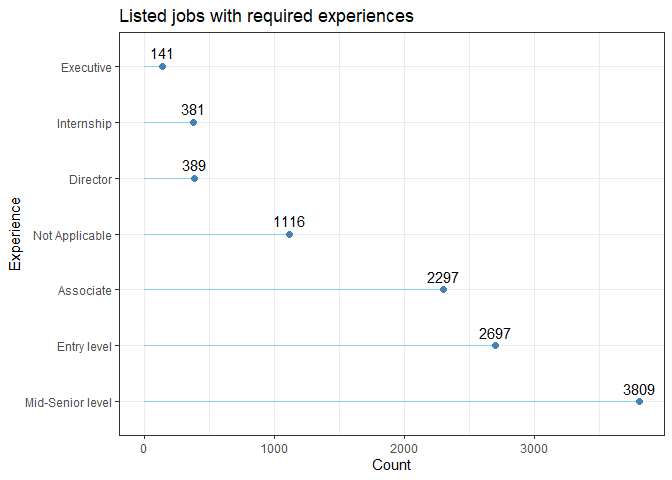
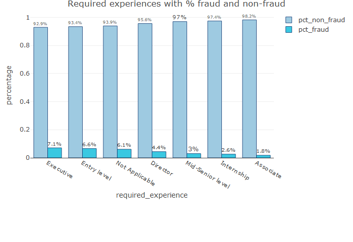

Fake Job Posting Analysis
================

# Introduction

Unlike the past when job seekers used newspapers to seek job
opportunities, job seekers nowadays use employment website such as
JobStreet, Linkedin, Indeed and countless due to advancement in modern
technology and social communication. The authenticity of job postings
has become critical with a constant increase in the number of job scams.
According to Habiba et all (2021), job advertisements which are fake and
steal personal & professional information of job seekers instead of
giving right jobs to them is known as job scam. Job scams often involve
fake online job ads in social platforms and untrusted job portals
offering high paying jobs. Victims may also receive unsolicited messages
from social media such as Whatsapp, Facebook, WeChat that offers jobs
that do not exist. For example, job scammers will ask victims to
disclose personal and/or banking details or transfer upfront fees to
secure a interview or more information about the fraud jobs. Due to the
growing concerns about job scams, our aim is to raise awareness of job
seekers in the job application process and give an early warning sign to
job seekers with Machine Learning (ML) and Natural Language Processing
(NLP) approaches.

# Objectives

-   To identify the key features of fraudulent job postings.
-   To build a model to classify real or fake job postings.

# Initial Questions

-   What are the key features/characteristics of fraudulent job
    postings?
-   Which classification model is the best to determine whether the job
    is real or not?

# Data Cleaning and Pre-processing

The dataset used in this project was published by the Employment Scam
Aegean Dataset (EMSCAD) and was retrieved from
[Kaggle](https://www.kaggle.com/datasets/shivamb/real-or-fake-fake-jobposting-prediction).
This data contains 17,880 observations out of which about 866 are fake,
and 18 features. The data consists of a combination of numeric and text
features. A brief description of the variables is given below:

| Variable            | Description                                              |
|---------------------|----------------------------------------------------------|
| job_id              | ID of each job posting                                   |
| title               | Description of position or job                           |
| location            | Where the job is located                                 |
| department          | Department of the job offered                            |
| salary_range        | Expected salary range                                    |
| company_profile     | Company information                                      |
| description         | Description about the position offered                   |
| requirements        | Pre-requisites to qualify for the job                    |
| benefits            | Benefits provided by the job                             |
| telecommuting       | Is work from home or remote work allowed                 |
| has_company_logo    | Does the post have a company logo                        |
| has_questions       | Does the post have any questions                         |
| employment_type     | Full-time, part-time, contract, temporary and others     |
| required_experience | Experience level, e.g. Entry level, Executive, Director… |
| required_education  | Education level, e.g. High School, Bachelor, Master…     |
| industry            | Relevant industry                                        |
| function            | Job’s functionality                                      |
| fraudulent          | Target variable (0: Real, 1: Fake)                       |

### Import libraries

### Load data

``` r
df <- read.csv("https://raw.githubusercontent.com/abbylmm/fake_job_posting/main/data/fake_job_postings.csv")
```

### Display n sample of the data

``` r
df_fake_job <- df
sample_n(df_fake_job, 3)
```

    ##   job_id                  title          location department   salary_range
    ## 1   2327           GM Contracts IN, AP, hyderabad  Contracts 800000-2000000
    ## 2  10567     Manager of Finance US, OH, Cleveland                          
    ## 3  12465 SAP Archive Specialist          US, PA,                           
    ##                                                                                                                                                                                                                        company_profile
    ## 1                                                                                                                                                                                                                                     
    ## 2 We Provide Full Time Permanent Positions for many medium to large US companies. We are interested in finding/recruiting high quality candidates in IT, Engineering, Manufacturing and other highly technical and non-technical jobs.
    ## 3                                                                                                                                                                                                                                     
    ##                                                                                                                                                                                                                                                                                                                                                                                                                                                                                                                                                                                                                                                                                                                                                                                                                                                                                                                                                                                                                                                                                                                                                                                                                                                                                                                                                                                                                                                        description
    ## 1                                                                                                                                                                                                                                                                                                                                                                                                                                                                                                                                                                                                                                                                                                                                                                                                                                          Job DescriptionSupport to Tendering, Estimation and Bidding ProcessContractual Correspondences with the Client and the major VendorsWell versed with preparation and finalization of following documents: Pre-Bid Memorandum of Understanding (MOU)Representation / Agency AgreementsContract Agreements (Commercial Part)Risk AnalysisTendering Documents (Commercial Part) Claim preparation, analysis, submission, negotiation and settlementDispute Resolution, Arbitration, other process of litigation through Court or other meansContract closing  Training in Contracts Management and Commercial acumen 
    ## 2 (We have more than 1500+ Job openings in our website and some of them are relevant to this job. Feel free to search it in the website and apply directly. Just Click the â\200œApply Nowâ\200\235 and you will redirect to our main website where you can search for the other jobs.)#URL_94f805e93a6fa859cd8540e9767e187e295d764a384221d77f8880142b6416b7#-#URL_dbdb917780b325918ec611d0f47d6a0dff5ee871b96bc71180616d0d0570925b#Job Requirements:Ideal candidate will have a min. Bachelor's degree, 5+ years of relevant and progressive leadership/management experience in a complex healthcare environment. Master's degree is a plus along with prior experience in a leadership role with a health plan. Extensive experience in managing and analyzing utilization trends (claims) is a must. Medicaid exp is a plus but not required.Specific duties include managing financial relationship between Health Plan and Hospital System â\200“ including payables and receivables between entities; monitoring and assessing UM trends for various populationsâ\200\231 bands; prepare reports and present financial outcomes to a board level audience. Ensures and fosters a high level of collaboration in order to coordinate activities, review work, exchange information, and resolve problems.Position will report to the Vice President of Health Plan Finance and report indirectly to the executive director of the Hospital system. Position is based downtown.
    ## 3                                                                                                                                                                                  Location:  PennsylvaniaDuration:  4 months Target       Start Date:  11/09/14Responsibilities: This       is a project for setting up a new Archiving system. Client will be using       IXOS  for SAP Archiving. Will need to propose a strategy. High level Tasks: Work with Client's SAP       Functional Team to identify the Archiving requirements and issues.       Resource will work with Client's SAP Functional Team to understand the       functional requirements being given for Archiving. Must be able to       explain the BASIS Archiving requirements &amp; issues in a non-technical       manner to the Functional users. Will work with Client BASIS teams to       discuss/verify existing archiving setups and modifications. Resource will       do the agreed modifications to the Archiving setups.   Skill Sets Needed: Resource must be self driven,       have excellent communication skills, both written and verbal. SAP       BASIS Expert in the area of Archiving with ability to understand SAP       Functional matters and communicate in a non-technical manner. Main       modules included in scope of Archiving are HR, FI, PP and IDOCS.
    ##                                                                                                                                                                               requirements
    ## 1 Experience in following SectorsRoadsMiningIrrigationPower Distribution &amp; TransmissionWater &amp; Waste Water; Oil &amp; GasRailwaysOther Infrastructure Building &amp; Constructions
    ## 2                                                                                                                                                                                         
    ## 3                                                                                                                                                                                         
    ##   benefits telecommuting has_company_logo has_questions employment_type
    ## 1                      1                1             0       Full-time
    ## 2                      0                0             0       Full-time
    ## 3                      0                0             0        Contract
    ##   required_experience required_education     industry        function.
    ## 1    Mid-Senior level  Bachelor's Degree Construction General Business
    ## 2                                          Accounting                 
    ## 3    Mid-Senior level                                                 
    ##   fraudulent
    ## 1          0
    ## 2          0
    ## 3          0

### Summary data

``` r
summary(df_fake_job)
```

    ##      job_id         title             location          department       
    ##  Min.   :    1   Length:17880       Length:17880       Length:17880      
    ##  1st Qu.: 4471   Class :character   Class :character   Class :character  
    ##  Median : 8940   Mode  :character   Mode  :character   Mode  :character  
    ##  Mean   : 8940                                                           
    ##  3rd Qu.:13410                                                           
    ##  Max.   :17880                                                           
    ##  salary_range       company_profile    description        requirements      
    ##  Length:17880       Length:17880       Length:17880       Length:17880      
    ##  Class :character   Class :character   Class :character   Class :character  
    ##  Mode  :character   Mode  :character   Mode  :character   Mode  :character  
    ##                                                                             
    ##                                                                             
    ##                                                                             
    ##    benefits         telecommuting    has_company_logo has_questions   
    ##  Length:17880       Min.   :0.0000   Min.   :0.0000   Min.   :0.0000  
    ##  Class :character   1st Qu.:0.0000   1st Qu.:1.0000   1st Qu.:0.0000  
    ##  Mode  :character   Median :0.0000   Median :1.0000   Median :0.0000  
    ##                     Mean   :0.0429   Mean   :0.7953   Mean   :0.4917  
    ##                     3rd Qu.:0.0000   3rd Qu.:1.0000   3rd Qu.:1.0000  
    ##                     Max.   :1.0000   Max.   :1.0000   Max.   :1.0000  
    ##  employment_type    required_experience required_education   industry        
    ##  Length:17880       Length:17880        Length:17880       Length:17880      
    ##  Class :character   Class :character    Class :character   Class :character  
    ##  Mode  :character   Mode  :character    Mode  :character   Mode  :character  
    ##                                                                              
    ##                                                                              
    ##                                                                              
    ##   function.           fraudulent     
    ##  Length:17880       Min.   :0.00000  
    ##  Class :character   1st Qu.:0.00000  
    ##  Mode  :character   Median :0.00000  
    ##                     Mean   :0.04843  
    ##                     3rd Qu.:0.00000  
    ##                     Max.   :1.00000

### Check all the missing values - ‘empty’

``` r
skim_without_charts(df_fake_job)
```

|                                                  |             |
|:-------------------------------------------------|:------------|
| Name                                             | df_fake_job |
| Number of rows                                   | 17880       |
| Number of columns                                | 18          |
| \_\_\_\_\_\_\_\_\_\_\_\_\_\_\_\_\_\_\_\_\_\_\_   |             |
| Column type frequency:                           |             |
| character                                        | 13          |
| numeric                                          | 5           |
| \_\_\_\_\_\_\_\_\_\_\_\_\_\_\_\_\_\_\_\_\_\_\_\_ |             |
| Group variables                                  | None        |

Data summary

**Variable type: character**

| skim_variable       | n_missing | complete_rate | min |   max | empty | n_unique | whitespace |
|:--------------------|----------:|--------------:|----:|------:|------:|---------:|-----------:|
| title               |         0 |             1 |   3 |   142 |     0 |    11231 |          0 |
| location            |         0 |             1 |   0 |   161 |   346 |     3106 |          0 |
| department          |         0 |             1 |   0 |   255 | 11547 |     1338 |          6 |
| salary_range        |         0 |             1 |   0 |    20 | 15012 |      875 |          0 |
| company_profile     |         0 |             1 |   0 |  6230 |  3308 |     1710 |          0 |
| description         |         0 |             1 |   3 | 22722 |     0 |    14802 |          0 |
| requirements        |         0 |             1 |   0 | 10921 |  2694 |    11970 |          0 |
| benefits            |         2 |             1 |   0 |  4489 |  7206 |     6207 |          0 |
| employment_type     |         0 |             1 |   0 |     9 |  3471 |        6 |          0 |
| required_experience |         0 |             1 |   0 |    16 |  7050 |        8 |          0 |
| required_education  |         0 |             1 |   0 |    33 |  8105 |       14 |          0 |
| industry            |         0 |             1 |   0 |    36 |  4903 |      132 |          0 |
| function.           |         0 |             1 |   0 |    22 |  6455 |       38 |          0 |

**Variable type: numeric**

| skim_variable    | n_missing | complete_rate |    mean |      sd |  p0 |     p25 |    p50 |      p75 |  p100 |
|:-----------------|----------:|--------------:|--------:|--------:|----:|--------:|-------:|---------:|------:|
| job_id           |         0 |             1 | 8940.50 | 5161.66 |   1 | 4470.75 | 8940.5 | 13410.25 | 17880 |
| telecommuting    |         0 |             1 |    0.04 |    0.20 |   0 |    0.00 |    0.0 |     0.00 |     1 |
| has_company_logo |         0 |             1 |    0.80 |    0.40 |   0 |    1.00 |    1.0 |     1.00 |     1 |
| has_questions    |         0 |             1 |    0.49 |    0.50 |   0 |    0.00 |    0.0 |     1.00 |     1 |
| fraudulent       |         0 |             1 |    0.05 |    0.21 |   0 |    0.00 |    0.0 |     0.00 |     1 |

### Split location to country, state, city and fill empty with NA

``` r
df_fake_job[c("country", "state", "city")] <- str_split_fixed(df_fake_job$location, ", ", 3)
df_fake_job[c("country", "state", "city")][df_fake_job[c("country", "state", "city")] == ""] <- NA
```

### Split salary_range to min_salary, max_salary and fill empty with NA

``` r
df_fake_job[c("min_salary", "max_salary")] <- str_split_fixed(df_fake_job$salary_range, "-", 2)
df_fake_job[c("min_salary", "max_salary")][df_fake_job[c("min_salary", "max_salary")] == ""] <- NA
```

### Drop location and salary_range

``` r
df_fake_job <- select(df_fake_job, -c(location, salary_range))
```

### View the structure of data

``` r
glimpse(df_fake_job)
```

    ## Rows: 17,880
    ## Columns: 21
    ## $ job_id              <int> 1, 2, 3, 4, 5, 6, 7, 8, 9, 10, 11, 12, 13, 14, 15,~
    ## $ title               <chr> "Marketing Intern", "Customer Service - Cloud Vide~
    ## $ department          <chr> "Marketing", "Success", "", "Sales", "", "", "ANDR~
    ## $ company_profile     <chr> "We're Food52, and we've created a groundbreaking ~
    ## $ description         <chr> "Food52, a fast-growing, James Beard Award-winning~
    ## $ requirements        <chr> "Experience with content management systems a majo~
    ## $ benefits            <chr> "", "What you will get from usThrough being part o~
    ## $ telecommuting       <int> 0, 0, 0, 0, 0, 0, 0, 0, 0, 0, 0, 0, 0, 0, 0, 0, 0,~
    ## $ has_company_logo    <int> 1, 1, 1, 1, 1, 0, 1, 1, 1, 1, 0, 1, 1, 1, 1, 1, 1,~
    ## $ has_questions       <int> 0, 0, 0, 0, 1, 0, 1, 1, 1, 0, 0, 0, 0, 1, 0, 1, 0,~
    ## $ employment_type     <chr> "Other", "Full-time", "", "Full-time", "Full-time"~
    ## $ required_experience <chr> "Internship", "Not Applicable", "", "Mid-Senior le~
    ## $ required_education  <chr> "", "", "", "Bachelor's Degree", "Bachelor's Degre~
    ## $ industry            <chr> "", "Marketing and Advertising", "", "Computer Sof~
    ## $ function.           <chr> "Marketing", "Customer Service", "", "Sales", "Hea~
    ## $ fraudulent          <int> 0, 0, 0, 0, 0, 0, 0, 0, 0, 0, 0, 0, 0, 0, 0, 0, 0,~
    ## $ country             <chr> "US", "NZ", "US", "US", "US", "US", "DE", "US", "U~
    ## $ state               <chr> "NY", NA, "IA", "DC", "FL", "MD", "BE", "CA", "FL"~
    ## $ city                <chr> "New York", "Auckland", "Wever", "Washington", "Fo~
    ## $ min_salary          <chr> NA, NA, NA, NA, NA, NA, "20000", NA, NA, NA, "1000~
    ## $ max_salary          <chr> NA, NA, NA, NA, NA, NA, "28000", NA, NA, NA, "1200~

``` r
class(df_fake_job)
```

    ## [1] "data.frame"

### View column names

``` r
names(df_fake_job)
```

    ##  [1] "job_id"              "title"               "department"         
    ##  [4] "company_profile"     "description"         "requirements"       
    ##  [7] "benefits"            "telecommuting"       "has_company_logo"   
    ## [10] "has_questions"       "employment_type"     "required_experience"
    ## [13] "required_education"  "industry"            "function."          
    ## [16] "fraudulent"          "country"             "state"              
    ## [19] "city"                "min_salary"          "max_salary"

### Check if any duplication id

``` r
table(duplicated(df_fake_job$job_id))
```

    ## 
    ## FALSE 
    ## 17880

There is no duplication id.

### Check for total missing values for each feature

``` r
colSums(is.na(df_fake_job))
```

    ##              job_id               title          department     company_profile 
    ##                   0                   0                   0                   0 
    ##         description        requirements            benefits       telecommuting 
    ##                   0                   0                   2                   0 
    ##    has_company_logo       has_questions     employment_type required_experience 
    ##                   0                   0                   0                   0 
    ##  required_education            industry           function.          fraudulent 
    ##                   0                   0                   0                   0 
    ##             country               state                city          min_salary 
    ##                 346                2580                2067               15012 
    ##          max_salary 
    ##               15013

There are two missing values in ‘benefits’ column.

### List rows with missing values

``` r
missingdf <- df_fake_job[!complete.cases(df_fake_job), ]
sample_n(missingdf, 3)
```

    ##   job_id                           title            department
    ## 1  13570          Line Cooks & Waitstaff                      
    ## 2  14326 Veterinary Assistant- Part-time Small Animal Hospital
    ## 3   4630        Chief Commercial Officer                 Sales
    ##                                                                                                                                                                                                                                                                                                                                                                                                                                                                                                                                                                                                                                                                                                                                                                                                                                                                                                                                                                                                                                                                                                                                                                                                                                                                                                                                                                                                                                                                                                                                                                    company_profile
    ## 1                                                                                                                                                                                                                                                                                                                                                                                                                                                                                                                                                                                                                                                                                                                                                                                                                                                                                                                                                                                                                                                                                                                                                                                                                                                                                                                                                                                                                                                                                                                                                                                 
    ## 2                                             The Central California SPCA (CCSPCA), established in 1946 and located in Fresno County, California, is a 501(c)(3) non-profit humane society.As the leading animal welfare organization in Californiaâ\200\231s Central Valley, we are committed to leading and serving our community of animals and people by providing programs and services which serve all the stages of an animalâ\200\231s life.  These programs include Adoptions, Rescue, Foster Care, Owner Surrenders, Outreach, Humane Education, Veterinary Services, Spay/Neuter programs, and Pet Services.The CCSPCA also assumes responsibility, by contract, to perform the Animal Control and Leash Law services for the City of Fresno dating back to September 1951. The modern facilities and our caring staff offer safe refuge, nourishment, medical care, and love to every animal in our Animal Center.  Free ambulance service and shelter is provided for lost or stray animals in the City of Fresno, or those owned but temporarily without homes because their owners can no longer keep them.Although the CCSPCA is contracted to conduct Animal Control Services and Rabies Control Enforcement within the Fresno City, we are not federally, state, or locally funded and do not receive aid from any national organization (including the ASPCA). The CCSPCA owns its own land, buildings, and equipment purchased with privately donated funds.  Our funds come from our loyal supporters, allowing us to provide many vital services to our community.
    ## 3 Axonix is a global mobile advertising technology company that's powered by a platform with a 4 year history of leading the market. Using technology acquired from Mobclix, the worldâ\200\231s first RTB-enabled mobile ad exchange, Axonix offers a fully transparent programmatic trading platform that enables publishers to sell their mobile advertising inventory in real-time to brands, agencies and ad networks globally.We serve billions of ads per month across more than 150+ countries, working with our 100+ demand partners globally to achieve industry-leading CPMs, CTRs and fill rates. With built-in fraud detection controls and data-driven targeting options, we help advertisers to secure the optimal ad inventory that will deliver the best campaign results for them.Axonix is headquartered in central London and backed by Telefonica and private equity group, Blackstone.OUR PHILOSOPHY TO HIRINGOur technology serves billions of mobile ads every month, across more than 150 countries. Our company is truly global in scale. We're growing so fast we need to hire the best people out there.People who thrive on fresh challenges. People who want to see their work make an impact, right away. People who demand a lot from themselves and others. We hire someone when weâ\200\231re sure â\200œThereâ\200\231s no better person for this job, and no better person weâ\200\231d rather work with.â\200\235We know people are our most important asset. If you're exceptional at what you do, we want to hear from you. The next stage in your career could start today.
    ##                                                                                                                                                                                                                                                                                                                                                                                                                                                                                                                                                                                                                                                                                                                                                                                                                                                                                                                                                                                                                                                                                                                                                                                                                                                                                                                                                                                                                                                                                                                                                                                                                                                                                                                                                                                                                                                                                                                                                                                                                                                                                                                                                                                                                                                                                                                                                                                                                                                     description
    ## 1                                                                                                                                                                                                                                                                                                                                                                                                                                                                                                                                                                                                                                                                                                                                                                                                                                                                                                                                                                                                                                                                                                                                                                                                                                                                                                                                                                                                                                                                                                                                                                                                                                                                                                                                                                                                                                                                                                                                                                                                                                                                                                                                                                            Callahanâ\200\231s West is a full service Restaurant and Bar featuring Pizza, Barbecue, Burgers, and more. We are a scratch kitchen seeking full and part time Line Cooks, and Wait Staff with one year of high volume experience.Applicants must be Dynamic, Presentable, and Reliable.
    ## 2                                                                                                                                                                                                                                                                                                                                                                                                                                                                                                                                                                                                                                                                                                                                                                                                                                                                                                                                                                                                                                                                                                                                                                                                                                                                                                                                                                                                                                                                                                                                                                                                                                                                                                                                                                                                                                                                                                                                                                                                                                              The CCSPCA Small Animal Hospital is seeking an Animal Care Assistant part-time. Candidate must be able to work Saturdays and holidays.   Experience required.  If interested, please email your resume to #EMAIL_0b09ffb2866d1711819bef2d81fb674843de1b89304e4769a2fd8f5e3215d238# or complete an application online on our website at #URL_66cf84470e0f9fd51df7d7eae211edf349f3a1e8b127045f3b70d4488c950437#.
    ## 3 To strengthen its new executive management team, Axonix is seeking a Chief Commercial Officer to lead the global sales and ad operations teams. This is a critical role within the business, reporting directly into the CEO and working as a member of the executive leadership team to formulate and execute the business acceleration strategy.The CCO will have full responsibility for ensuring the business achieves its revenue and operational KPIs and delivers best-in-class technical service, support and campaign analytics to its customers. The CCO will drive the global sales strategy and lead the business development and account management teams that will engage with both buy-side (advertisers, agencies and DSPs) and sell-side (web publishers and app developers) customers. In addition, the CCO will be responsible for ad operations to ensure the efficient and effective delivery of all ad inventory, including the onboarding of new publishers and buyers.As Axonix is a new business, the CCO will be tasked with recruiting the sales, account management and operations teams. The CCO will need to establish all necessary processes, policies, trading principals and sales documentation that will make Axonix the global best-in-class business for customer service, operational efficiency and ROI.Axonix is headquartered in London but is a global business, so it is likely that the CCO will be required to support the establishment of new sales offices and operational support teams in USA and Latin America.This is an exceptional opportunity for a talented and experienced Sales Director to move into an executive global leadership position in an exciting, new business. You will have managed sales teams supporting customers across Europe, USA and Latin America, with extensive experience working specifically with publishers, brands and/or agencies. You will have a deep familiarity with the programmatic advertising industry and will have had an operational focus to previous roles, with responsibility for the trafficking of online and/or mobile ad campaigns. You will be detail-orientated and proactive in identifying opportunities for the business, ensuring these are followed through with flawless execution.As with all small and entrepreneurial companies, the CCO will be expected to perform a multitude of tasks beyond the roleâ\200\231s core responsibilities. 
    ##                                                                                                                                                                                                                                                                                                                                                                                                                                                                                                                                                                                                                                                                                                                                                                                                                                                                                                                                                                                                                                                                                                                                                                                                                                                                                                                                                                                                                                                                                                                                                                                                                                                                                                                                                                                                                                                                                                                                                                                                                                                                                                                                                                                                                                                                                                                                                                                                                                                                                                                                                                                                                                                                                                                                                                                                                                                                                                                                                                                                                                                                                                                                                                                                                                                                                                                                                                                                                                                                                                                                                                                                                                                                                                                                                                                                                                                                                                                                                                                                                                                                                                                                                                                                                                                                                                                                                                                                                                                                                                   requirements
    ## 1                                                                                                                                                                                                                                                                                                                                                                                                                                                                                                                                                                                                                                                                                                                                                                                                                                                                                                                                                                                                                                                                                                                                                                                                                                                                                                                                                                                                                                                                                                                                                                                                                                                                                                                                                                                                                                                                                                                                                                                                                                                                                                                                                                                                                                                                                                                                                                                                                                                                                                                                                                                                                                                                                                                                                                                                                                                                                                                                                                                                                                                                                                                                                                                                                                                                                                                                                                                                                                                                                                                                                                                                                                                                                                                                                                                                                                                                                                                                                                                                                                                                                                                                                                                                                                                                                                                                                                                                                                                                                                             
    ## 2                                                                                                                                                                                                                                                                                                                                                                                                                                                                                                                                                                                                                                                                                                                                                                                                                                                                                                                                                                                                                                                                                                                                                                                                                                                                                                                                                                                                                                                                                                                                                                                                                                                                                                                                                                                                                                                                                                                                                                                                                                                                                                                                                                                                                                                                                                                                                                                                                                                                                                                                                                                                                                                                                                                                                                                                                                                                                                                                                                                                                                                                                                                                                                                                                                                                                                                                                                                                                                                                                                                                                                                                                                                                                                                                                                                                                                                                                                                                                                                                                                                                                                                                                                                                            Experience required. Must be able to lift over 50 pounds and have basic computer skills. Must be able to work weekends and holidays. Must be able to maintain a calm and professional demeanor in a fast-paced environment. Must communicate clearly and concisely, both orally and in writing. 
    ## 3 Core role objectivesRecruit, lead, develop and manage the global sales, account management and operations organization, to become a high performing team that is recognized as delivering world-class performance, service and customer engagement. Own the development and execution of the global sales strategy to ensure Axonix achieves or exceeds its sales, volume and margin targets.Own all post-sales operational processes, including new customer onboarding and technical integration, inventory management and optimisation, customer service and technical support.Define key advertiser &amp; publisher contract terms, including pricing and annual trading deals, to maximise sales effectiveness and gross profitability.Champion a customer-led approach to sales, product development and all operational processes through a deep understanding of customersâ\200\231 feature &amp; service requirements and competitorsâ\200\231 products.Evangalise and promote Veyron across the mobile advertising industry.Key responsibilities - SalesAchieve the revenue, volume and margin targets for the business.Recruit and lead the Demand-Side and Supply-Side sales teams, and the Post-Sales Account Management team, to be recognized externally as best-in-class. Define account priorities, account plans, sales targets and other KPIs for each sales team member.Identify and prioritise target publishers, brands, agencies, networks and trading desks, and ensure effective marketing and sales engagement to acquire their business.Engage with executive management at Tier 1 customers to establish long-term, trusted relationships.Define and negotiate contract terms, including pricing and annual trading deals.Engage with Telefonicaâ\200\231s Advertising business leadership at global, regional and local levels to agree and execute business development collaboration strategies.Evaluate customer requirements and competitor solutions to help prioritise the product development roadmap.Secure speaking slots at industry events and conferences.Work with the other executive managers to develop, refine and execute the wider company business plan. Key responsibilities - OperationsAchieve the inventory utilization, platform availability and customer service targets for the business.Recruit and manage the Customer Onboarding and Ad Operations teams to ensure Axonix is regarded as leading the industry for customer service.Establish and regularly review all workflow processes to maintain efficient operations and effective integration across departments. Establish escalation, tracking &amp; resolution processes for technical issues impacting business performance to ensure these are rapidly addressed. Personal qualities and experience weâ\200\231re looking forBA/BS degree (Masters or MBA an advantage)Proven senior-level sales leadership experience, ideally in an international role â\200“ minimum 3 years at Sales Director level or above and with a history of exceeding sales targetsDeep understanding of the programmatic / real-time buying advertising industry, ideally having previously worked for a competitor or agency trading desk â\200“ minimum 2 years in this industry, minimum 5 years in the digital advertising industryExtensive knowledge of ad serving, ad exchange, DSP, DMP and SSP technologies and the procedures for trafficking ad campaigns using these platformsStrong strategic leadership skills, with an exceptional reputation for developing visionary strategies with a rigorous attitude to execution.Team management - Experience of recruiting and managing large teams of at least 10 people, with highly positive feedback from previous direct reportsProcess optimization experience, with a history of delivering measurable operational performance improvementStrong communicator, presenter and public speaker â\200“ with experience of presenting at large conferencesHighly personable, with strong interpersonal communications skills, able to work in a small, highly collaborative team environmentEntrepreneurial spirit, self-starter attitude &amp; highly adaptable â\200“ able to use own initiative to prioritise, multi-task and deliver under pressure within a fast-paced start-up environmentProven high achiever â\200“ with a passion for personal developmentLanguages â\200“ Fluency in English essential; business-level Spanish or Portuguese an advantage but not essential
    ##                                                                                                        benefits
    ## 1                                                                                                              
    ## 2                                                                                                              
    ## 3 Competitive salary according to experienceAnnual bonus schemeGenerous flexible benefits packageEquity package
    ##   telecommuting has_company_logo has_questions employment_type
    ## 1             0                0             0                
    ## 2             0                1             0       Full-time
    ## 3             0                1             1       Full-time
    ##   required_experience        required_education                  industry
    ## 1                                                             Restaurants
    ## 2         Entry level High School or equivalent                Veterinary
    ## 3           Executive         Bachelor's Degree Marketing and Advertising
    ##   function. fraudulent country state   city min_salary max_salary
    ## 1                    0      US    KS Lenexa       <NA>       <NA>
    ## 2                    0      US    CA Fresno       <NA>       <NA>
    ## 3     Sales          0      GB  <NA> London     110000     125000

### Visualize missing rates for each feature

``` r
gg_miss_var(df_fake_job, show_pct = TRUE) + labs(y = "% Missing")
```

<!-- -->

### Merge columns and create a new ‘full_text’ column

``` r
viz_df <- select(df_fake_job, -c(max_salary, min_salary, state, city))
viz_df$full_text <- 
  paste(na.omit(viz_df$title), 
        na.omit(viz_df$country), 
        na.omit(viz_df$department), 
        na.omit(viz_df$company_profile), 
        na.omit(viz_df$description), 
        na.omit(viz_df$requirements), 
        na.omit(viz_df$benefits), 
        na.omit(viz_df$employment_type), 
        na.omit(viz_df$required_experience), 
        na.omit(viz_df$required_education), 
        na.omit(viz_df$industry), 
        na.omit(viz_df$function.))
viz_df[viz_df == ""] <- NA
```

### Visualize missing profile for each feature

``` r
plot_missing(viz_df)
```

<!-- -->

### Heatplot of missingness across the dataframe

``` r
vis_miss(viz_df)
```

<!-- -->

### Drop columns

``` r
model_df <- select(viz_df, 
                   -c(title, 
                      country, 
                      department, 
                      company_profile, 
                      description, 
                      requirements, 
                      benefits, 
                      employment_type, 
                      required_experience, 
                      required_education, 
                      industry, 
                      function.))
sample_n(model_df, 3)
```

    ##   job_id telecommuting has_company_logo has_questions fraudulent
    ## 1   8881             0                1             1          0
    ## 2  17381             0                1             1          0
    ## 3  12114             0                0             0          0
    ##                                                                                                                                                                                                                                                                                                                                                                                                                                                                                                                                                                                                                                                                                                                                                                                                                                                                                                                                                                                                                                                                                                                                                                                                                                                                                                                                                                                                                                                                                                                                                                                                                                                                                                                                                                                                                                                                                                                                                                                                                                                                                                                                                                                                                                                                                                                                                                                                                                                                                                                                                                                                                                                                                                                                                                                                                                                                                                                                                                                                                                                                                                                                                                                                                                                                   full_text
    ## 1                                                                                                                                                                                                                                                                                                                                                                                                                                                                                                                                                                                                                                                                                                                                                                                                                                                                                                                                                                                                                                                                                                                                                                                                                                                                                                                                                                                                                                                                                                                                                                                                                                                                                                                                                                                                                                                                                                                                                                                                                Acquisition Marketing Manager - Netlog US  Massive Media is the social media company behind the successful digital brands #URL_18234f381f5e7b9a9ffdc727cd05c9046edffb45bce85533c8f9b6d0216e925e# and #URL_af2b2f34d003dd6238fb60ec002a2f9df551ec9f8c6df8c980fc4fd8d24cc707#. In November 2013 Massive Media bought and relaunched the social discovery platform Stepout. We enable members to meet nearby people instantly. Over 100 million people have joined our sites on web and mobile. Can you provide analytical thought leadership to set-up and manage member acquisition programs?     Do you want to help us build a world-class marketing plan to find, target and sollicit new members in specific segments?      Would you love to set-up external communication and co-marketing plans in the on-line space in order to drive traffic and registrations?     Can we trust on you to create well-balanced strategic partnerships with the right global partners in on-line (youth) media and entertainment?     Are you ready to rock and roll?Letâ\200\231s dance!Apply now.  Three weeks paid vacationCell phone reimbursementPaid sick and personal leaveHealth Insurance Retirement plan with 3% company matchQuarterly bonus plan     
    ## 2 Vice President US  We are a PR and social media agency that goes ALL IN to create campaigns people can't stop talking about for major consumer brands.  DBC PR+Social Media is an elite, fast-growing boutique public relations agency specializing in consumer public relations. We are seeking a Vice President to manage clients, conduct media relations and mentor our team.PRIMARY RESPONSIBILITIES- Participate in building strong working relationships with clients, serving as the day-to-day contact- Drive the day-to-day execution of PR, social media and integrated communications programs, working within the account teams to ensure client objectives are achieved and agency business goals are met- Develop and execute national and local market PR events- Assist with and manage media outreach including proactive and reactive media pitching- Manage news and media coverage monitoring and analysis, providing weekly updates and monthly PR coverage and measurement report- Oversee client budgets and work with SVP to bill clients accordingly and manage team memberâ\200\231s utilization- Participate in new business development, including research &amp; presentation development- Demonstrate a desire to work in a fast-paced, creative agency environment where all  members roll up their sleeves and pitch in- Understand and implement the agencyâ\200\231s dedication to client service- Write and edit marketing materials across multiple mediums- Mentor junior team members- Work nicely with othersBenefitsDBC is happy place to work.  We offer a number of benefits, including:- A respectful flexible work environment that is family friendly- Summer hours- Healthcare (Health, Dental, Vision)- 401(k) - Great vacation benefits- MacBook Air's  The ideal candidate must demonstrate the following skills/experience: 9+ years demonstrated public relations experiencePR agency experience requiredAble to formulate strategy and plansForward-thinking self starter who is driven to provide results and solve problemsAbility to generate creative ideas and willingness to chase big, bold ideasDemonstrated success in creating and implementing large scale consumer PR campaignsExcellent planning and project management skills, including delegation of tasks to appropriate staffExpertise working on a variety of different projects on behalf of different clients while meeting all individual deadlines and deliverablesHave a proven track record of successful media outreach to national and local media outletsExcellent communication, presentation and client relation skillsSuperior writing skillsDetail oriented, reliable and flexibleSpecial event logistics and planning experience (media events, conferences &amp; meetings)Motivated self-starter with the ability to work independently and on a teamProficient computer skills including MS Word, Excel &amp; PowerPoint [Mac]The desire and ability to travel to client meetings and events; total travel is approximately 20%Bachelorâ\200\231s degree in Communications, Public Relations, Journalism, English, Marketing, or a related field.  Full-time Executive Bachelor's Degree Public Relations and Communications Public Relations
    ## 3                                                                                                                                                                                                                                                                                                                                                                                                                                                                                                                                                                                                                                                                                                                                                                                                                                                                                                                                                                                                                                                                                                                                                                                                                                                                                                                                                                                                                                                                                                                                                                                                                                                                                                                                                                                                                                                                                                                                                                                                                                                                                                                                         Quality Assurance Manager NL  We Provide Full Time Permanent Positions for many medium to large US companies. We are interested in finding/recruiting high quality candidates in IT, Engineering, Manufacturing and other highly technical and non-technical jobs. (We have more than 1500+ Job openings in our website and some of them are relevant to this job. Feel free to search it in the website and apply directly. Just Click the â\200œApply Nowâ\200\235 and you will redirect to our main website where you can search for the other jobs.)Will develop the ESL (extended shelf life) HACCP program.Qualifications:â\200¢ Bachelors degree 5-10 years of relevant experience(We have more than 1500+ Job openings in our website and some of them are relevant to this job. Feel free to search it in the website and apply directly. Just Click the â\200œApply Nowâ\200\235 and you will redirect to our main website where you can search for the other jobs.) Visit - #URL_ec64af2b4fe2ca316e828f93b0cd098c22f8beba98dcac09d4dd7384b221a5e8#-#URL_2954b76adf23051d4bc35fc729f5a18c5de715ed82dfaee24b3aabbf3874ca57#    Full-time

### Check NA or missing values

``` r
sum(is.na(model_df))
```

    ## [1] 0

``` r
sum(model_df == "")
```

    ## [1] 0

### Visualize missing values

``` r
vis_miss(model_df)
```

<!-- -->

``` r
vis_dat(model_df)
```

<!-- -->

# Exploratory Data Analysis (EDA)

Before building our models, we performed exploratory data analysis to
understand the dataset.

## Visualize fraud and real

``` r
viz_df2 <- viz_df
viz_df2$fraudulent[viz_df2$fraudulent == 1] <- "Fraud"
viz_df2$fraudulent[viz_df2$fraudulent == 0] <- "Non Fraud"
count <- table(viz_df2$fraudulent)
bar <- barplot(count, 
               main="Proportion of fraudulent job postings", 
               xlab="fraudulent", 
               ylab="count", 
               col=c(rgb(0.3,0.1,0.4,0.6), rgb(0.3,0.9,0.4,0.6)))
text(bar, count/2, labels = count)
```

<!-- -->

It is observable that there are 17,014 cases of legitimate job postings,
while the number of fraudulent job postings is 866. The fraud rate of
this dataset is 4.84%.

## Visualize country-wise job postings

``` r
temp <- na.omit(subset(viz_df, select = c(country))) %>% 
  group_by(country) %>% 
  summarize(n = n()) %>% 
  arrange(desc(n)) %>% 
  top_n(10, n)

par(mar=c(6,4,4,4))
barplot(height=temp$n, 
        main="Top 10 country-wise job postings", 
        ylab="count", 
        col=brewer.pal(10, "Set3"), 
        names.arg=c("United States",
                    "United Kingdom",
                    "Greece",
                    "Canada",
                    "Germany",
                    "New Zealand",
                    "India",
                    "Australia",
                    "Philippines",
                    "Netherlands"), 
        cex.names=0.7, 
        las=2)
```

<!-- -->

Top 10 countries with most of the number of job postings are US, GB, GR,
CA, DE, NZ, IN, AU, PH, NL. United States listed 10,656 job postings,
followed by 2,384 for United Kingdom and 940 for Greece.

## Visualize the industries

``` r
temp <- na.omit(subset(viz_df, select = c(industry))) %>% 
  group_by(industry) %>% 
  summarize(n = n()) %>% 
  arrange(desc(n)) %>% 
  top_n(10, n)

par(mar=c(10,4,4,4))
barplot(height=temp$n, 
        names=temp$industry, 
        main="Top 10 industries", 
        ylab="count", 
        col=brewer.pal(10, "Set3"), 
        cex.names=0.6, 
        las=2)
```

<!-- -->

Most job openings are IT related such as Information Technology and
Services (1,734), Computer Software (1,376) and Internet (1,062).

## Visualize the departments

``` r
temp <- na.omit(subset(viz_df, select = c(department))) %>% 
  group_by(department) %>% 
  summarize(n = n()) %>% 
  arrange(desc(n)) %>% 
  top_n(10, n)

par(mar=c(8,4,4,4))
barplot(height=temp$n, 
        names=temp$department, 
        main="Top 10 departments", 
        ylab="count", 
        col=brewer.pal(10, "Set3"), 
        cex.names=0.6, 
        las=2)
```

<!-- -->

Top hiring departments are Sales (551), Engineering (487) and Marketing
(401).

## Visualize the required experiences in the jobs

``` r
viz_df %>% group_by(required_experience) %>% 
  summarize(n = n()) %>% 
  arrange(desc(n)) %>% 
  drop_na() %>% 
  top_n(10, n) %>% 
  ggplot(aes(x=reorder(required_experience, -n), y = n)) + 
  geom_segment(aes(x=reorder(required_experience, -n), xend=reorder(required_experience, -n), y=0, yend=n), color="skyblue") + 
  geom_point(color="steelblue", size=2, alpha=1) + 
  theme_light() + 
  coord_flip() + 
  theme(panel.grid.major.y = element_blank(), 
        panel.border = element_blank(), 
        axis.ticks.y = element_blank()) + 
  theme_bw() + labs(title = "Listed jobs with required experiences", 
                    x = "Experience", 
                    y = "Count", 
                    fill = "Experience") + 
  geom_text(aes(label=round(n,0)), vjust=-0.6)
```

<!-- -->

Mid-Senior level jobs are in demand, followed by entry level and
associate.

## Visualize the required education in the jobs

``` r
viz_df %>% group_by(required_education) %>% 
  summarize(n = n()) %>% 
  arrange(desc(n)) %>% 
  drop_na() %>% 
  top_n(10, n) %>% 
  ggplot(aes(x=reorder(required_education, -n), y = n)) + 
  geom_segment(aes(x=reorder(required_education, -n), xend=reorder(required_education, -n), y=0, yend=n), color="skyblue") + 
  geom_point(color="steelblue", size=2, alpha=1) + 
  theme_light() + 
  coord_flip() + 
  theme(panel.grid.major.y = element_blank(), 
        panel.border = element_blank(), 
        axis.ticks.y = element_blank()) + 
  theme_bw() + labs(title = "Listed jobs with required education", 
                    x = "Education", 
                    y = "Count", 
                    fill = "Education") + 
  geom_text(aes(label=round(n,0)), vjust=-0.6)
```

<!-- -->

Most of the education requirements in job ads are at least Bachelor’s
degree.

## Visualize fraudulent job postings based on employment types

``` r
viz_df2 <- viz_df
viz_df2$employment_type <- ifelse(is.na(viz_df2$employment_type), "Missing", viz_df2$employment_type)
df1 <- subset(viz_df2, select = c(employment_type, fraudulent)) %>% 
  group_by(employment_type, fraudulent) %>% 
  summarize(yes = sum(fraudulent==1), .groups = 'drop') %>% 
  filter(fraudulent==1)
df2 <- subset(viz_df2, select = c(employment_type, fraudulent)) %>% 
  group_by(employment_type, fraudulent) %>% 
  summarize(no = sum(fraudulent==0), .groups = 'drop') %>% 
  filter(fraudulent==0)
df_new <- merge(df1, df2, by = c("employment_type")) %>% 
  group_by(employment_type) %>% 
  summarize(pct_fraud = round(yes/(yes+no), digits=3), 
            pct_non_fraud = 1-pct_fraud, .groups = 'drop') %>% 
  mutate(employment_type = factor(employment_type, 
                                  levels = c('Part-time',
                                             'Missing',
                                             'Other',
                                             'Full-time',
                                             'Contract',
                                             'Temporary')))
fig <- df_new %>% plot_ly(width = 700, height = 400)
fig <- fig %>% add_trace(x = ~employment_type, y = ~pct_non_fraud, type = 'bar', 
             text = ~paste0(pct_non_fraud*100,"%"), textposition = 'outside', name = 'pct_non_fraud', 
             marker = list(color = 'rgb(158,202,225)', 
                           line = list(color = 'rgb(8,48,107)', width = 0.8)))
fig <- fig %>% add_trace(x = ~employment_type, y = ~pct_fraud, type = 'bar', 
            text = ~paste0(pct_fraud*100,"%"), textposition = 'outside', name = 'pct_fraud', 
            marker = list(color = 'rgb(58,200,225)', 
                          line = list(color = 'rgb(8,48,107)', width = 0.8)))
fig <- fig %>% layout(title = "Employment types with % fraud and non-fraud",
         barmode = 'group',
         xaxis = list(title = "employment_type"),
         yaxis = list(title = "percentage"))
fig
```

<!-- -->

The percentage of fraudulent job postings is the highest for part-time
jobs, nearly 9%. Jobs without an employment type also have a high fraud
rate, around 7%.

## Visualize fraudulent job postings based on required experiences

``` r
viz_df2 <- viz_df
viz_df2$required_experience <- ifelse(is.na(viz_df2$required_experience), "Not Applicable", viz_df2$required_experience)
df1 <- subset(viz_df2, select = c(required_experience, fraudulent)) %>% 
  group_by(required_experience, fraudulent) %>% 
  summarize(yes = sum(fraudulent==1), .groups = 'drop') %>% 
  filter(fraudulent==1)
df2 <- subset(viz_df2, select = c(required_experience, fraudulent)) %>% 
  group_by(required_experience, fraudulent) %>% 
  summarize(no = sum(fraudulent==0), .groups = 'drop') %>% 
  filter(fraudulent==0)
df_new <- merge(df1, df2, by = c("required_experience")) %>% 
  group_by(required_experience) %>% 
  summarize(pct_fraud = round(yes/(yes+no), digits=3), 
            pct_non_fraud = 1-pct_fraud, .groups = 'drop') %>% 
  mutate(required_experience = factor(required_experience, 
                                      levels = c('Executive',
                                                 'Entry level',
                                                 'Not Applicable',
                                                 'Director',
                                                 'Mid-Senior level',
                                                 'Internship',
                                                 'Associate')))
fig <- df_new %>% plot_ly(width = 700, height = 400)
fig <- fig %>% add_trace(x = ~required_experience, y = ~pct_non_fraud, type = 'bar', 
             text = ~paste0(pct_non_fraud*100,"%"), textposition = 'outside', name = 'pct_non_fraud', 
             marker = list(color = 'rgb(158,202,225)', 
                           line = list(color = 'rgb(8,48,107)', width = 0.8)))
fig <- fig %>% add_trace(x = ~required_experience, y = ~pct_fraud, type = 'bar', 
            text = ~paste0(pct_fraud*100,"%"), textposition = 'outside', name = 'pct_fraud', 
            marker = list(color = 'rgb(58,200,225)', 
                          line = list(color = 'rgb(8,48,107)', width = 0.8)))
fig <- fig %>% layout(title = "Required experiences with % fraud and non-fraud",
         barmode = 'group',
         xaxis = list(title = "required_experience"),
         yaxis = list(title = "percentage"))
fig
```

<!-- -->

Most executive or entry level jobs that require minimum qualifications
and little experience have highest fraud rate, nearly 7%.

## Visualize fraudulent job postings based on job functions

``` r
viz_df2 <- viz_df
viz_df2$fraudulent[viz_df2$fraudulent == 1] <- "Fraud"
viz_df2$fraudulent[viz_df2$fraudulent == 0] <- "Non Fraud"
temp <- na.omit(subset(viz_df2, select = c(function., fraudulent))) %>% 
  group_by(function., fraudulent) %>% 
  summarize(n = n(), .groups = 'drop') %>% 
  group_by(function.) %>% 
  summarize(pct_fraud = round(sum(n[fraudulent=="Fraud"]/sum(n)), digits=3), 
            pct_non_fraud = 1-pct_fraud, .groups = 'drop') %>% 
  arrange(desc(pct_fraud)) %>% 
  top_n(10, pct_fraud) %>% 
  mutate(function. = factor(function., 
                            levels = c('Administrative',
                                       'Financial Analyst',
                                       'Accounting/Auditing',
                                       'Distribution',
                                       'Other',
                                       'Finance',
                                       'Engineering',
                                       'Business Development',
                                       'Advertising',
                                       'Customer Service')))
melted_temp <- melt(temp, id = "function.")
ggplot(melted_temp, aes(x = function., y = value, fill = variable)) + 
  geom_bar(position = "fill", 
           stat = "identity", 
           color = "black", 
           width = 0.8) + 
  theme(axis.text.x = element_text(angle = 90, hjust = 1, vjust = 0.6)) + 
  scale_y_continuous(labels = scales::percent) + 
  geom_text(aes(label = paste0(value*100,"%")), 
            position = position_stack(vjust = 0.6), size = 2) + 
  ggtitle("Job functions with % fraud and non-fraud") + 
  xlab("function") + 
  ylab("percentage")
```

<!-- -->

The function with highest fraudulent job postings is Administrative,
close to 19%, followed by Financial Analyst, Accounting/Auditing. Admin
jobs seem most suspicious. Possibly, it’s easy for scammers to disguise
their scams.

## Visualize fraudulent job postings based on required education

``` r
temp <- na.omit(subset(viz_df2, select = c(required_education, fraudulent))) %>% 
  group_by(required_education, fraudulent) %>% 
  summarize(n = n(), .groups = 'drop') %>% 
  group_by(required_education) %>% 
  summarize(pct_fraud = round(sum(n[fraudulent=="Fraud"]/sum(n)), digits=3), 
            pct_non_fraud = 1-pct_fraud, .groups = 'drop') %>% 
  arrange(desc(pct_fraud)) %>% 
  top_n(10, pct_fraud) %>% 
  mutate(required_education = factor(required_education, 
                                     levels = c("Some High School Coursework",
                                                "Certification",
                                                "High School or equivalent",
                                                "Master's Degree",
                                                "Professional",
                                                "Unspecified",
                                                "Doctorate",
                                                "Some College Coursework Completed",
                                                "Associate Degree",
                                                "Bachelor's Degree")))
melted_temp <- melt(temp, id = "required_education")
ggplot(melted_temp, aes(x = required_education, y = value, fill = variable)) + 
  geom_bar(position = "fill", 
           stat = "identity", 
           color = "black", 
           width = 0.8) + 
  theme(axis.text.x = element_text(angle = 90, hjust = 1, vjust = 0.6)) + 
  scale_y_continuous(labels = scales::percent) + 
  geom_text(aes(label = paste0(value*100,"%")), 
            position = position_stack(vjust = 0.6), size = 2) + 
  ggtitle("Required education with % fraud and non-fraud") + 
  xlab("required_education") + 
  ylab("percentage")
```

<!-- -->

As high as 74% of fake jobs require little educational credentials -
“Some High School Coursework”.

## Word Cloud

To visualize the fraud and real job postings, the WordCloud is used to
see the top occurring keywords in the data. To do so, fraud and real job
postings are separated into two text files and WordCloud has plotted
accordingly.

### Word Cloud of fraudulent job postings

``` r
selected_df <- subset(viz_df, fraudulent == 1)

# Create a vector containing only the text
text <- selected_df$title

# Create a corpus
docs <- Corpus(VectorSource(text))

docs <- docs %>%
  tm_map(removeNumbers) %>%
  tm_map(removePunctuation) %>%
  tm_map(stripWhitespace)
docs <- tm_map(docs, content_transformer(tolower))
docs <- tm_map(docs, removeWords, stopwords("english"))

dtm <- TermDocumentMatrix(docs)
matrix <- as.matrix(dtm)
words <- sort(rowSums(matrix), decreasing=TRUE)
df <- data.frame(word = names(words), freq=words)

wordcloud(words = df$word, freq = df$freq, min.freq = 1, max.words = 200, random.order = FALSE, rot.per = 0.35, colors = brewer.pal(8, "Dark2"))
```

<!-- -->

Many of the fraudulent job postings have common keywords in the job
titles - “Data Entry”, “Administrative”, “Home Based”, “Earn Daily”.

### Word Cloud of NON-fraudulent job postings

``` r
selected_df <- subset(viz_df, fraudulent == 0)

# Create a vector containing only the text
text <- selected_df$title

# Create a corpus
docs <- Corpus(VectorSource(text))

docs <- docs %>%
  tm_map(removeNumbers) %>%
  tm_map(removePunctuation) %>%
  tm_map(stripWhitespace)
docs <- tm_map(docs, content_transformer(tolower))
docs <- tm_map(docs, removeWords, stopwords("english"))

dtm <- TermDocumentMatrix(docs)
matrix <- as.matrix(dtm)
words <- sort(rowSums(matrix), decreasing=TRUE)
df <- data.frame(word = names(words), freq=words)

wordcloud(words = df$word, freq = df$freq, min.freq = 1, max.words = 200, random.order = FALSE, rot.per = 0.35, colors = brewer.pal(8, "Dark2"))
```

<!-- -->

Many of the NON-fraudulent job postings have common keywords in the job
titles - “Manager”, “Developer”, “Engineer”.

# Modeling

Before modeling, a final dataset is determined. This project will use a
dataset with these features for the final analysis:

-   fraudulent (target variable)
-   telecommuting
-   has_company_logo
-   has_questions
-   full_text: a combination of title, country, department,
    company_profile, description, requirements, benefits,
    employment_type, required_experience, required_education, industry
    and function

Five supervised machine learning algorithms used in the project are:

-   Logistic Regression
-   Random Forest
-   K-Nearest Neighbor (KNN)
-   XGBoost
-   Support Vector Machine (SVM)

## Data pre-process (full_text)

For this analysis, the entire full_text column is converted to a
DocumentTermMatrix and then convert to a dataframe.

``` r
docs <- Corpus(VectorSource(model_df$full_text))
docs <- docs %>%
  tm_map(removeNumbers) %>% # Remove numbers
  tm_map(removePunctuation) %>% # Remove punctuation
  tm_map(stripWhitespace) # Eliminate extra white spaces
docs <- tm_map(docs, content_transformer(tolower))
docs <- tm_map(docs, removeWords, stopwords("english"))

# Convert each full_text into a row with columns containing each term in the document and giving the frequency of unique words used in the full_text
dtm <- DocumentTermMatrix(docs)
sparse_data <- removeSparseTerms(dtm, 0.90) # Remove sparse data
```

``` r
# Convert to dataframe for further analysis
sparse_data_df <- as.data.frame(as.matrix(sparse_data))
final_df <- subset(sparse_data_df, select = -c(`–`))

# Add other variables
final_df$telecommuting <- model_df$telecommuting
final_df$has_company_logo <- model_df$has_company_logo
final_df$has_questions <- model_df$has_questions
final_df$fraudulent <- model_df$fraudulent
```

### View the dimension of the dataframe

``` r
dim(final_df)
```

    ## [1] 17880   313

``` r
# 17880 rows, 313 columns
```

### Visualize data

``` r
# Histogram
par(mfrow=c(2,2))
for(i in 310:313) {
    hist(final_df[,i], main=names(final_df)[i], border="blue", col="yellow")
}
```

<!-- -->

``` r
# Boxplot
par(mfrow=c(2,2))
for(i in 310:313) {
    boxplot(final_df[,i], main=names(final_df)[i], border="blue", col="yellow")
}
```

<!-- -->

## Correlation

A correlation matrix is created to visualize the numeric data
relationship.

``` r
# Calculate the correlation between each pair of numeric variables
selected_df <- final_df[, 310:313]
corr_df <- round(cor(selected_df), 2)
corr_df
```

    ##                  telecommuting has_company_logo has_questions fraudulent
    ## telecommuting             1.00            -0.02          0.02       0.03
    ## has_company_logo         -0.02             1.00          0.23      -0.26
    ## has_questions             0.02             0.23          1.00      -0.09
    ## fraudulent                0.03            -0.26         -0.09       1.00

Visualize correlation heatmap

``` r
# Reduce the size of correlation matrix
melted_corr_mat <- melt(corr_df)

# Plot the correlation heatmap
ggplot(data = melted_corr_mat, aes(x = Var1, y = Var2, fill = value)) + 
  geom_tile() + 
  geom_text(aes( label = value), color = "black", size = 4)
```

<!-- -->

It can be seen that all features are not highly correlated, however
has_company_logo and has_questions have negative correlation with
fraudulent. This indicates that if the job posting has a company logo or
with questions, the likelihood of fraudulent decreases.

## Split data into 70% training, 30% testing

``` r
# Using the same seed value, reproduce the division of the training and testing sets
set.seed(123)
train_index <- sample(dim(final_df)[1], 0.7 * dim(final_df)[1])
model_dftrain<- final_df[train_index, ]
model_dftest <- final_df[-train_index, ]
paste("train sample size: ", dim(model_dftrain)[1])
```

    ## [1] "train sample size:  12516"

``` r
paste("test sample size: ", dim(model_dftest)[1])
```

    ## [1] "test sample size:  5364"

### View training set

``` r
sample_n(model_dftrain, 3)
```

    ##       also amp andor around attention best big business communication company
    ## 17169    0   0     0      0         0    1   0        0             0       0
    ## 3482     0   0     0      0         0    0   0        1             0       0
    ## 9043     1   0     0      0         0    0   0        0             1       1
    ##       content currently daily drive engineering existing experience full highly
    ## 17169       0         0     0     0           0        0          0    0      0
    ## 3482        0         0     0     0           1        1          2    0      0
    ## 9043        0         0     0     0           0        0          0    0      0
    ##       hours information like long management market marketing media need new
    ## 17169     0           1    0    0          1      0         0     0    0   0
    ## 3482      0           2    1    0          0      0         0     0    0   1
    ## 9043      0           0    0    1          1      0         0     0    0   2
    ##       offer office one online people plus small social staff startup support
    ## 17169     0      0   0      0      0    0     0      0     0       0       0
    ## 3482      0      0   1      0      0    0     0      0     0       0       0
    ## 9043      1      1   0      0      0    0     0      0     0       0       0
    ##       systems talented team technology top using various website work working
    ## 17169       0        0    1          1   0     0       1       0    0       0
    ## 3482        0        0    2          3   0     1       0       0    0       1
    ## 9043        0        0    0          0   0     0       2       0    1       0
    ##       able apply based can candidates client clients communicate companies
    ## 17169    0     0     0   0          0      0       0           0         0
    ## 3482     0     0     0   0          0      0       0           0         0
    ## 9043     0     0     0   0          0      0       0           0         0
    ##       computer cost creative customer delivery effectively email environment
    ## 17169        0    0        0        0        0           0     0           0
    ## 3482         2    0        0        0        0           0     0           0
    ## 9043         0    0        0        1        0           1     0           0
    ##       every excellent fast following fulltime get global great grow growing
    ## 17169     0         0    0         0        1   0      0     0    0       0
    ## 3482      0         0    0         0        1   0      0     0    0       0
    ## 9043      0         0    0         0        2   0      0     0    0       1
    ##       growth high include including international issues key know knowledge
    ## 17169      0    0       0         0             0      0   0    0         0
    ## 3482       0    2       0         0             0      0   0    0         0
    ## 9043       0    0       0         1             0      0   0    0         1
    ##       large learn level looking making manage manager managing network
    ## 17169     0     0     1       0      0      0       0        0       0
    ## 3482      0     0     0       0      0      0       0        0       0
    ## 9043      0     0     0       0      0      0       0        1       0
    ##       opportunity part passion person phone planning platform please position
    ## 17169           0    0       0      0     0        0        0      0        1
    ## 3482            2    1       0      0     0        0        0      0        0
    ## 9043            0    0       0      0     0        0        0      0        0
    ##       process product production project projects provides quality range right
    ## 17169       0       1          0       0        0        0       0     0     0
    ## 3482        0       0          0       0        0        0       2     0     0
    ## 9043        0       2          0       0        0        0       0     0     0
    ##       role service skills software success successful system teams understand
    ## 17169    0       0      0        1       0          0      0     0          0
    ## 3482     0       0      0        3       0          0      0     1          1
    ## 9043     0       2      1        0       0          1      0     0          0
    ##       web will world across activities candidate career contract engineer
    ## 17169   0    1     0      0          0         0      1        0        0
    ## 3482    2    1     0      0          0         0      0        0        0
    ## 9043    1    0     0      0          0         0      0        0        0
    ##       ensure experienced field focus health ideal meet must needs opportunities
    ## 17169      1           0     0     0      0     1    0    0     0             0
    ## 3482       0           0     0     0      0     0    0    0     0             0
    ## 9043       0           0     0     0      3     0    0    0     1             0
    ##       per provide requirements resources seeking services solutions strong
    ## 17169   0       0            0         0       0        0         2      0
    ## 3482    0       0            0         0       0        1         5      0
    ## 9043    0       0            1         0       0        1         0      0
    ##       unique vision way ability analysis available bachelors benefits build
    ## 17169      0      0   0       0        0         0         1        0     0
    ## 3482       0      0   0       0        0         0         1        0     1
    ## 9043       0      1   0       1        1         0         0        1     0
    ##       competitive culture customers degree develop development equivalent first
    ## 17169           0       0         0      1       0           2          0     0
    ## 3482            0       0         0      2       1           3          0     0
    ## 9043            1       0         0      1       0           0          0     0
    ##       goals good help industry lead life maintain make midsenior motivated
    ## 17169     0    0    0        0    0    0        0    0         1         0
    ## 3482      0    0    0        1    0    1        0    0         0         0
    ## 9043      0    0    0        0    0    1        0    0         0         0
    ##       order organization personal problem professional providing related
    ## 17169     0            0        0       0            0         0       0
    ## 3482      0            0        0       0            0         0       0
    ## 9043      0            0        0       0            0         0       1
    ##       responsible sales strategy travel understanding value verbal within
    ## 17169           0     0        0      1             0     0      0      0
    ## 3482            0     0        0      0             0     0      0      0
    ## 9043            0     1        0      0             0     0      0      1
    ##       written year years care current deliver directly innovative interested
    ## 17169       0    0     0    0       0       0        0          0          0
    ## 3482        0    0     1    0       0       2        0          1          0
    ## 9043        0    1     1    2       0       0        0          0          0
    ##       job leadership monthly offers open operations performance positions
    ## 17169   0          0       0      0    0          0           0         0
    ## 3482    0          0       0      0    0          0           0         0
    ## 9043    0          0       0      1    1          0           0         0
    ##       potential preferred processes reports results standards time training
    ## 17169         0         0         1       0       0         0    1        0
    ## 3482          0         0         0       0       0         0    0        0
    ## 9043          0         0         0       0       0         0    3        0
    ##       well areas come design driven employees excel financial join relevant
    ## 17169    1     0    0      1      0         0     0         0    0        0
    ## 3482     0     0    0      0      0         0     0         0    0        0
    ## 9043     0     0    0      0      0         1     0         0    0        1
    ##       school senior technical we’re without brand dynamic ideas leading many
    ## 17169      0      1         0     0       0     0       0     0       0    0
    ## 3482       0      0         0     1       0     0       1     0       0    0
    ## 9043       0      0         0     0       0     0       0     0       0    1
    ##       mobile take creating flexible free just love minimum mission multiple
    ## 17169      0    0        0        0    0    0    0       0       0        0
    ## 3482       0    0        0        0    0    0    0       0       0        0
    ## 9043       0    0        0        1    0    0    0       0       0        1
    ##       passionate play record required use want applications associate change
    ## 17169          0    0      0        0   0    0            0         0      0
    ## 3482           0    1      0        0   0    0            3         0      0
    ## 9043           1    0      0        0   0    0            0         1      0
    ##       tools background delivering duties entry improve months reporting tasks
    ## 17169     0          0          0      0     0       1      0         0     0
    ## 3482      0          0          0      0     0       0      0         0     0
    ## 9043      0          0          0      1     1       0      0         0     1
    ##       agency building data developer developing digital internal learning
    ## 17169      0        0    0         2          0       0        0        0
    ## 3482       0        0    0         1          2       0        0        0
    ## 9043       0        0    1         0          0       0        0        0
    ##       products technologies closely employee internet start track application
    ## 17169        0            0       0        0        0     0     0           0
    ## 3482         1            0       0        0        0     0     0           2
    ## 9043         2            0       0        0        0     0     0           0
    ##       create established may user hard insurance believe now plan problems
    ## 17169      0           0   0    0    1         0       0   0    0        0
    ## 3482       1           0   0    0    0         0       0   0    0        0
    ## 9043       0           2   0    0    0         2       0   1    1        0
    ##       complex day education individuals relationships jobs fun see english
    ## 17169       0   0         0           0             0    0   0   0       0
    ## 3482        0   0         0           0             0    0   0   0       0
    ## 9043        0   0         2           0             0    0   0   0       0
    ##       individual salary dental group package paid medical exciting members
    ## 17169          0      0      0     0       0    0       0        0       1
    ## 3482           0      0      0     0       0    0       0        0       0
    ## 9043           0      0      1     0       1    1      12        0       1
    ##       least telecommuting has_company_logo has_questions fraudulent
    ## 17169     0             0                1             1          0
    ## 3482      1             0                1             1          0
    ## 9043      0             0                1             0          0

### Convert the dependent variable as a factor

``` r
model_dftrain$fraudulent = as.factor(model_dftrain$fraudulent)
model_dftest$fraudulent = as.factor(model_dftest$fraudulent)
```

## Logistic Regression

``` r
# Train logistic regression
lr_model <- glm(formula = fraudulent ~ ., family = "binomial", data = model_dftrain)
```

### Predict the testing set

``` r
lr_pred_test <- predict(lr_model, newdata = model_dftest, type = "response")
```

``` r
test <- model_dftest
glm.probs = predict(lr_model, newdata = test, type = "response")
test$pred_glm = ifelse(glm.probs > 0.5, "1", "0")
test$pred_glm = as.factor(test$pred_glm)
```

### Calculate AUC of the model

``` r
calcAUC <- function(predcol, outcol) {
  perf <- performance(prediction(as.numeric(predcol), outcol == 1), "auc")
  as.numeric(perf@y.values)
}

paste("AUC of Logistic Regression is", round(calcAUC(lr_pred_test, model_dftest$fraudulent), digits=4))
```

    ## [1] "AUC of Logistic Regression is 0.953"

## Random Forest

``` r
# Train random forest
trcontrol <- trainControl(method = "repeatedcv", number = 2, repeats = 1, search = "random", verboseIter = TRUE)
grid <- data.frame(mtry = c(100))
rf_model <- train(fraudulent ~ ., method = "rf", data = model_dftrain, ntree = 200, trControl = trcontrol, tuneGrid = grid)
```

    ## + Fold1.Rep1: mtry=100 
    ## - Fold1.Rep1: mtry=100 
    ## + Fold2.Rep1: mtry=100 
    ## - Fold2.Rep1: mtry=100 
    ## Aggregating results
    ## Fitting final model on full training set

``` r
rf_model
```

    ## Random Forest 
    ## 
    ## 12516 samples
    ##   312 predictor
    ##     2 classes: '0', '1' 
    ## 
    ## No pre-processing
    ## Resampling: Cross-Validated (2 fold, repeated 1 times) 
    ## Summary of sample sizes: 6258, 6258 
    ## Resampling results:
    ## 
    ##   Accuracy   Kappa    
    ##   0.9691595  0.5253441
    ## 
    ## Tuning parameter 'mtry' was held constant at a value of 100

### Predict the testing set

``` r
rf_pred_test <- predict(rf_model, newdata = model_dftest)
```

### Calculate AUC of the model

``` r
paste("AUC of Random Forest is", round(calcAUC(rf_pred_test, model_dftest$fraudulent), digits=4))
```

    ## [1] "AUC of Random Forest is 0.8028"

## K-Nearest Neighbor (KNN)

``` r
# Train knn
knn <- kknn(fraudulent ~ ., model_dftrain, model_dftest, k = 25)
# View(knn)
```

### Predict the testing set

``` r
knn_pred_test <- predict(knn, newdata = model_dftest)
```

### Calculate AUC of the model

``` r
paste("AUC of KNN is", round(calcAUC(knn_pred_test, model_dftest$fraudulent), digits=4))
```

    ## [1] "AUC of KNN is 0.767"

## XGBoost

``` r
x_train = subset(model_dftrain, select = -c(fraudulent))
y_train = subset(model_dftrain, select = c(fraudulent))
x_test = subset(model_dftest, select = -c(fraudulent))
y_test= subset(model_dftest, select = c(fraudulent))
x_train = as.matrix(x_train)
y_train = as.matrix(y_train)
x_test = as.matrix(x_test)
y_test = as.matrix(y_test)
xgboost_train = xgb.DMatrix(data=x_train, label=y_train)
xgboost_test = xgb.DMatrix(data=x_test, label=y_test)
```

``` r
model <- xgboost(data = xgboost_train, 
                 max_depth = 3, 
                 eta = 0.1, 
                 nrounds = 100, 
                 booster = "gbtree")
```

    ## [1]  train-rmse:0.457630 
    ## [2]  train-rmse:0.420081 
    ## [3]  train-rmse:0.386988 
    ## [4]  train-rmse:0.357967 
    ## [5]  train-rmse:0.332568 
    ## [6]  train-rmse:0.310259 
    ## [7]  train-rmse:0.290797 
    ## [8]  train-rmse:0.273965 
    ## [9]  train-rmse:0.259404 
    ## [10] train-rmse:0.246891 
    ## [11] train-rmse:0.236248 
    ## [12] train-rmse:0.227150 
    ## [13] train-rmse:0.219307 
    ## [14] train-rmse:0.212578 
    ## [15] train-rmse:0.207041 
    ## [16] train-rmse:0.202255 
    ## [17] train-rmse:0.198396 
    ## [18] train-rmse:0.194924 
    ## [19] train-rmse:0.192325 
    ## [20] train-rmse:0.189878 
    ## [21] train-rmse:0.187593 
    ## [22] train-rmse:0.186022 
    ## [23] train-rmse:0.184275 
    ## [24] train-rmse:0.182951 
    ## [25] train-rmse:0.181881 
    ## [26] train-rmse:0.181043 
    ## [27] train-rmse:0.180074 
    ## [28] train-rmse:0.179555 
    ## [29] train-rmse:0.178357 
    ## [30] train-rmse:0.177737 
    ## [31] train-rmse:0.176941 
    ## [32] train-rmse:0.176630 
    ## [33] train-rmse:0.176375 
    ## [34] train-rmse:0.175657 
    ## [35] train-rmse:0.175207 
    ## [36] train-rmse:0.174575 
    ## [37] train-rmse:0.174157 
    ## [38] train-rmse:0.173986 
    ## [39] train-rmse:0.173817 
    ## [40] train-rmse:0.173649 
    ## [41] train-rmse:0.172673 
    ## [42] train-rmse:0.172193 
    ## [43] train-rmse:0.172038 
    ## [44] train-rmse:0.171735 
    ## [45] train-rmse:0.171296 
    ## [46] train-rmse:0.171182 
    ## [47] train-rmse:0.170742 
    ## [48] train-rmse:0.170479 
    ## [49] train-rmse:0.170209 
    ## [50] train-rmse:0.169823 
    ## [51] train-rmse:0.169673 
    ## [52] train-rmse:0.169418 
    ## [53] train-rmse:0.169115 
    ## [54] train-rmse:0.168875 
    ## [55] train-rmse:0.168692 
    ## [56] train-rmse:0.168299 
    ## [57] train-rmse:0.167796 
    ## [58] train-rmse:0.167589 
    ## [59] train-rmse:0.167490 
    ## [60] train-rmse:0.167180 
    ## [61] train-rmse:0.167008 
    ## [62] train-rmse:0.166682 
    ## [63] train-rmse:0.166507 
    ## [64] train-rmse:0.166344 
    ## [65] train-rmse:0.165948 
    ## [66] train-rmse:0.165773 
    ## [67] train-rmse:0.165665 
    ## [68] train-rmse:0.165345 
    ## [69] train-rmse:0.164959 
    ## [70] train-rmse:0.164591 
    ## [71] train-rmse:0.164412 
    ## [72] train-rmse:0.164269 
    ## [73] train-rmse:0.164155 
    ## [74] train-rmse:0.163932 
    ## [75] train-rmse:0.163832 
    ## [76] train-rmse:0.163560 
    ## [77] train-rmse:0.163200 
    ## [78] train-rmse:0.162873 
    ## [79] train-rmse:0.162655 
    ## [80] train-rmse:0.162445 
    ## [81] train-rmse:0.162223 
    ## [82] train-rmse:0.162022 
    ## [83] train-rmse:0.161935 
    ## [84] train-rmse:0.161770 
    ## [85] train-rmse:0.161594 
    ## [86] train-rmse:0.161420 
    ## [87] train-rmse:0.161321 
    ## [88] train-rmse:0.160963 
    ## [89] train-rmse:0.160885 
    ## [90] train-rmse:0.160762 
    ## [91] train-rmse:0.160711 
    ## [92] train-rmse:0.160495 
    ## [93] train-rmse:0.160235 
    ## [94] train-rmse:0.160145 
    ## [95] train-rmse:0.160026 
    ## [96] train-rmse:0.159598 
    ## [97] train-rmse:0.159510 
    ## [98] train-rmse:0.159454 
    ## [99] train-rmse:0.159272 
    ## [100]    train-rmse:0.159154

### Predict the testing set

``` r
summary(model)
```

    ##                Length Class              Mode       
    ## handle              1 xgb.Booster.handle externalptr
    ## raw            115056 -none-             raw        
    ## niter               1 -none-             numeric    
    ## evaluation_log      2 data.table         list       
    ## call               16 -none-             call       
    ## params              4 -none-             list       
    ## callbacks           2 -none-             list       
    ## feature_names     312 -none-             character  
    ## nfeatures           1 -none-             numeric

``` r
pred_test = predict(model, x_test)
```

``` r
prediction = as.numeric(pred_test > 0.5)
y_test = as.numeric(y_test)
prediction = as.factor(prediction)
y_test = as.factor(y_test)
```

### Calculate AUC of the model

``` r
paste("AUC of XGBoost is", round(calcAUC(y_test, prediction), digits=4))
```

    ## [1] "AUC of XGBoost is 0.9545"

## Support Vector Machine (SVM)

``` r
fraudulentSVM = svm(formula = fraudulent ~ ., data = model_dftrain, type='C-classification', kernel='linear')
```

### Predict the testing set

``` r
fraudulentSVMPrediction = predict(fraudulentSVM, newdata = model_dftest)
```

### Calculate AUC of the model

``` r
paste("AUC of SVM is", round(calcAUC(fraudulentSVMPrediction, model_dftest$fraudulent), digits=4))
```

    ## [1] "AUC of SVM is 0.759"

# Evaluation

Accuracy and area under the curve (AUC) are used to evaluate the
effectiveness of models in terms of classifying real and fake job
postings. However, the dataset used for training is highly imbalanced.
Thus, it is necessary to use F1, precision and recall scores to evaluate
the model’s ability to identify both real and fake job postings.

-   Accuracy score: Metric that provides a general idea of the model
    performance.
-   AUC score: Measure how well the model can distinguish real and fake
    job postings.
-   Precision score: Percentage of positive predictions are accurate.
-   Recall score: Percentage of positive results that have been
    classified correctly by the model.
-   F1 score: Harmonic mean of precision and recall.

## Confusion Matrix and Error Metrics of Logistic Regression

``` r
confMatrix_lr = confusionMatrix(test$pred_glm, test$fraudulent, mode = "everything", positive = "1")
print(confMatrix_lr)
```

    ## Confusion Matrix and Statistics
    ## 
    ##           Reference
    ## Prediction    0    1
    ##          0 5025  114
    ##          1   67  158
    ##                                           
    ##                Accuracy : 0.9663          
    ##                  95% CI : (0.9611, 0.9709)
    ##     No Information Rate : 0.9493          
    ##     P-Value [Acc > NIR] : 1.193e-09       
    ##                                           
    ##                   Kappa : 0.6183          
    ##                                           
    ##  Mcnemar's Test P-Value : 0.0006282       
    ##                                           
    ##             Sensitivity : 0.58088         
    ##             Specificity : 0.98684         
    ##          Pos Pred Value : 0.70222         
    ##          Neg Pred Value : 0.97782         
    ##               Precision : 0.70222         
    ##                  Recall : 0.58088         
    ##                      F1 : 0.63581         
    ##              Prevalence : 0.05071         
    ##          Detection Rate : 0.02946         
    ##    Detection Prevalence : 0.04195         
    ##       Balanced Accuracy : 0.78386         
    ##                                           
    ##        'Positive' Class : 1               
    ## 

## Confusion Matrix and Error Metrics of Random Forest

``` r
confMatrix_rf = confusionMatrix(rf_pred_test, model_dftest$fraudulent, mode = "everything", positive = "1")
print(confMatrix_rf)
```

    ## Confusion Matrix and Statistics
    ## 
    ##           Reference
    ## Prediction    0    1
    ##          0 5087  107
    ##          1    5  165
    ##                                           
    ##                Accuracy : 0.9791          
    ##                  95% CI : (0.9749, 0.9828)
    ##     No Information Rate : 0.9493          
    ##     P-Value [Acc > NIR] : < 2.2e-16       
    ##                                           
    ##                   Kappa : 0.7363          
    ##                                           
    ##  Mcnemar's Test P-Value : < 2.2e-16       
    ##                                           
    ##             Sensitivity : 0.60662         
    ##             Specificity : 0.99902         
    ##          Pos Pred Value : 0.97059         
    ##          Neg Pred Value : 0.97940         
    ##               Precision : 0.97059         
    ##                  Recall : 0.60662         
    ##                      F1 : 0.74661         
    ##              Prevalence : 0.05071         
    ##          Detection Rate : 0.03076         
    ##    Detection Prevalence : 0.03169         
    ##       Balanced Accuracy : 0.80282         
    ##                                           
    ##        'Positive' Class : 1               
    ## 

## Confusion Matrix and Error Metrics of KNN

``` r
confMatrix_knn = confusionMatrix(knn_pred_test, model_dftest$fraudulent, mode = "everything", positive = "1")
print(confMatrix_knn)
```

    ## Confusion Matrix and Statistics
    ## 
    ##           Reference
    ## Prediction    0    1
    ##          0 5078  126
    ##          1   14  146
    ##                                          
    ##                Accuracy : 0.9739         
    ##                  95% CI : (0.9693, 0.978)
    ##     No Information Rate : 0.9493         
    ##     P-Value [Acc > NIR] : < 2.2e-16      
    ##                                          
    ##                   Kappa : 0.6633         
    ##                                          
    ##  Mcnemar's Test P-Value : < 2.2e-16      
    ##                                          
    ##             Sensitivity : 0.53676        
    ##             Specificity : 0.99725        
    ##          Pos Pred Value : 0.91250        
    ##          Neg Pred Value : 0.97579        
    ##               Precision : 0.91250        
    ##                  Recall : 0.53676        
    ##                      F1 : 0.67593        
    ##              Prevalence : 0.05071        
    ##          Detection Rate : 0.02722        
    ##    Detection Prevalence : 0.02983        
    ##       Balanced Accuracy : 0.76701        
    ##                                          
    ##        'Positive' Class : 1              
    ## 

## Confusion Matrix and Error Metrics of XGBoost

``` r
conf_mat = confusionMatrix(y_test, prediction, mode = "everything", positive = "1")
print(conf_mat)
```

    ## Confusion Matrix and Statistics
    ## 
    ##           Reference
    ## Prediction    0    1
    ##          0 5087    5
    ##          1  187   85
    ##                                          
    ##                Accuracy : 0.9642         
    ##                  95% CI : (0.9589, 0.969)
    ##     No Information Rate : 0.9832         
    ##     P-Value [Acc > NIR] : 1              
    ##                                          
    ##                   Kappa : 0.4559         
    ##                                          
    ##  Mcnemar's Test P-Value : <2e-16         
    ##                                          
    ##             Sensitivity : 0.94444        
    ##             Specificity : 0.96454        
    ##          Pos Pred Value : 0.31250        
    ##          Neg Pred Value : 0.99902        
    ##               Precision : 0.31250        
    ##                  Recall : 0.94444        
    ##                      F1 : 0.46961        
    ##              Prevalence : 0.01678        
    ##          Detection Rate : 0.01585        
    ##    Detection Prevalence : 0.05071        
    ##       Balanced Accuracy : 0.95449        
    ##                                          
    ##        'Positive' Class : 1              
    ## 

## Confusion Matrix and Error Metrics of SVM

``` r
confMatrix_svm = confusionMatrix(fraudulentSVMPrediction, model_dftest$fraudulent, mode = "everything", positive = "1")
print(confMatrix_svm)
```

    ## Confusion Matrix and Statistics
    ## 
    ##           Reference
    ## Prediction    0    1
    ##          0 5034  128
    ##          1   58  144
    ##                                           
    ##                Accuracy : 0.9653          
    ##                  95% CI : (0.9601, 0.9701)
    ##     No Information Rate : 0.9493          
    ##     P-Value [Acc > NIR] : 9.687e-09       
    ##                                           
    ##                   Kappa : 0.5899          
    ##                                           
    ##  Mcnemar's Test P-Value : 4.207e-07       
    ##                                           
    ##             Sensitivity : 0.52941         
    ##             Specificity : 0.98861         
    ##          Pos Pred Value : 0.71287         
    ##          Neg Pred Value : 0.97520         
    ##               Precision : 0.71287         
    ##                  Recall : 0.52941         
    ##                      F1 : 0.60759         
    ##              Prevalence : 0.05071         
    ##          Detection Rate : 0.02685         
    ##    Detection Prevalence : 0.03766         
    ##       Balanced Accuracy : 0.75901         
    ##                                           
    ##        'Positive' Class : 1               
    ## 

## Summary of Results

| Metric    | Logistic Regression | Random Forest | KNN  | XGBoost | SVM  |
|-----------|---------------------|---------------|------|---------|------|
| Accuracy  | 0.97                | 0.98          | 0.97 | 0.96    | 0.97 |
| Precision | 0.70                | 0.97          | 0.91 | 0.31    | 0.71 |
| Recall    | 0.58                | 0.61          | 0.54 | 0.94    | 0.53 |
| F1        | 0.64                | 0.75          | 0.68 | 0.47    | 0.61 |
| AUC       | 0.95                | 0.80          | 0.77 | 0.95    | 0.76 |

The Random Forest has achieved the best accuracy, precision and F1
scores. However, Logistic Regression and XGBoost have achieved the
highest AUC than others while their precision scores are comparative
lower than other models. Given the precision and also F1 scores, we can
conclude that Random Forest is the best in terms of classifying real and
fake job postings.

# Results Analysis Summary

1.  What are the key features/characteristics of fraudulent job
    postings?

Based on the correlation analysis, all of the features are not highly
correlated to our target feature (fraudulent) and therefore, it is
difficult to find out the key features or characteristics of fraudulent
job postings. However, it can be seen that has_company_logo and
has_questions features have negative correlation with fraudulent. This
indicates that if the job posting has a company logo or with questions,
the likelihood of fraudulent decreases.

2.  Which classification model is the best to determine whether the job
    is real or not?

Random Forest is the best classification model to determine whether the
job is real or not. This conclusion was made in regard to Random Forest
model has shown the best accuracy, precision and F1 scores compared to
other models.

3.  Other findings

-   74% of fake jobs require little educational credentials - “Some High
    School Coursework”. This may indicate the target of fake job
    postings is jobseekers with little educational credentials such as
    highschoolers or students.
-   Most executive or entry level jobs that require minimum
    qualifications and little experience have highest fraud rate, nearly
    7%. This information implies that job seekers with lack of
    experience such as fresh graduates are most likely being the target
    of these fake job postings.
-   Many of the fraudulent job postings have common keywords in the job
    titles - “Data Entry”, “Administrative”, “Home Based”, “Earn Daily”.
    These are the words that can attract the attention of the
    jobseekers.

# Limitation and Improvement

Since the dataset is highly imbalanced where most of the job postings
are legitimate, and only few are fraudulent. Thus, real jobs are being
identified quite well. Techniques to handle imbalanced data like SMOTE
can be applied to make a fair comparison between real and fraudulent
jobs. Besides, other NLP processing like TF-IDF vectorizer can be chosen
to discover the best possible numerical/vectorial representation of the
text strings for running ML models.

# Conclusion

In most instances, if something appears too good to be true, it probably
is. Most of the fraudulent job description and requirements are vague
and too good to be true such as easy work for unrealistic pay. Be aware
of part-time, entry-level jobs that require minimum qualifications and
little experience like data entry and administrative. Home based and job
listings without company logo can be alarming. In terms of
classification models, Random Forest gives the best accuracy, precision
and F1 scores, however better results can be achieved with a more
balanced dataset with sufficient use cases for both real and fake job
postings. Finally, with a little research, we can not only find out if a
company and a job are legit, but also discover if the company is a right
fit.
