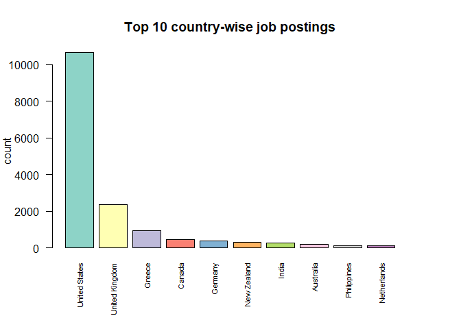
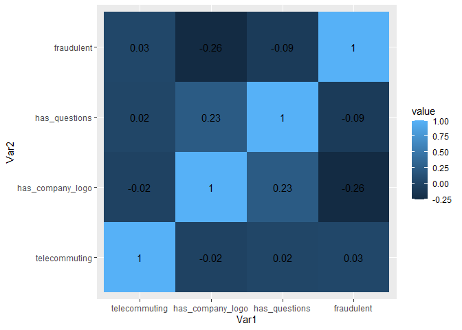

WQD7004 Group Project
================

# Fake Job Posting Analysis

### Group 4:

-   JingYu Shen (S2113037)
-   JiPing Zhang (S2042894)
-   Lee Mun Mun (S2112842)
-   Nayli Hatim (S2149344)
-   Jenifer Mayang Jues (S2016572)

# Introduction

Unlike the past when job seekers used newspapers to seek job
opportunities, job seekers nowadays use employment website such as
JobStreet, Linkedin, Indeed and countless due to advancement in modern
technology and social communication. The authenticity of job postings
has become critical with a constant increase in the number of job scams.
According to Habiba et all (2021), job advertisements which are fake and
steal personal & professional information of job seekers instead of
giving right jobs to them is known as job scam. Job scams often involve
fake online job ads in social platforms and untrusted job portals
offering high paying jobs. Victims may also receive unsolicited messages
from social media such as Whatsapp, Facebook, WeChat that offers jobs
that do not exist. For example, job scammers will ask victims to
disclose personal and/or banking details or transfer upfront fees to
secure a interview or more information about the fraud jobs. Due to the
growing concerns about job scams, our aim is to raise awareness of job
seekers in the job application process and give a early warning sign to
job seekers with Machine Learning (ML) and Natural Language Processing
(NLP) approaches.

# Objectives

-   To identify the key features of fraudulent job postings.
-   To build a model to classify real or fake job postings.

# Initial Questions

-   What are the key features/characteristics of fraudulent job
    postings?
-   Which classification model is the best to determine whether the job
    is real or not?

# Data Cleaning and Pre-processing

The dataset used in this project was published by the Employment Scam
Aegean Dataset (EMSCAD) and was retrieved from
[Kaggle](https://www.kaggle.com/datasets/shivamb/real-or-fake-fake-jobposting-prediction)
and this data contains 17,880 observations out of which about 866 are
fake, and 18 features. The data consists of a combination of numeric and
text features. A brief definition of the variables is given below:

| Variable            | Description                                              |
|---------------------|----------------------------------------------------------|
| job_id              | ID of each job posting                                   |
| title               | Description of position or job                           |
| location            | Where the job is located                                 |
| department          | Department of the job offered                            |
| salary_range        | Expected salary range                                    |
| company_profile     | Company information                                      |
| description         | Description about the position offered                   |
| requirements        | Pre-requisites to qualify for the job                    |
| benefits            | Benefits provided by the job                             |
| telecommuting       | Is work from home or remote work allowed                 |
| has_company_logo    | Does the post have a company logo                        |
| has_questions       | Does the post have any questions                         |
| employment_type     | Full-time, part-time, contract, temporary and others     |
| required_experience | Experience level, e.g. Entry level, Executive, Director… |
| required_education  | Education level, e.g. High School, Bachelor, Master…     |
| industry            | Relevant industry                                        |
| function            | Job’s functionality                                      |
| fraudulent          | Target variable (0: Real, 1: Fake)                       |

## Import libraries

## Load data

``` r
df <- read.csv("https://raw.githubusercontent.com/abbylmm/fake_job_posting/main/data/fake_job_postings.csv")
```

## Display n sample of the data

``` r
df_fake_job <- df
sample_n(df_fake_job, 3)
```

    ##   job_id                                                     title
    ## 1  12089                                  Sales Operations Analyst
    ## 2  14067                                       Senior C# Developer
    ## 3  15540 Master Scheduler/ Materials Manager Job In cincinnati, OH
    ##              location department salary_range
    ## 1    US, NY, New York Operations          0-0
    ## 2     US, WA, Seattle                        
    ## 3 US, CA, Los Angeles                        
    ##                                                                                                                                                                                                                                                                                                                                                                                                                                                                                                                                                company_profile
    ## 1 Namely is the leading end-to-end HR and payroll platform for growing companies. Offerings include human payroll, benefits administration, time management, human capital management, performance management, and employee engagement. In addition, each company is assigned its own account manager, available 24/7 for ongoing support and training for each of Namelyâ\200\231s features. Namely is used by some of the worldâ\200\231s most innovative and exciting companies from many industries, including media, technology, commerce, and professional services.
    ## 2                                                                                                                                                                                                                                                                                                                                                                                                                                                                                           Startup Recroot matches talent with with early-mid stage startups!
    ## 3                                                                                                                                                                                                                                                                                                                         We Provide Full Time Permanent Positions for many medium to large US companies. We are interested in finding/recruiting high quality candidates in IT, Engineering, Manufacturing and other highly technical and non-technical jobs.
    ##                                                                                                                                                                                                                                                                                                                                                                                                                                                                                                                                                                                                                                                                                                                                                                                                                                                                                                                                                                                                                                                                                                                                                                                                                                                                                                                                                                                                                                                                                                                                                                                                                                                                                                                                                                                                                                                                                                                                                                                                                                                                                                                                                                                                                                                                                                                                                                                                                                                                                                                                                                                                                                                                                                                                                                                                                                                                                                                                                                                                                                                                                                                                                                                                                                                                                                   description
    ## 1                                                                                                                                                                                                                                                                                                                                                                                                                                                                                                                                                                                                                                                                                                                                                                                                                                                                                                                                                                                                                                                                                                                                                                                                                                                                                                                                                                                                                                                                                                                                                                                                                                                                                                                                                                                 Namely is an agile startup dedicated to building an end-to-end Human Capital Management platform for businesses of all sizes â\200“ some of the worldâ\200\231s most innovative and exciting companies from many industries use Namely for HR Management. Our users are varied (HR administrators, managers, and average employees), and our clients each have their own culture and #URL_8869fa3fa07d85357b4177d1dad41e67b47a61deef5973cf8ecf1f1170de770d# you are:The position is based in Manhattan, NY. We offer a competitive salary with great benefits, and an extremely fun environment.RESPONSIBILITIESCRM &amp; Sales Force Process OptimizationDrive the design, roll-out and adoption of sales methodology, processes and tools that support the selling process and improve the customer experienceDesign and generate dashboards, reports and statistics that support better decision making and process improvement within the organization, including sales forecasting, win/loss analysis, and market trend analysis, etc.Collaborate with Sales and Marketing in customer segmentation, lead generation and monitoring the effectiveness of marketing and promotional programs.Work with end users to provide best practices and tips on Salesforce usage including training, documentation and support as necessary. Proposal/RFP/Contract ManagementAssist the business contract process in collaboration with legal, key account and sales management.Provide oversight to pricing and contract compliance.
    ## 2 Tango Card is the first company to provide Rewards-as-a-Service, RaaS® to enterprise customers. Just as Salesforce moved CRM to the cloud, Tango Card is moving loyalty and rewards to the cloud â\200“ a $50 Billion dollar industry in the US alone.Weâ\200\231re a 30 person team based in West Seattle. We have filed 3 patents, have a fantastic sales pipeline, and are growing very quickly. We recently completed a significant Series B financing round and our stellar investor group now consists of Allegro Venture Partners, Floodgate Capital, Eric Schmidtâ\200\231s Innovation Endeavors, SWaN and Legend partners and WTI. We are looking to add a few absolutely stellar engineers to our team to build the products and capabilities that will take us to the next level.We are looking for a results-oriented developer who can:Rapidly build innovative software products and applicationsBuild enterprise-level products and applications that are stable, secure and scalableDo all of this on aggressive schedulesWork effectively both independently and as part of a teamYou will be successful at Tango Card if you can:Respond quickly to project prioritiesMultitask in a fast-paced work environmentDo what it takes to get quality products online, on timeWork successfully in a startup environment while bringing you own voice to what we doBe passionate, collaborative and diligent about design, development and testingTechnical skills we require:Expert in C#, #URL_01a736d89d2f0b19de700923d2c312837e180465650804d0f84105352812bf9a# (latest versions) and able to work with multiple languages and platformsExperience in MVC, LINQ, JSON, MS SQL and Entity framework desiredExperience building and consuming industry standard RESTful web-servicesMust be familiar with distributed version control system (like Github)Experience with agile development processMust have strong critical thinking and problem solving skills4+ years of software development and testing experienceComputer Science degree (or equivalent)Cultural fit:There has to be a strong fit with our culture for you to be successful. Key elements that define Tango Cardâ\200\231s culture are:We have a positive, can do attitudeWe set a higher standard in everything we doWe delight our external customers and keep our focus externallyWe have a sense of urgencyWe are great at setting and meeting commitmentsWe win or lose as a team, not as individualsWe are fired up and love winning!More information about Tango Card:Tango Card has created the ideal rewards and loyalty platform for the modern, mobile and social enterprise.We have 200 live enterprise customers today, we closed a $4.125M series B round at the end of April 2013, and we work with some of the largest customers in the world including Microsoft, Salesforce, Twitter and Intuit, as well as some successful emerging companies like Beintoo, Extole, Plink, and TrialPay.We also work with the top Gift Card brands in the country including Amazon, Starbucks, and REI locally, and Target, Walmart, Home Depot and almost 50 more nationally. Last but not least, we partner with many of the most respected non-profits in the country including the National Park Foundation and Habitat for Humanity.
    ## 3                                                                                                                                                                                                                                                                                                                                                                                                                                                                                                                                                                                                                                                                                                                                                                                                                                                                                                                                                                                                                                                                                                                                                                                                                                                                                                                                                                                                                                                                                                                                                                                                                                                                                                                                                                                                                                                                                                                                                                                                                                                                                                                                                                                                                                                                                                                                                                                                                                                                                                                                                                                                                                                                                                                                                                                                                                                                                                                                                                                                                                                                                                 BA/BS degree - Business or Technicalâ\200¢APICS certification desirableâ\200¢5-8 years experience in Manufacturing and/or Materials managementâ\200¢Experienced user of computer systems.â\200¢SAP experience required.
    ##                                                                                                                                                                                                                                                                                                                                                                                                                                                                                                                                                                                                                                                                          requirements
    ## 1                                                                 BA/BS in business/information systems, finance, math, a related field.1-3 years of experiences with #URL_8d92932a488fb7e172d73a0f6813d06d464f1f03705d2825f86b2c7947d60a86#, or similar CRM Experience required leads, including work implementing Salesforce and/or redesigning and significantly enhancing how the system is used within an organization.1-3 years of sales operations, finance or analytics experience preferably in a sales environmentStrong analytical and problem solving skills.Attention to detail and thoroughness in completing work tasks.Strong proficiency with Microsoft Office suite
    ## 2                                                                       Technical skills we require:Expert in C#, #URL_01a736d89d2f0b19de700923d2c312837e180465650804d0f84105352812bf9a# (latest versions) and able to work with multiple languages and platformsExperience in MVC, LINQ, JSON, MS SQL and Entity framework desiredExperience building and consuming industry standard RESTful web-servicesMust be familiar with distributed version control system (like Github)Experience with agile development processMust have strong critical thinking and problem solving skills4+ years of software development and testing experienceComputer Science degree (or equivalent)
    ## 3 Minimum Requirements for the Job :BA/BS degree - Business or Technicalâ\200¢APICS certification desirableâ\200¢5-8 years experience in Manufacturing and/or Materials managementâ\200¢Experienced user of computer systems.â\200¢SAP experience required.Job Description:Plan and control all scheduling activities supporting assigned brands. Balance production and inventory levels with demand to support target consistent with 99% customer service levels, inventory turn goals and capacity utilization/staffing requirements.Visit  : #URL_ec64af2b4fe2ca316e828f93b0cd098c22f8beba98dcac09d4dd7384b221a5e8#-#URL_9753a54b28303bf636a2816399b9c255d76fabb791336a4c748da2611a23264f#
    ##   benefits telecommuting has_company_logo has_questions employment_type
    ## 1                      0                1             1       Full-time
    ## 2                      0                0             1       Full-time
    ## 3                      0                0             0       Full-time
    ##   required_experience required_education              industry
    ## 1           Associate  Bachelor's Degree     Computer Software
    ## 2    Mid-Senior level                        Computer Software
    ## 3    Mid-Senior level  Bachelor's Degree Management Consulting
    ##                function. fraudulent
    ## 1                  Sales          0
    ## 2 Information Technology          0
    ## 3             Management          0

## Summary data

``` r
summary(df_fake_job)
```

    ##      job_id         title             location          department       
    ##  Min.   :    1   Length:17880       Length:17880       Length:17880      
    ##  1st Qu.: 4471   Class :character   Class :character   Class :character  
    ##  Median : 8940   Mode  :character   Mode  :character   Mode  :character  
    ##  Mean   : 8940                                                           
    ##  3rd Qu.:13410                                                           
    ##  Max.   :17880                                                           
    ##  salary_range       company_profile    description        requirements      
    ##  Length:17880       Length:17880       Length:17880       Length:17880      
    ##  Class :character   Class :character   Class :character   Class :character  
    ##  Mode  :character   Mode  :character   Mode  :character   Mode  :character  
    ##                                                                             
    ##                                                                             
    ##                                                                             
    ##    benefits         telecommuting    has_company_logo has_questions   
    ##  Length:17880       Min.   :0.0000   Min.   :0.0000   Min.   :0.0000  
    ##  Class :character   1st Qu.:0.0000   1st Qu.:1.0000   1st Qu.:0.0000  
    ##  Mode  :character   Median :0.0000   Median :1.0000   Median :0.0000  
    ##                     Mean   :0.0429   Mean   :0.7953   Mean   :0.4917  
    ##                     3rd Qu.:0.0000   3rd Qu.:1.0000   3rd Qu.:1.0000  
    ##                     Max.   :1.0000   Max.   :1.0000   Max.   :1.0000  
    ##  employment_type    required_experience required_education   industry        
    ##  Length:17880       Length:17880        Length:17880       Length:17880      
    ##  Class :character   Class :character    Class :character   Class :character  
    ##  Mode  :character   Mode  :character    Mode  :character   Mode  :character  
    ##                                                                              
    ##                                                                              
    ##                                                                              
    ##   function.           fraudulent     
    ##  Length:17880       Min.   :0.00000  
    ##  Class :character   1st Qu.:0.00000  
    ##  Mode  :character   Median :0.00000  
    ##                     Mean   :0.04843  
    ##                     3rd Qu.:0.00000  
    ##                     Max.   :1.00000

## Check all the missing values - ‘empty’

``` r
skim_without_charts(df_fake_job)
```

|                                                  |             |
|:-------------------------------------------------|:------------|
| Name                                             | df_fake_job |
| Number of rows                                   | 17880       |
| Number of columns                                | 18          |
| \_\_\_\_\_\_\_\_\_\_\_\_\_\_\_\_\_\_\_\_\_\_\_   |             |
| Column type frequency:                           |             |
| character                                        | 13          |
| numeric                                          | 5           |
| \_\_\_\_\_\_\_\_\_\_\_\_\_\_\_\_\_\_\_\_\_\_\_\_ |             |
| Group variables                                  | None        |

Data summary

**Variable type: character**

| skim_variable       | n_missing | complete_rate | min |   max | empty | n_unique | whitespace |
|:--------------------|----------:|--------------:|----:|------:|------:|---------:|-----------:|
| title               |         0 |             1 |   3 |   142 |     0 |    11231 |          0 |
| location            |         0 |             1 |   0 |   161 |   346 |     3106 |          0 |
| department          |         0 |             1 |   0 |   255 | 11547 |     1338 |          6 |
| salary_range        |         0 |             1 |   0 |    20 | 15012 |      875 |          0 |
| company_profile     |         0 |             1 |   0 |  6230 |  3308 |     1710 |          0 |
| description         |         0 |             1 |   3 | 22722 |     0 |    14802 |          0 |
| requirements        |         0 |             1 |   0 | 10921 |  2694 |    11970 |          0 |
| benefits            |         2 |             1 |   0 |  4489 |  7206 |     6207 |          0 |
| employment_type     |         0 |             1 |   0 |     9 |  3471 |        6 |          0 |
| required_experience |         0 |             1 |   0 |    16 |  7050 |        8 |          0 |
| required_education  |         0 |             1 |   0 |    33 |  8105 |       14 |          0 |
| industry            |         0 |             1 |   0 |    36 |  4903 |      132 |          0 |
| function.           |         0 |             1 |   0 |    22 |  6455 |       38 |          0 |

**Variable type: numeric**

| skim_variable    | n_missing | complete_rate |    mean |      sd |  p0 |     p25 |    p50 |      p75 |  p100 |
|:-----------------|----------:|--------------:|--------:|--------:|----:|--------:|-------:|---------:|------:|
| job_id           |         0 |             1 | 8940.50 | 5161.66 |   1 | 4470.75 | 8940.5 | 13410.25 | 17880 |
| telecommuting    |         0 |             1 |    0.04 |    0.20 |   0 |    0.00 |    0.0 |     0.00 |     1 |
| has_company_logo |         0 |             1 |    0.80 |    0.40 |   0 |    1.00 |    1.0 |     1.00 |     1 |
| has_questions    |         0 |             1 |    0.49 |    0.50 |   0 |    0.00 |    0.0 |     1.00 |     1 |
| fraudulent       |         0 |             1 |    0.05 |    0.21 |   0 |    0.00 |    0.0 |     0.00 |     1 |

## Split location to country, state, city and fill empty with NA

``` r
df_fake_job[c("country", "state", "city")] <- str_split_fixed(df_fake_job$location, ", ", 3)
df_fake_job[c("country", "state", "city")][df_fake_job[c("country", "state", "city")] == ""] <- NA
```

## Split salary_range to min_salary, max_salary and fill empty with NA

``` r
df_fake_job[c("min_salary", "max_salary")] <- str_split_fixed(df_fake_job$salary_range, "-", 2)
df_fake_job[c("min_salary", "max_salary")][df_fake_job[c("min_salary", "max_salary")] == ""] <- NA
```

## Drop location and salary_range

``` r
df_fake_job <- select(df_fake_job, -c(location, salary_range))
```

## View the structure of data

``` r
glimpse(df_fake_job)
```

    ## Rows: 17,880
    ## Columns: 21
    ## $ job_id              <int> 1, 2, 3, 4, 5, 6, 7, 8, 9, 10, 11, 12, 13, 14, 15,~
    ## $ title               <chr> "Marketing Intern", "Customer Service - Cloud Vide~
    ## $ department          <chr> "Marketing", "Success", "", "Sales", "", "", "ANDR~
    ## $ company_profile     <chr> "We're Food52, and we've created a groundbreaking ~
    ## $ description         <chr> "Food52, a fast-growing, James Beard Award-winning~
    ## $ requirements        <chr> "Experience with content management systems a majo~
    ## $ benefits            <chr> "", "What you will get from usThrough being part o~
    ## $ telecommuting       <int> 0, 0, 0, 0, 0, 0, 0, 0, 0, 0, 0, 0, 0, 0, 0, 0, 0,~
    ## $ has_company_logo    <int> 1, 1, 1, 1, 1, 0, 1, 1, 1, 1, 0, 1, 1, 1, 1, 1, 1,~
    ## $ has_questions       <int> 0, 0, 0, 0, 1, 0, 1, 1, 1, 0, 0, 0, 0, 1, 0, 1, 0,~
    ## $ employment_type     <chr> "Other", "Full-time", "", "Full-time", "Full-time"~
    ## $ required_experience <chr> "Internship", "Not Applicable", "", "Mid-Senior le~
    ## $ required_education  <chr> "", "", "", "Bachelor's Degree", "Bachelor's Degre~
    ## $ industry            <chr> "", "Marketing and Advertising", "", "Computer Sof~
    ## $ function.           <chr> "Marketing", "Customer Service", "", "Sales", "Hea~
    ## $ fraudulent          <int> 0, 0, 0, 0, 0, 0, 0, 0, 0, 0, 0, 0, 0, 0, 0, 0, 0,~
    ## $ country             <chr> "US", "NZ", "US", "US", "US", "US", "DE", "US", "U~
    ## $ state               <chr> "NY", NA, "IA", "DC", "FL", "MD", "BE", "CA", "FL"~
    ## $ city                <chr> "New York", "Auckland", "Wever", "Washington", "Fo~
    ## $ min_salary          <chr> NA, NA, NA, NA, NA, NA, "20000", NA, NA, NA, "1000~
    ## $ max_salary          <chr> NA, NA, NA, NA, NA, NA, "28000", NA, NA, NA, "1200~

``` r
class(df_fake_job)
```

    ## [1] "data.frame"

## View column names

``` r
names(df_fake_job)
```

    ##  [1] "job_id"              "title"               "department"         
    ##  [4] "company_profile"     "description"         "requirements"       
    ##  [7] "benefits"            "telecommuting"       "has_company_logo"   
    ## [10] "has_questions"       "employment_type"     "required_experience"
    ## [13] "required_education"  "industry"            "function."          
    ## [16] "fraudulent"          "country"             "state"              
    ## [19] "city"                "min_salary"          "max_salary"

## Check if any duplication id

``` r
table(duplicated(df_fake_job$job_id))
```

    ## 
    ## FALSE 
    ## 17880

``` r
# there is no duplication id
```

## Check for total missing values for each feature

``` r
colSums(is.na(df_fake_job))
```

    ##              job_id               title          department     company_profile 
    ##                   0                   0                   0                   0 
    ##         description        requirements            benefits       telecommuting 
    ##                   0                   0                   2                   0 
    ##    has_company_logo       has_questions     employment_type required_experience 
    ##                   0                   0                   0                   0 
    ##  required_education            industry           function.          fraudulent 
    ##                   0                   0                   0                   0 
    ##             country               state                city          min_salary 
    ##                 346                2580                2067               15012 
    ##          max_salary 
    ##               15013

``` r
# there are two missing values in 'benefits' column
```

## List rows with missing values

``` r
missingdf <- df_fake_job[!complete.cases(df_fake_job), ]
sample_n(missingdf, 3)
```

    ##   job_id
    ## 1   7397
    ## 2  13899
    ## 3  15565
    ##                                                                          title
    ## 1                                                 Senior Lease Records Analyst
    ## 2                                              Caregivers needed for Holidays!
    ## 3 Marketing Intern with Vietnamese language skills - Paid Position (part-time)
    ##   department
    ## 1           
    ## 2           
    ## 3           
    ##                                                                                                                                                                                                                                                                                                                                                                                                                                                                                                                                                                                                                                                                                                                                                                                                                                                                                                                 company_profile
    ## 1 Valor Services provides Workforce Solutions that meet the needs of companies across the Private Sector, with a special focus on the Oil &amp; Gas Industry. Valor Services will be involved with you throughout every step of the hiring process and remain in contact with you all the way through the final step of signing of the employment contract with your new employer. Valor Services was founded with the vision of employing the unique skills, experiences, and qualities of Americaâ\200\231s finest veterans to provide Private Sector companies with precise and concerted value-added services â\200“ and Americaâ\200\231s finest Veterans with an optimized career opportunity.We are eager to get the word out to veterans that there are ample opportunities for employment in the private sector and that you are the ideal candidates to fill those positions. Valor Services Your Success is Our Mission. ™ 
    ## 2                                                                                                                                                                                                                                                                                                                                                                                                                                                                                                                                                                                                                                                                                                                                                                                                                                                                                                                              
    ## 3                                                                                                                                                                                                                                                                                                                                                                                          Fabrily makes it easy for campaigners/communities/charities/causes/artists. etcâ\200¦ to raise funds and awareness with custom merchandising (T-shirts, Hoodies, iPhone covers, etcâ\200¦) Users design a merchandise with Fabrilyâ\200\231s help and sell it to their network/community. Fabrily handles the printing and shipping and give the profits back to the sellers. It is absolutely free for the sellers to use.This 60 second video explains how it works â\200“ #URL_39f7a1fd2a9c4e06693f732e976b7ec6011a6484aa0363b7a85cf5f2968742d5#
    ##                                                                                                                                                                                                                                                                                                                                                                                                                                                                                                                                                                                                                                                                                                                                                                                                                                                                                                                                                                                                                                                                                                                                                                                                                                                                                                                                                                                                                                                                                                                                                                                                                                                                                                                                                                                                                                                                                                                                                                                                                     description
    ## 1                                                                                                                            This is an amazing opportunity to work with one of the most robust companies in the Oil &amp; Gas Industry. Opportunities for advancement are extensive as the company is currently in the process of expanding. Strong compensation and benefits packages are available for qualified candidates who want to join the largest player in the region.*This position will require relocation to Oklahoma.SUMMARYReview and analyze oil and gas leases and related exploration and production contracts to insure proper maintenance of these company assets. Enter data into the companyâ\200\231s lease and contract systems to accurately and timely maintain all contractual obligations. Maintain paper file records containing original leases, contracts, documents, maps, bonus and rental check receipts, and related correspondence.ESSENTIAL DUTIES AND RESPONSIBILITIES Review and analyze leases and related documents acquired by district offices.Insure pertinent lease information is timely and accurately entered into companyâ\200\231s lease system.Established proper rental shut-in and minimum royalty payment records to maintain leases in force.Analyze correspondence and title change documents received from lesser and partners.Adjust records in lease maintenance system to reflect subsequent changes.Maintain accurate name and address data for lesser, payees, and partners.Review and initiate telephone and written contact with lesser, payees and partners.Insure pertinent contract information is timely and accurately entered into company contract system.Adjust records in contract maintenance system to reflect subsequent changes.Monitor drilling reports and well status notices received from districts.Review and update records affected by well completions or well status changes.Assist with research, special projects and other duties as required.
    ## 2                                                                                                                                                                                                                                                                                                                                                                                                                                                                                                                                                                                                                                                                                                                                                                                                                                                                                                                                                                                                                                                                                                                                                                                                                                                                                                                                                                                                                                                                                                                                                                                                                                                                                                                                                                                                                                     Currently hiring per-diem caregivers to work on holidays. Shifts available include Thanksgiving, day after Thanksgiving, Christmas Eve, Christmas Day, New Years Eve and New Years Day. 
    ## 3 Are you looking to join an exciting and high-growth startup? Are you up for a challenge? Do you enjoying working hard and making a dent in the universe? If you answered yes to these questions then please read onâ\200¦Fabrily is on the hunt for a brilliant marketing / business development intern to join our existing team. We are looking for someone who is energetic, intelligent and full of good ideas. We want someone to join our friendly and hardworking team to assist us in getting the word out about this new disruptive service. As we expand our services internationally, we are looking for an enthusiastic and driven person who can combine marketing research and business development skills to analyze and serve our growing Southeast Asian seller base.  As this is a part-time position, you could also combine this with your studies.  What is Fabrily?Fabrily is a startup that makes it easy for campaigners/communities/charities/causes/artists. etcâ\200¦ to raise funds and awareness with custom merchandising (T-shirts, Hoodies, tank tops, etcâ\200¦) Users design a merchandise with Fabrilyâ\200\231s help and sell it to their network/community. Fabrily handles the printing and shipping and give the profits back to the sellers. It is absolutely free for the sellers to use.This 60 second video explains how it works â\200“ #URL_850ac80fb1cdb4e0a89c79a9ce7a3d03c57c733c45af5bb20455dd30755cc8b3#Key ResponsibilitiesUndertaking market research, business development and marketing related activities to get new campaigners on boardInvestigating new types of audiences which might find Fabrily usefulLead generation â\200“ both online and offlineLiaising with potential campaigns to get them on boardNetworking in the community to get people excited about FabrilyWe have already seen an amazing take-up of the service and have big plans for the future. The internship will be part-time for a duration of 3 months with a potential full time job offer at the end. 
    ##                                                                                                                                                                                                                                                                                                                                     requirements
    ## 1 EDUCATION and EXPERIENCEBachelorâ\200\231s degree and eight (8) years of experience required.  Must accurately perform basic math functions, exhibit proficiency in MS Word and Excel, and demonstrate ability to learn and use the company's current land system and other systems as needed in the performance of the functions of this position.
    ## 2                                              In order to be eligible for this job, you must meet the following requirements:First Aid/CPRNegative TB testFingerprint Clearance Card or ability to pass background checkMinimum 6 months experience as a caregiverAbility to lift uo to 50 lbsPositive AttitudeCNA's Preferred but not required
    ## 3                                                                         Self motivated, proactive, well organized and efficientShould take the initiative, pick things up and run with itGood networker with fluent English &amp; Vietnamese (additional languages a plus)Some experience with marketing and business development is desirable
    ##                                                                                                                                                                                                                                                                                                                                                benefits
    ## 1                                                                                                                                                                                                                                                                                                                                                      
    ## 2                                                                                                                                                                                                                                                                                                                                                      
    ## 3 Work as a paid intern in an exciting new startup (part-time or full-time)Be a part of taking a fast paced startup to the next levelLots of learning and networkingFlexibility to work remotely as and when neededInputs and involvement in other parts of the businessDevelop your own marketing ideas and implement themPossibility to work remotely
    ##   telecommuting has_company_logo has_questions employment_type
    ## 1             0                1             1       Full-time
    ## 2             0                0             1                
    ## 3             0                1             1                
    ##   required_experience required_education     industry function. fraudulent
    ## 1                      Bachelor's Degree Oil & Energy                    0
    ## 2                                                                        0
    ## 3                                                                        0
    ##   country state          city min_salary max_salary
    ## 1      US    OK Oklahoma City       <NA>       <NA>
    ## 2      US    AZ       Phoenix       <NA>       <NA>
    ## 3      GB   LND        London       <NA>       <NA>

## Visualize missing rates for each feature

``` r
gg_miss_var(df_fake_job, show_pct = TRUE) + labs(y = "% Missing")
```

<!-- -->

## Merge columns and create a new ‘full_text’ column

``` r
viz_df <- select(df_fake_job, -c(max_salary, min_salary, state, city))
viz_df$full_text <- 
  paste(na.omit(viz_df$title), 
        na.omit(viz_df$country), 
        na.omit(viz_df$department), 
        na.omit(viz_df$company_profile), 
        na.omit(viz_df$description), 
        na.omit(viz_df$requirements), 
        na.omit(viz_df$benefits), 
        na.omit(viz_df$employment_type), 
        na.omit(viz_df$required_experience), 
        na.omit(viz_df$required_education), 
        na.omit(viz_df$industry), 
        na.omit(viz_df$function.))
viz_df[viz_df == ""] <- NA
# sample(viz_df, 3)
# write.csv(viz_df, "C:/Users/munmu/Documents/GitHub/fake_job_posting\\viz_df.csv", row.names = FALSE)
```

## Visualize missing profile for each feature

``` r
plot_missing(viz_df)
```

<!-- -->

## Heatplot of missingness across the dataframe

``` r
vis_miss(viz_df)
```

<!-- -->

## Drop columns

``` r
model_df <- select(viz_df, 
                   -c(title, 
                      country, 
                      department, 
                      company_profile, 
                      description, 
                      requirements, 
                      benefits, 
                      employment_type, 
                      required_experience, 
                      required_education, 
                      industry, 
                      function.))
sample_n(model_df, 3)
```

    ##   job_id telecommuting has_company_logo has_questions fraudulent
    ## 1   4652             0                0             0          0
    ## 2   8546             0                1             1          0
    ## 3   9746             0                1             1          0
    ##                                                                                                                                                                                                                                                                                                                                                                                                                                                                                                                                                                                                                                                                                                                                                                                                                                                                                                                                                                                                                                                                                                                                                                                                                                                                                                                                                                                                                                                                                                                                                                                                                                                                                                                                                                                                                                                                                                                                                                                                                                                                                                                                                                                                                                                                                                                                                                                                                                                                                                                                                                                                                                                                                                                                                                                            full_text
    ## 1                                                                                                                                                                                                                                                                                                                                                                                                                                                                                                                                                                                                                                                                                                                                                                                                                                                                                                                                                                                                                                                                                                                                                                                                                                                                                                                                                                                                                                                                                                                                                                                                                                                                                                                                                                                                                                                                                                                                                                                                                                                                                                                                                                                                                                                                                                                                                                                                                                                              DRIVER  US   CLASS 5  VALID LICENCE TO DRIVE MINI VAN  FOR OUT OF TOWN PROJECTS IN ALBERTA . ONE TO TWO NIGHTS STAY , HOTEL /FOOD BY COMPANY, LIGHT WORK.  HELPER TO ENGINEER. APPLY CASH OR PAYROLL $15/HR. CALL VIJAY AT #PHONE_776f65d507216da693f53f58ad2c04e5cf609dee342af8f736a56bd37f01d5c5#  STARTING TOMORROW.        
    ## 2 Marketing Associate US Marketing The smarter way to investPicking from thousands of stocks or funds is hard. Finding an investment manager can be even harder. Weâ\200\231ve built a smarter way for savvy investors to find managers they can trust.We believe investing should be transparent, fair, and a pleasure, not a chore.Our investorsThe companyâ\200\231s investors include Union Square Ventures, Spark Capital and Amadeus Capital Partners.Learn more on #URL_e69aa09a90250fdf472550ec4ae5a6795a6f09d317f44b9beda100daf3203e0b# Covestor is seeking a talented, hands-on individual to join our relationship marketing and digital client acquisition team. Solid knowledge of how to engage prospects online, exceptional copywriting and mastery of HubSpot is required. The position reports to the Chief Marketing Officer.Your background should demonstrate proven success in creating and delivering high-impact consumer marketing programs. The ideal candidate will have experience with the nuts and bolts of online marketing and experience with customer acquisition. Experience in asset management or wealth management is a preferred. You should be comfortable in a fluid start-up environment and bring an energetic, fun and creative approach to your work.This job will be based in our US headquarters in downtown Boston.The role:Develop marketing campaigns, content marketing plans, website calls-to-action and other relationship formation marketing programs to drive new leads and clients.Produce compelling content that attracts and engages new clients to Covestor. Programs focus on the topical concerns of affluent and high net worth investors.Own and evolve our HubSpot programEvolve the retention and development marketing programs targeted at Covestor clients.Develop marketing programs that re-engage older prospects. To succeed, youâ\200\231ll needâ\200¦Very strong organizational, writing and communication skillsCreative flair and willingness to experimentEfficient digital worker chops5+ years of relevant experience developing consumer marketing programs in an online environment and/or ad agencyExperience with managing and evolving HubSpot implementationExperience with content marketing and email marketingComfortable in a small, intense and high-growth start-up environmentTo apply, please send(1) a cover email of two or three paragraphs describing the reason for your interest in both this position and in joining Covestor,(2) links to your recent writing and web presence Friendly atmosphereHighly competitive salarySolve concrete problems by creating tools that will be immediately usedOpportunity for self-improvement and growth Full-time Associate Bachelor's Degree Financial Services Marketing
    ## 3                                                                                                                                                                                                                                                                                                                                                                                                                                                                                                                                                                                                                                                                                                                                                                                                                                                                                                                                                                                                                                                                                                                                                                                                                                                                                                                                                                                                                                                                                                                                                                                                                                                                                                                                                                                                                                                                                                                                                                                                                                                                                                                           English Teacher Abroad  US  We help teachers get safe &amp; secure jobs abroad :) Play with kids, get paid for it Love travel? Jobs in Asia$1,500+ USD monthly ($200 Cost of living)Housing provided (Private/Furnished)Airfare ReimbursedExcellent for student loans/credit cardsGabriel Adkins : #URL_ed9094c60184b8a4975333957f05be37e69d3cdb68decc9dd9a4242733cfd7f7##URL_75db76d58f7994c7db24e8998c2fc953ab9a20ea9ac948b217693963f78d2e6b#12 month contract : Apply today  University degree required. TEFL / TESOL / CELTA or teaching experience preferred but not necessaryCanada/US passport holders only  Contract  Bachelor's Degree Education Management

``` r
# write.csv(model_df, "C:/Users/munmu/Documents/GitHub/fake_job_posting\\model_df.csv", row.names = FALSE)
```

## Check NA or missing values

``` r
sum(is.na(model_df))
```

    ## [1] 0

``` r
sum(model_df == "")
```

    ## [1] 0

## Visualize missing values

``` r
vis_miss(model_df)
```

<!-- -->

``` r
vis_dat(model_df)
```

<!-- -->

# Exploratory Data Analysis (EDA)

Before building our models, we performed exploratory data analysis to
understand the dataset.

## Visualize fraud and real

``` r
viz_df2 <- viz_df
viz_df2$fraudulent[viz_df2$fraudulent == 1] <- "Fraud"
viz_df2$fraudulent[viz_df2$fraudulent == 0] <- "Non Fraud"
count <- table(viz_df2$fraudulent)
bar <- barplot(count, 
               main="Proportion of fraudulent job postings", 
               xlab="fraudulent", 
               ylab="count", 
               col=c(rgb(0.3,0.1,0.4,0.6), rgb(0.3,0.9,0.4,0.6)))
text(bar, count/2, labels = count)
```

<!-- -->

It is observable that there are 17,014 cases of legitimate job postings,
while the number of fraudulent job postings is 866. The fraud rate of
this dataset is 4.84%.

## Visualize country-wise job postings

``` r
temp <- na.omit(subset(viz_df, select = c(country))) %>% 
  group_by(country) %>% 
  summarize(n = n()) %>% 
  arrange(desc(n)) %>% 
  slice(1:10)

par(mar=c(6,4,4,4))
barplot(height=temp$n, 
        main="Top 10 country-wise job postings", 
        ylab="count", 
        col=brewer.pal(10, "Set3"), 
        names.arg=c("United States",
                    "United Kingdom",
                    "Greece",
                    "Canada",
                    "Germany",
                    "New Zealand",
                    "India",
                    "Australia",
                    "Philippines",
                    "Netherlands"), 
        cex.names=0.7, 
        las=2)
```

<!-- -->

Top 10 countries with most of the number of job postings are US, GB, GR,
CA, DE, NZ, IN, AU, PH, NL. United States listed 10,656 job postings,
followed by 2,384 for United Kingdom and 940 for Greece.

## Visualize the industries

``` r
temp <- na.omit(subset(viz_df, select = c(industry))) %>% 
  group_by(industry) %>% 
  summarize(n = n()) %>% 
  arrange(desc(n)) %>% 
  slice(1:10)

par(mar=c(10,4,4,4))
barplot(height=temp$n, 
        names=temp$industry, 
        main="Top 10 industries", 
        ylab="count", 
        col=brewer.pal(10, "Set3"), 
        cex.names=0.6, 
        las=2)
```

<!-- -->

Most job openings are IT related such as Information Technology and
Services (1,734), Computer Software (1,376) and Internet (1,062).

## Visualize the departments

``` r
temp <- na.omit(subset(viz_df, select = c(department))) %>% 
  group_by(department) %>% 
  summarize(n = n()) %>% 
  arrange(desc(n)) %>% 
  slice(1:10)

par(mar=c(8,4,4,4))
barplot(height=temp$n, 
        names=temp$department, 
        main="Top 10 departments", 
        ylab="count", 
        col=brewer.pal(10, "Set3"), 
        cex.names=0.6, 
        las=2)
```

<!-- -->

Top hiring departments are Sales (551), Engineering (487) and Marketing
(401).

## Visualize the required experiences in the jobs

``` r
viz_df %>% group_by(required_experience) %>% 
  summarize(n = n()) %>% 
  arrange(desc(n)) %>% 
  slice(2:11) %>% 
  ggplot(aes(x=reorder(required_experience, -n), y = n)) + 
  geom_segment(aes(x=reorder(required_experience, -n), xend=reorder(required_experience, -n), y=0, yend=n), color="skyblue") + 
  geom_point(color="steelblue", size=2, alpha=1) + 
  theme_light() + 
  coord_flip() + 
  theme(panel.grid.major.y = element_blank(), 
        panel.border = element_blank(), 
        axis.ticks.y = element_blank()) + 
  theme_bw() + labs(title = "Listed jobs with required experiences", 
                    x = "Experience", 
                    y = "Count", 
                    fill = "Experience") + 
  geom_text(aes(label=round(n,0)), vjust=-0.6)
```

<!-- -->

Mid-Senior level jobs are in demand, followed by entry level and
associate.

## Visualize the required education in the jobs

``` r
viz_df %>% group_by(required_education) %>% 
  summarize(n = n()) %>% 
  arrange(desc(n)) %>% 
  slice(2:11) %>% 
  ggplot(aes(x=reorder(required_education, -n), y = n)) + 
  geom_segment(aes(x=reorder(required_education, -n), xend=reorder(required_education, -n), y=0, yend=n), color="skyblue") + 
  geom_point(color="steelblue", size=2, alpha=1) + 
  theme_light() + 
  coord_flip() + 
  theme(panel.grid.major.y = element_blank(), 
        panel.border = element_blank(), 
        axis.ticks.y = element_blank()) + 
  theme_bw() + labs(title = "Listed jobs with required education", 
                    x = "Education", 
                    y = "Count", 
                    fill = "Education") + 
  geom_text(aes(label=round(n,0)), vjust=-0.6)
```

<!-- -->

Most of the education requirements in job ads are at least Bachelor’s
degree.

## Visualize fraudulent job postings based on employment types

``` r
viz_df2 <- viz_df
viz_df2$employment_type <- ifelse(is.na(viz_df2$employment_type), "Missing", viz_df2$employment_type)
df1 <- subset(viz_df2, select = c(employment_type, fraudulent)) %>% 
  group_by(employment_type, fraudulent) %>% 
  summarize(yes = sum(fraudulent==1), .groups = 'drop') %>% 
  filter(fraudulent==1)
df2 <- subset(viz_df2, select = c(employment_type, fraudulent)) %>% 
  group_by(employment_type, fraudulent) %>% 
  summarize(no = sum(fraudulent==0), .groups = 'drop') %>% 
  filter(fraudulent==0)
df_new <- merge(df1, df2, by = c("employment_type")) %>% 
  group_by(employment_type) %>% 
  summarize(pct_fraud = round(yes/(yes+no), digits=3), 
            pct_non_fraud = 1-pct_fraud, .groups = 'drop') %>% 
  mutate(employment_type = factor(employment_type, 
                                  levels = c('Part-time',
                                             'Missing',
                                             'Other',
                                             'Full-time',
                                             'Contract',
                                             'Temporary')))
fig <- df_new %>% plot_ly(width = 700, height = 400)
fig <- fig %>% add_trace(x = ~employment_type, y = ~pct_non_fraud, type = 'bar', 
             text = ~paste0(pct_non_fraud*100,"%"), textposition = 'outside', name = 'pct_non_fraud', 
             marker = list(color = 'rgb(158,202,225)', 
                           line = list(color = 'rgb(8,48,107)', width = 0.8)))
fig <- fig %>% add_trace(x = ~employment_type, y = ~pct_fraud, type = 'bar', 
            text = ~paste0(pct_fraud*100,"%"), textposition = 'outside', name = 'pct_fraud', 
            marker = list(color = 'rgb(58,200,225)', 
                          line = list(color = 'rgb(8,48,107)', width = 0.8)))
fig <- fig %>% layout(title = "Employment types with % fraud and non-fraud",
         barmode = 'group',
         xaxis = list(title = "employment_type"),
         yaxis = list(title = "percentage"))
fig
```

<!-- -->

The percentage of fraudulent job postings is the highest for part-time
jobs, nearly 9%. Jobs without an employment type also have a high fraud
rate, around 7%.

## Visualize fraudulent job postings based on required experiences

``` r
viz_df2 <- viz_df
viz_df2$required_experience <- ifelse(is.na(viz_df2$required_experience), "Not Applicable", viz_df2$required_experience)
df1 <- subset(viz_df2, select = c(required_experience, fraudulent)) %>% 
  group_by(required_experience, fraudulent) %>% 
  summarize(yes = sum(fraudulent==1), .groups = 'drop') %>% 
  filter(fraudulent==1)
df2 <- subset(viz_df2, select = c(required_experience, fraudulent)) %>% 
  group_by(required_experience, fraudulent) %>% 
  summarize(no = sum(fraudulent==0), .groups = 'drop') %>% 
  filter(fraudulent==0)
df_new <- merge(df1, df2, by = c("required_experience")) %>% 
  group_by(required_experience) %>% 
  summarize(pct_fraud = round(yes/(yes+no), digits=3), 
            pct_non_fraud = 1-pct_fraud, .groups = 'drop') %>% 
  mutate(required_experience = factor(required_experience, 
                                      levels = c('Executive',
                                                 'Entry level',
                                                 'Not Applicable',
                                                 'Director',
                                                 'Mid-Senior level',
                                                 'Internship',
                                                 'Associate')))
fig <- df_new %>% plot_ly(width = 700, height = 400)
fig <- fig %>% add_trace(x = ~required_experience, y = ~pct_non_fraud, type = 'bar', 
             text = ~paste0(pct_non_fraud*100,"%"), textposition = 'outside', name = 'pct_non_fraud', 
             marker = list(color = 'rgb(158,202,225)', 
                           line = list(color = 'rgb(8,48,107)', width = 0.8)))
fig <- fig %>% add_trace(x = ~required_experience, y = ~pct_fraud, type = 'bar', 
            text = ~paste0(pct_fraud*100,"%"), textposition = 'outside', name = 'pct_fraud', 
            marker = list(color = 'rgb(58,200,225)', 
                          line = list(color = 'rgb(8,48,107)', width = 0.8)))
fig <- fig %>% layout(title = "Required experiences with % fraud and non-fraud",
         barmode = 'group',
         xaxis = list(title = "required_experience"),
         yaxis = list(title = "percentage"))
fig
```

<!-- -->

Most executive or entry level jobs that require minimum qualifications
and little experience have highest fraud rate, nearly 7%.

## Visualize fraudulent job postings based on job functions

``` r
viz_df2 <- viz_df
viz_df2$fraudulent[viz_df2$fraudulent == 1] <- "Fraud"
viz_df2$fraudulent[viz_df2$fraudulent == 0] <- "Non Fraud"
temp <- na.omit(subset(viz_df2, select = c(function., fraudulent))) %>% 
  group_by(function., fraudulent) %>% 
  summarize(n = n(), .groups = 'drop') %>% 
  group_by(function.) %>% 
  summarize(pct_fraud = round(sum(n[fraudulent=="Fraud"]/sum(n)), digits=3), 
            pct_non_fraud = 1-pct_fraud, .groups = 'drop') %>% 
  arrange(desc(pct_fraud)) %>% 
  slice(1:10) %>% 
  mutate(function. = factor(function., 
                            levels = c('Administrative',
                                       'Financial Analyst',
                                       'Accounting/Auditing',
                                       'Distribution',
                                       'Other',
                                       'Finance',
                                       'Engineering',
                                       'Business Development',
                                       'Advertising',
                                       'Customer Service')))
melted_temp <- melt(temp, id = "function.")
ggplot(melted_temp, aes(x = function., y = value, fill = variable)) + 
  geom_bar(position = "fill", 
           stat = "identity", 
           color = "black", 
           width = 0.8) + 
  theme(axis.text.x = element_text(angle = 90, hjust = 1, vjust = 0.6)) + 
  scale_y_continuous(labels = scales::percent) + 
  geom_text(aes(label = paste0(value*100,"%")), 
            position = position_stack(vjust = 0.6), size = 2) + 
  ggtitle("Job functions with % fraud and non-fraud") + 
  xlab("function") + 
  ylab("percentage")
```

<!-- -->

The function with highest fraudulent job postings is Administrative,
close to 19%, followed by Financial Analyst, Accounting/Auditing. Admin
jobs seem most suspicious. Possibly, it’s easy for scammers to disguise
their scams.

## Visualize fraudulent job postings based on required education

``` r
temp <- na.omit(subset(viz_df2, select = c(required_education, fraudulent))) %>% 
  group_by(required_education, fraudulent) %>% 
  summarize(n = n(), .groups = 'drop') %>% 
  group_by(required_education) %>% 
  summarize(pct_fraud = round(sum(n[fraudulent=="Fraud"]/sum(n)), digits=3), 
            pct_non_fraud = 1-pct_fraud, .groups = 'drop') %>% 
  arrange(desc(pct_fraud)) %>% 
  slice(1:10) %>% 
  mutate(required_education = factor(required_education, 
                                     levels = c("Some High School Coursework",
                                                "Certification",
                                                "High School or equivalent",
                                                "Master's Degree",
                                                "Professional",
                                                "Unspecified",
                                                "Doctorate",
                                                "Some College Coursework Completed",
                                                "Associate Degree",
                                                "Bachelor's Degree")))
melted_temp <- melt(temp, id = "required_education")
ggplot(melted_temp, aes(x = required_education, y = value, fill = variable)) + 
  geom_bar(position = "fill", 
           stat = "identity", 
           color = "black", 
           width = 0.8) + 
  theme(axis.text.x = element_text(angle = 90, hjust = 1, vjust = 0.6)) + 
  scale_y_continuous(labels = scales::percent) + 
  geom_text(aes(label = paste0(value*100,"%")), 
            position = position_stack(vjust = 0.6), size = 2) + 
  ggtitle("Required education with % fraud and non-fraud") + 
  xlab("required_education") + 
  ylab("percentage")
```

<!-- -->

As high as 74% of fake jobs require little educational credentials -
“Some High School Coursework”.

## Word Cloud

To visualize the fraud and real job postings, the WordCloud is used to
see the top occurring keywords in the data. To do so, fraud and real job
postings are separated into two text files and WordCloud has plotted
accordingly.

## Word Cloud of fraudulent job postings

``` r
selected_df <- subset(viz_df, fraudulent == 1)

# Create a vector containing only the text
text <- selected_df$title

# Create a corpus
docs <- Corpus(VectorSource(text))

docs <- docs %>%
  tm_map(removeNumbers) %>%
  tm_map(removePunctuation) %>%
  tm_map(stripWhitespace)
docs <- tm_map(docs, content_transformer(tolower))
docs <- tm_map(docs, removeWords, stopwords("english"))

dtm <- TermDocumentMatrix(docs)
matrix <- as.matrix(dtm)
words <- sort(rowSums(matrix), decreasing=TRUE)
df <- data.frame(word = names(words), freq=words)

wordcloud(words = df$word, freq = df$freq, min.freq = 1, max.words = 200, random.order = FALSE, rot.per = 0.35, colors = brewer.pal(8, "Dark2"))
```

<!-- -->

Many of the fraudulent job postings have common keywords in the job
titles - “Data Entry”, “Administrative”, “Home Based”, “Earn Daily”.

## Word Cloud of NON-fraudulent job postings

``` r
selected_df <- subset(viz_df, fraudulent == 0)

# Create a vector containing only the text
text <- selected_df$title

# Create a corpus
docs <- Corpus(VectorSource(text))

docs <- docs %>%
  tm_map(removeNumbers) %>%
  tm_map(removePunctuation) %>%
  tm_map(stripWhitespace)
docs <- tm_map(docs, content_transformer(tolower))
docs <- tm_map(docs, removeWords, stopwords("english"))

dtm <- TermDocumentMatrix(docs)
matrix <- as.matrix(dtm)
words <- sort(rowSums(matrix), decreasing=TRUE)
df <- data.frame(word = names(words), freq=words)

wordcloud(words = df$word, freq = df$freq, min.freq = 1, max.words = 200, random.order = FALSE, rot.per = 0.35, colors = brewer.pal(8, "Dark2"))
```

<!-- -->

Many of the NON-fraudulent job postings have common keywords in the job
titles - “Manager”, “Developer”, “Engineer”.

# Modeling

Before modeling, a final dataset is determined. This project will use a
dataset with these features for the final analysis:

-   fraudulent (target variable)
-   telecommuting
-   has_company_logo
-   has_questions
-   full_text: a combination of title, country, department,
    company_profile, description, requirements, benefits,
    employment_type, required_experience, required_education, industry
    and function

Three supervised machine learning algorithms used in the project are:

-   Logistic Regression
-   Random Forest
-   K-Nearest Neighbor (KNN)

``` r
model_df <- subset(model_df, select = -c(job_id))
names(model_df)
```

    ## [1] "telecommuting"    "has_company_logo" "has_questions"    "fraudulent"      
    ## [5] "full_text"

## Data pre-process (full_text)

For this analysis, the entire full_text column is converted to a
DocumentTermMatrix and then convert to a dataframe.

``` r
# temp <- subset(model_df, fraudulent == 1)
docs <- Corpus(VectorSource(model_df$full_text))
docs <- docs %>%
  tm_map(removeNumbers) %>% # Remove numbers
  tm_map(removePunctuation) %>% # Remove punctuation
  tm_map(stripWhitespace) # Eliminate extra white spaces
docs <- tm_map(docs, content_transformer(tolower))
docs <- tm_map(docs, removeWords, stopwords("english"))

# Convert each full_text into a row with columns containing each term in the document and giving the frequency of unique words used in the full_text
dtm <- DocumentTermMatrix(docs)
sparse_data <- removeSparseTerms(dtm, 0.90) # Remove sparse data
```

``` r
# Convert to dataframe for further analysis
sparse_data_df <- as.data.frame(as.matrix(sparse_data))
final_df <- subset(sparse_data_df, select = -c(`–`))

# Add other variables
final_df$telecommuting <- model_df$telecommuting
final_df$has_company_logo <- model_df$has_company_logo
final_df$has_questions <- model_df$has_questions
final_df$fraudulent <- model_df$fraudulent
```

## View the dimension of the dataframe

``` r
dim(final_df)
```

    ## [1] 17880   313

``` r
# 17880 rows, 313 columns
```

## Visualize data

``` r
# Histogram
par(mfrow=c(2,2))
for(i in 310:313) {
    hist(final_df[,i], main=names(final_df)[i], border="blue", col="yellow")
}
```

<!-- -->

``` r
# Boxplot
par(mfrow=c(2,2))
for(i in 310:313) {
    boxplot(final_df[,i], main=names(final_df)[i], border="blue", col="yellow")
}
```

<!-- -->

## Correlation

A correlation matrix is created to visualize the numeric data
relationship.

``` r
# Calculate the correlation between each pair of numeric variables
correlations <- cor(final_df[, 310:313])
corrplot(correlations, method="circle")
```

<!-- -->

has_company_logo and has_questions seem to have negative correlation
with fraudulent. If the job posting has company logo or with questions,
the likelihood of fraudulent decreases.

## Split data into 70% training, 30% testing

``` r
# Using the same seed value, reproduce the division of the training and testing sets
set.seed(123)
train_index <- sample(dim(final_df)[1], 0.7 * dim(final_df)[1])
model_dftrain<- final_df[train_index, ]
model_dftest <- final_df[-train_index, ]
paste("train sample size: ", dim(model_dftrain)[1])
```

    ## [1] "train sample size:  12516"

``` r
paste("test sample size: ", dim(model_dftest)[1])
```

    ## [1] "test sample size:  5364"

## View training set

``` r
sample_n(model_dftrain, 3)
```

    ##       also amp andor around attention best big business communication company
    ## 17169    0   0     0      0         0    1   0        0             0       0
    ## 3482     0   0     0      0         0    0   0        1             0       0
    ## 9043     1   0     0      0         0    0   0        0             1       1
    ##       content currently daily drive engineering existing experience full highly
    ## 17169       0         0     0     0           0        0          0    0      0
    ## 3482        0         0     0     0           1        1          2    0      0
    ## 9043        0         0     0     0           0        0          0    0      0
    ##       hours information like long management market marketing media need new
    ## 17169     0           1    0    0          1      0         0     0    0   0
    ## 3482      0           2    1    0          0      0         0     0    0   1
    ## 9043      0           0    0    1          1      0         0     0    0   2
    ##       offer office one online people plus small social staff startup support
    ## 17169     0      0   0      0      0    0     0      0     0       0       0
    ## 3482      0      0   1      0      0    0     0      0     0       0       0
    ## 9043      1      1   0      0      0    0     0      0     0       0       0
    ##       systems talented team technology top using various website work working
    ## 17169       0        0    1          1   0     0       1       0    0       0
    ## 3482        0        0    2          3   0     1       0       0    0       1
    ## 9043        0        0    0          0   0     0       2       0    1       0
    ##       able apply based can candidates client clients communicate companies
    ## 17169    0     0     0   0          0      0       0           0         0
    ## 3482     0     0     0   0          0      0       0           0         0
    ## 9043     0     0     0   0          0      0       0           0         0
    ##       computer cost creative customer delivery effectively email environment
    ## 17169        0    0        0        0        0           0     0           0
    ## 3482         2    0        0        0        0           0     0           0
    ## 9043         0    0        0        1        0           1     0           0
    ##       every excellent fast following fulltime get global great grow growing
    ## 17169     0         0    0         0        1   0      0     0    0       0
    ## 3482      0         0    0         0        1   0      0     0    0       0
    ## 9043      0         0    0         0        2   0      0     0    0       1
    ##       growth high include including international issues key know knowledge
    ## 17169      0    0       0         0             0      0   0    0         0
    ## 3482       0    2       0         0             0      0   0    0         0
    ## 9043       0    0       0         1             0      0   0    0         1
    ##       large learn level looking making manage manager managing network
    ## 17169     0     0     1       0      0      0       0        0       0
    ## 3482      0     0     0       0      0      0       0        0       0
    ## 9043      0     0     0       0      0      0       0        1       0
    ##       opportunity part passion person phone planning platform please position
    ## 17169           0    0       0      0     0        0        0      0        1
    ## 3482            2    1       0      0     0        0        0      0        0
    ## 9043            0    0       0      0     0        0        0      0        0
    ##       process product production project projects provides quality range right
    ## 17169       0       1          0       0        0        0       0     0     0
    ## 3482        0       0          0       0        0        0       2     0     0
    ## 9043        0       2          0       0        0        0       0     0     0
    ##       role service skills software success successful system teams understand
    ## 17169    0       0      0        1       0          0      0     0          0
    ## 3482     0       0      0        3       0          0      0     1          1
    ## 9043     0       2      1        0       0          1      0     0          0
    ##       web will world across activities candidate career contract engineer
    ## 17169   0    1     0      0          0         0      1        0        0
    ## 3482    2    1     0      0          0         0      0        0        0
    ## 9043    1    0     0      0          0         0      0        0        0
    ##       ensure experienced field focus health ideal meet must needs opportunities
    ## 17169      1           0     0     0      0     1    0    0     0             0
    ## 3482       0           0     0     0      0     0    0    0     0             0
    ## 9043       0           0     0     0      3     0    0    0     1             0
    ##       per provide requirements resources seeking services solutions strong
    ## 17169   0       0            0         0       0        0         2      0
    ## 3482    0       0            0         0       0        1         5      0
    ## 9043    0       0            1         0       0        1         0      0
    ##       unique vision way ability analysis available bachelors benefits build
    ## 17169      0      0   0       0        0         0         1        0     0
    ## 3482       0      0   0       0        0         0         1        0     1
    ## 9043       0      1   0       1        1         0         0        1     0
    ##       competitive culture customers degree develop development equivalent first
    ## 17169           0       0         0      1       0           2          0     0
    ## 3482            0       0         0      2       1           3          0     0
    ## 9043            1       0         0      1       0           0          0     0
    ##       goals good help industry lead life maintain make midsenior motivated
    ## 17169     0    0    0        0    0    0        0    0         1         0
    ## 3482      0    0    0        1    0    1        0    0         0         0
    ## 9043      0    0    0        0    0    1        0    0         0         0
    ##       order organization personal problem professional providing related
    ## 17169     0            0        0       0            0         0       0
    ## 3482      0            0        0       0            0         0       0
    ## 9043      0            0        0       0            0         0       1
    ##       responsible sales strategy travel understanding value verbal within
    ## 17169           0     0        0      1             0     0      0      0
    ## 3482            0     0        0      0             0     0      0      0
    ## 9043            0     1        0      0             0     0      0      1
    ##       written year years care current deliver directly innovative interested
    ## 17169       0    0     0    0       0       0        0          0          0
    ## 3482        0    0     1    0       0       2        0          1          0
    ## 9043        0    1     1    2       0       0        0          0          0
    ##       job leadership monthly offers open operations performance positions
    ## 17169   0          0       0      0    0          0           0         0
    ## 3482    0          0       0      0    0          0           0         0
    ## 9043    0          0       0      1    1          0           0         0
    ##       potential preferred processes reports results standards time training
    ## 17169         0         0         1       0       0         0    1        0
    ## 3482          0         0         0       0       0         0    0        0
    ## 9043          0         0         0       0       0         0    3        0
    ##       well areas come design driven employees excel financial join relevant
    ## 17169    1     0    0      1      0         0     0         0    0        0
    ## 3482     0     0    0      0      0         0     0         0    0        0
    ## 9043     0     0    0      0      0         1     0         0    0        1
    ##       school senior technical we’re without brand dynamic ideas leading many
    ## 17169      0      1         0     0       0     0       0     0       0    0
    ## 3482       0      0         0     1       0     0       1     0       0    0
    ## 9043       0      0         0     0       0     0       0     0       0    1
    ##       mobile take creating flexible free just love minimum mission multiple
    ## 17169      0    0        0        0    0    0    0       0       0        0
    ## 3482       0    0        0        0    0    0    0       0       0        0
    ## 9043       0    0        0        1    0    0    0       0       0        1
    ##       passionate play record required use want applications associate change
    ## 17169          0    0      0        0   0    0            0         0      0
    ## 3482           0    1      0        0   0    0            3         0      0
    ## 9043           1    0      0        0   0    0            0         1      0
    ##       tools background delivering duties entry improve months reporting tasks
    ## 17169     0          0          0      0     0       1      0         0     0
    ## 3482      0          0          0      0     0       0      0         0     0
    ## 9043      0          0          0      1     1       0      0         0     1
    ##       agency building data developer developing digital internal learning
    ## 17169      0        0    0         2          0       0        0        0
    ## 3482       0        0    0         1          2       0        0        0
    ## 9043       0        0    1         0          0       0        0        0
    ##       products technologies closely employee internet start track application
    ## 17169        0            0       0        0        0     0     0           0
    ## 3482         1            0       0        0        0     0     0           2
    ## 9043         2            0       0        0        0     0     0           0
    ##       create established may user hard insurance believe now plan problems
    ## 17169      0           0   0    0    1         0       0   0    0        0
    ## 3482       1           0   0    0    0         0       0   0    0        0
    ## 9043       0           2   0    0    0         2       0   1    1        0
    ##       complex day education individuals relationships jobs fun see english
    ## 17169       0   0         0           0             0    0   0   0       0
    ## 3482        0   0         0           0             0    0   0   0       0
    ## 9043        0   0         2           0             0    0   0   0       0
    ##       individual salary dental group package paid medical exciting members
    ## 17169          0      0      0     0       0    0       0        0       1
    ## 3482           0      0      0     0       0    0       0        0       0
    ## 9043           0      0      1     0       1    1      12        0       1
    ##       least telecommuting has_company_logo has_questions fraudulent
    ## 17169     0             0                1             1          0
    ## 3482      1             0                1             1          0
    ## 9043      0             0                1             0          0

## Convert the dependent variable as a factor

``` r
model_dftrain$fraudulent = as.factor(model_dftrain$fraudulent)
model_dftest$fraudulent = as.factor(model_dftest$fraudulent)
```

## Logistic Regression

``` r
# Train logistic regression
lr_model <- glm(formula = fraudulent ~ ., family = "binomial", data = model_dftrain)
```

### Predict the testing set

``` r
lr_pred_test <- predict(lr_model, newdata = model_dftest, type = "response")
```

``` r
test <- model_dftest
glm.probs = predict(lr_model, newdata = test, type = "response")
test$pred_glm = ifelse(glm.probs > 0.5, "1", "0")
test$pred_glm = as.factor(test$pred_glm)
```

### Calculate AUC of the model

``` r
calcAUC <- function(predcol, outcol) {
  perf <- performance(prediction(as.numeric(predcol), outcol == 1), "auc")
  as.numeric(perf@y.values)
}

paste("AUC of Logistic Regression is", round(calcAUC(lr_pred_test, model_dftest$fraudulent), digits=4))
```

    ## [1] "AUC of Logistic Regression is 0.953"

## Random Forest

``` r
# Train random forest
trcontrol <- trainControl(method = "repeatedcv", number = 2, repeats = 1, search = "random", verboseIter = TRUE)
grid <- data.frame(mtry = c(100))
rf_model <- train(fraudulent ~ ., method = "rf", data = model_dftrain, ntree = 200, trControl = trcontrol, tuneGrid = grid)
```

    ## + Fold1.Rep1: mtry=100 
    ## - Fold1.Rep1: mtry=100 
    ## + Fold2.Rep1: mtry=100 
    ## - Fold2.Rep1: mtry=100 
    ## Aggregating results
    ## Fitting final model on full training set

``` r
rf_model
```

    ## Random Forest 
    ## 
    ## 12516 samples
    ##   312 predictor
    ##     2 classes: '0', '1' 
    ## 
    ## No pre-processing
    ## Resampling: Cross-Validated (2 fold, repeated 1 times) 
    ## Summary of sample sizes: 6258, 6258 
    ## Resampling results:
    ## 
    ##   Accuracy   Kappa    
    ##   0.9691595  0.5253441
    ## 
    ## Tuning parameter 'mtry' was held constant at a value of 100

### Predict the testing set

``` r
rf_pred_test <- predict(rf_model, newdata = model_dftest)
```

### Calculate AUC of the model

``` r
paste("AUC of Random Forest is", round(calcAUC(rf_pred_test, model_dftest$fraudulent), digits=4))
```

    ## [1] "AUC of Random Forest is 0.8028"

## K-Nearest Neighbor (KNN)

``` r
# Train knn
knn <- kknn(fraudulent ~ ., model_dftrain, model_dftest, k = 25)
# View(knn)
```

### Predict the testing set

``` r
knn_pred_test <- predict(knn, newdata = model_dftest)
```

### Calculate AUC of the model

``` r
paste("AUC of KNN is", round(calcAUC(knn_pred_test, model_dftest$fraudulent), digits=4))
```

    ## [1] "AUC of KNN is 0.767"

# Evaluation

Accuracy and area under the curve (AUC) are used to evaluate the
effectiveness of models in terms of classifying real and fake job
postings. However, the dataset used for training is highly imbalanced.
Thus, it is necessary to use F1 scores, precision, and recall to
evaluate the model’s ability to identify both real and fake job
postings.

-   Accuracy score: Metric that provides a general idea of the model
    performance.
-   AUC score: Measure how well the model can distinguish real and fake
    job postings.
-   Precision score: Percentage of positive predictions are accurate.
-   Recall score: Percentage of positive results that have been
    classified correctly by the model.
-   F1 score: Harmonic mean of precision and recall.

``` r
# Error Metrics -- Confusion Matrix
err_metric=function(CM)
{
  TN = CM[1,1]
  TP = CM[2,2]
  FP = CM[1,2]
  FN = CM[2,1]
  precision = (TP)/(TP+FP)
  recall_score = (FP)/(FP+TN)
  
  f1_score = 2*((precision*recall_score)/(precision+recall_score))
  accuracy_model = (TP+TN)/(TP+TN+FP+FN)
  False_positive_rate = (FP)/(FP+TN)
  False_negative_rate = (FN)/(FN+TP)
  
  print(paste("Precision value of the model: ", round(precision,2)))
  print(paste("Accuracy of the model: ", round(accuracy_model,2)))
  print(paste("Recall value of the model: ", round(recall_score,2)))
  print(paste("False Positive rate of the model: ", round(False_positive_rate,2)))
  print(paste("False Negative rate of the model: ", round(False_negative_rate,2)))
  print(paste("f1 score of the model: ", round(f1_score,2)))
}
```

## Confusion Matrix and Error Metrics of Logistic Regression

``` r
confMatrix_lr = table(test$pred_glm, test$fraudulent)
print(confMatrix_lr)
```

    ##    
    ##        0    1
    ##   0 5025  114
    ##   1   67  158

``` r
err_metric(confMatrix_lr)
```

    ## [1] "Precision value of the model:  0.58"
    ## [1] "Accuracy of the model:  0.97"
    ## [1] "Recall value of the model:  0.02"
    ## [1] "False Positive rate of the model:  0.02"
    ## [1] "False Negative rate of the model:  0.3"
    ## [1] "f1 score of the model:  0.04"

## Confusion Matrix and Error Metrics of Random Forest

``` r
confMatrix_rf = table(rf_pred_test, model_dftest$fraudulent)
print(confMatrix_rf)
```

    ##             
    ## rf_pred_test    0    1
    ##            0 5087  107
    ##            1    5  165

``` r
err_metric(confMatrix_rf)
```

    ## [1] "Precision value of the model:  0.61"
    ## [1] "Accuracy of the model:  0.98"
    ## [1] "Recall value of the model:  0.02"
    ## [1] "False Positive rate of the model:  0.02"
    ## [1] "False Negative rate of the model:  0.03"
    ## [1] "f1 score of the model:  0.04"

## Confusion Matrix and Error Metrics of KNN

``` r
confMatrix_knn = table(knn_pred_test, model_dftest$fraudulent)
print(confMatrix_knn)
```

    ##              
    ## knn_pred_test    0    1
    ##             0 5078  126
    ##             1   14  146

``` r
err_metric(confMatrix_knn)
```

    ## [1] "Precision value of the model:  0.54"
    ## [1] "Accuracy of the model:  0.97"
    ## [1] "Recall value of the model:  0.02"
    ## [1] "False Positive rate of the model:  0.02"
    ## [1] "False Negative rate of the model:  0.09"
    ## [1] "f1 score of the model:  0.05"

## Summary of Results

| Metric    | Logistic Regression | Random Forest | KNN  |
|-----------|---------------------|---------------|------|
| Accuracy  | 0.97                | 0.98          | 0.97 |
| Precision | 0.58                | 0.61          | 0.54 |
| Recall    | 0.02                | 0.02          | 0.02 |
| F1        | 0.04                | 0.04          | 0.05 |
| AUC       | 0.95                | 0.80          | 0.77 |

The Random Forest has achieved the best accuracy and precision while its
f1 score is a little bit lower than KNN. However, Logistic Regression
has achieved the highest AUC than others while its precision is lower
than Random Forest. Given the precision score, we can conclude that
Random Forest is the best in terms of classifying real and fake job
postings.

# Limitation and Improvement

Since the dataset is highly imbalanced where most of the job postings
are legitimate, and only few are fraudulent. Thus, real jobs are being
identified quite well. Techniques to handle imbalanced data like SMOTE
can be applied to make a fair comparison between real and fraudulent
jobs. Besides, other NLP processing like TF-IDF vectorizer can be chosen
to discover the best possible numerical/vectorial representation of the
text strings for running ML models.

# Conclusion

In most instances, if something appears too good to be true, it probably
is. Most of the fraudulent job description and requirements are vague
and too good to be true such as easy work for unrealistic pay. Be aware
of part-time, entry-level jobs that require minimum qualifications and
little experience like data entry and administrative. Home based and job
listings without company logo can be alarming. In terms of
classification models, Random Forest gives the best accuracy and
precision, however better results can be achieved with a more balanced
dataset with sufficient use cases for both real and fake job postings.
Finally, with a little research, we can not only find out if a company
and a job are legit, but also discover if the company is a right fit.
